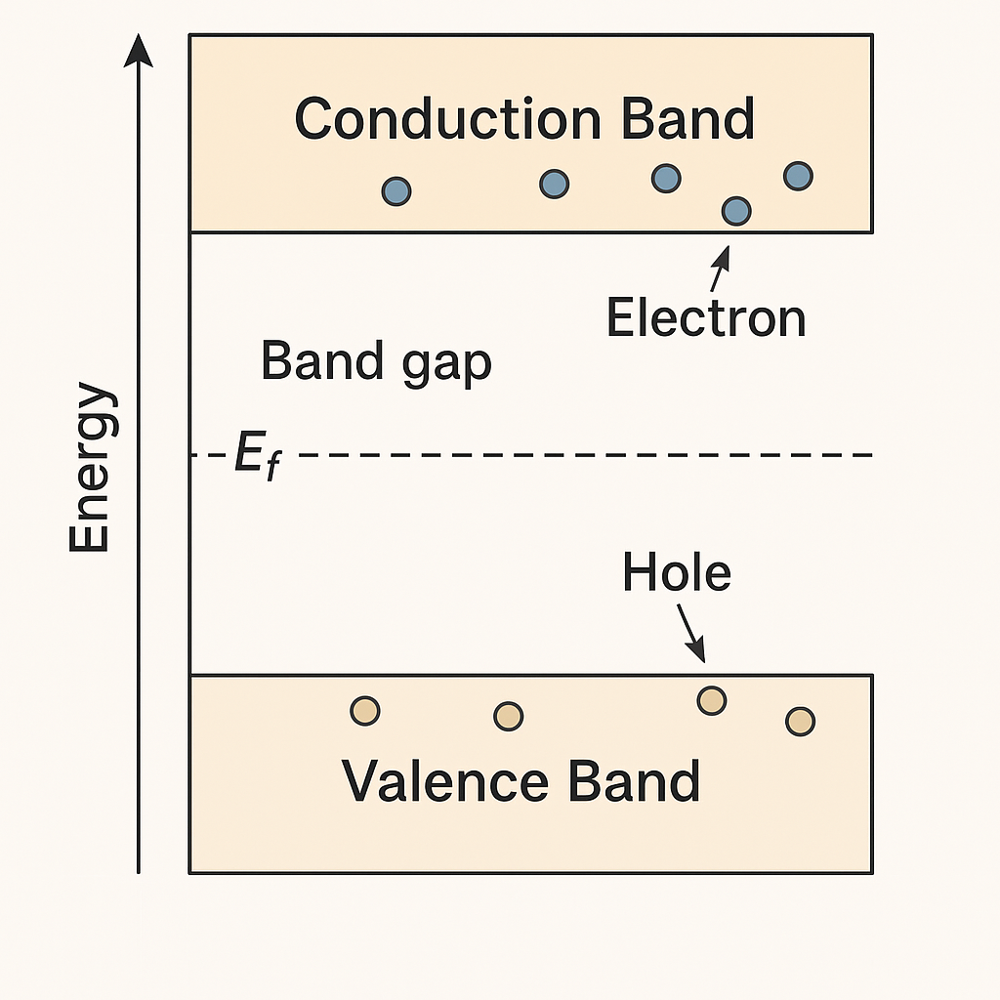

# 1.1 バンド構造とキャリア

MOSトランジスタの動作を理解するためには、その基盤である**半導体のエネルギーバンド構造**と**キャリア（電子・正孔）**の振る舞いを知ることが不可欠です。本節では、真性半導体とドーピングによるn型・p型半導体の違いを、バンド図とともに解説します。

---

## 🔹 エネルギーバンド構造の基本

半導体は、エネルギー的に以下のような構造を持ちます：

- **価電子帯（Valence Band）**：電子で満たされている
- **伝導帯（Conduction Band）**：電子が移動可能な空間
- **禁制帯（バンドギャップ）**：通常電子が存在できないエネルギー領域

> 図1.1-1：真性半導体のエネルギーバンド構造 

- 真性半導体では、**フェルミ準位（Ef）**は価電子帯と伝導帯の中間にあります。
- 温度が上がると、価電子帯から少数の電子が励起されて伝導帯へ移動します。

---

## 🔹 キャリアの種類と移動

- **電子（Electron）**：伝導帯に存在、負電荷キャリア
- **正孔（Hole）**：価電子帯に生じる空席、正電荷キャリア

これらのキャリアは、以下の2つの力で移動します：

1. **拡散（Diffusion）**：濃度差によりキャリアが広がる
2. **ドリフト（Drift）**：電界によりキャリアが移動する

---

## 🔹 ドーピングとn型・p型半導体

半導体に微量の不純物を加えることで、キャリアの性質を制御できます。

| 型 | ドーパント | 主キャリア | フェルミ準位の変化 |
|----|-------------|------------|----------------------|
| n型 | P, As, Sb  | 電子       | Efが伝導帯に近づく   |
| p型 | B, Al, Ga  | 正孔       | Efが価電子帯に近づく |

> 図1.1-2：n型・p型半導体のバンド構造とフェルミ準位の違い  
> ``

---

## 🔹 キャリア密度と温度依存性（参考）

- キャリア密度は温度・バンドギャップ・ドーピング濃度に依存
- 真性キャリア密度：  
  $$n_i \\propto \\exp\\left(-\\frac{E_g}{2kT}\\right)$$
- 実用的には、ドーピングにより支配される領域（外因的キャリア）が重要

---

## ✅ まとめ

- 半導体のバンド構造は、MOS構造やPN接合の理解における出発点
- ドーピングによりキャリアの種類・量を制御可能
- この物理的背景が、後のPN接合（次節）やMOS構造（1.3節）に直結する

---

📎 次節：[`1.2_pn_junction.md`](./1.2_pn_junction.md)  
