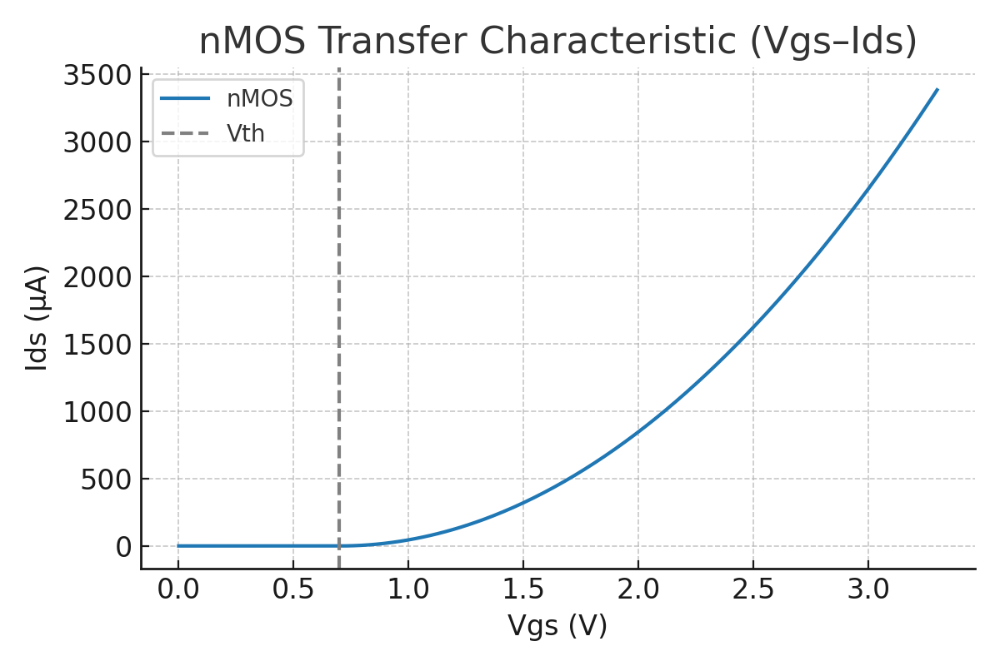
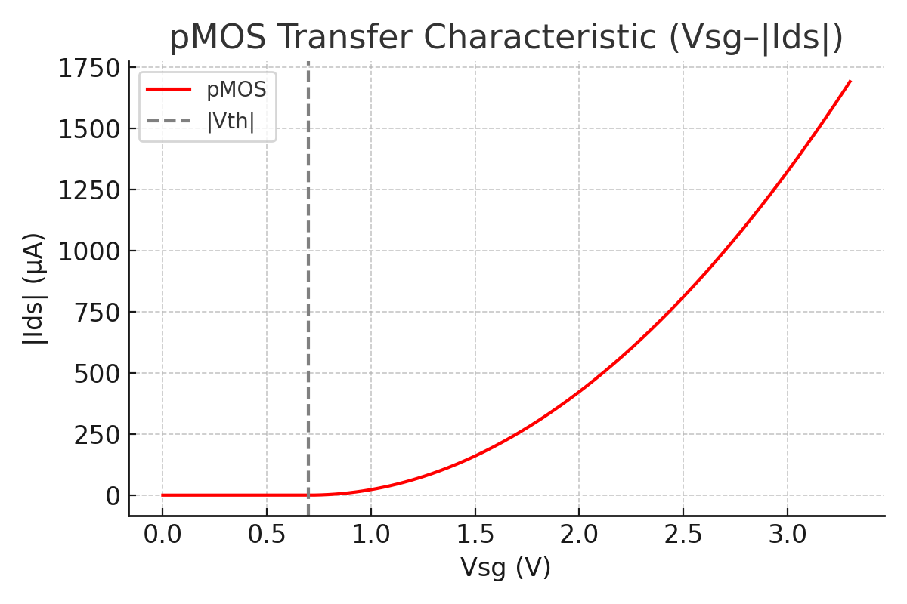
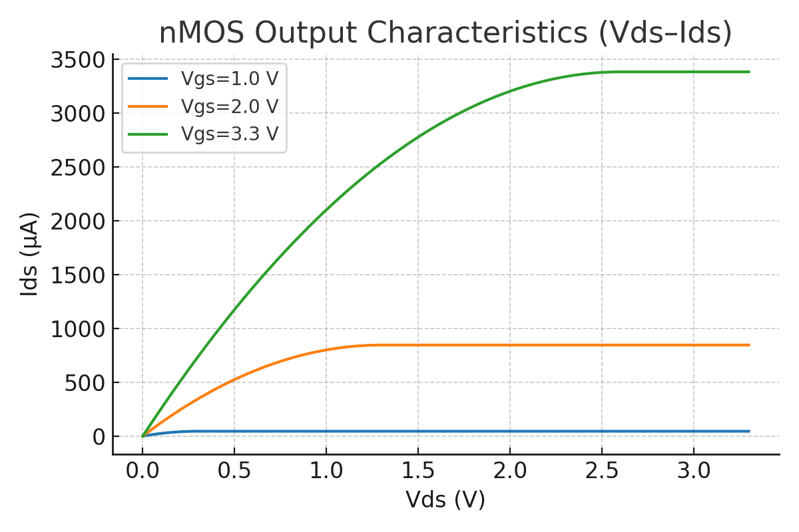
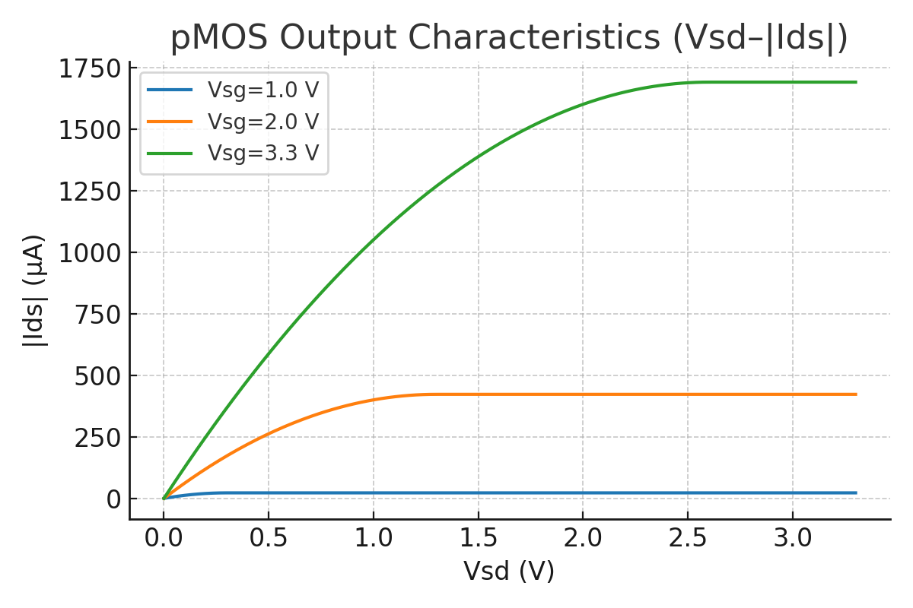

---

# 1.4 MOSトランジスタのスイッチ動作モデル  
*1.4 Switching Behavior Model of MOS Transistors*

---

## 🎯 本節のねらい｜Objective

MOS構造に電圧を印加することで形成されるチャネルが、  
**どのようにデジタルスイッチとして機能するか**を、  
**nMOS / pMOS の構造・電圧条件・ON/OFF制御**の視点で整理します。  

*This section explains how the **channel formed by gate voltage in a MOS structure** functions as a **digital switch**, focusing on **nMOS / pMOS structure, voltage conditions, and ON/OFF control**.*

---

## 🔹 nMOSトランジスタの動作原理  
*🔹 Operating Principle of nMOS*

nMOSは、p型基板上に形成され、**正のゲート電圧**によってチャネル（電子）が形成されます。  

- **VGS < Vth**：チャネル形成されず → **OFF**  
- **VGS ≥ Vth**：チャネル形成 → **ON**

📈 **図1.4-1：nMOS 転送特性 (Vgs–Ids)**  
*Figure 1.4-1: nMOS Transfer Characteristic (Vgs–Ids)*  

📘 **図1.4-2：nMOS構造とON/OFF状態**  
*Figure 1.4-2: Structure and Operation of nMOS*  

- ソースは **GND（0V）に固定**  
- ゲートに 0V / 3.3V などを印加し、ON/OFF を制御  
- ON状態では、**電子がドレイン→ソース方向に流れる**  

*The source is fixed at **GND (0V)**.  
The gate voltage (e.g., 0V / 3.3V) controls ON/OFF.  
In ON state, **electrons flow from drain to source**.*

---

## 🔹 pMOSトランジスタの動作原理  
*🔹 Operating Principle of pMOS*

pMOSは、n型基板上に形成され、**負のゲート電圧**によりチャネル（正孔）が形成されます。  

- **VSG < Vth**：チャネル無し → **OFF**  
- **VSG ≥ Vth**：チャネル形成 → **ON**

📈 **図1.4-3：pMOS 転送特性 (Vsg–|Ids|)**  
*Figure 1.4-3: pMOS Transfer Characteristic (Vsg–|Ids|)*  

📘 **図1.4-4：pMOS構造とON/OFF状態**  
*Figure 1.4-4: Structure and Operation of pMOS*  

- ソースは **VDD（例：3.3V）に固定**  
- ゲートを 0VまたはVDDで制御  
- **nMOSとは極性が逆**（LowでON）  

*The source is fixed at **VDD (e.g., 3.3V)**.  
The gate is controlled by 0V or VDD.  
The polarity is opposite to nMOS (**Low input turns ON**).*

---

## 🔹 スイッチモデルと論理回路への応用  
*🔹 Switch Model and Logic Applications*

MOSトランジスタは以下のように、**論理スイッチ**としてモデル化できます：  
*MOS transistors can be modeled as **logic switches** as follows:*

| 種類 | ゲート条件 | ON時の接続 | 論理的意味 |  
|------|-------------|----------------|--------------|  
| **nMOS** | High（"1"） | ドレイン–ソース間導通（GND方向） | "1"でON |  
| **pMOS** | Low（"0"）  | ドレイン–ソース間導通（VDD方向） | "0"でON |

📘 **図1.4-5：MOSスイッチモデル（記号・抽象化）**  
*Figure 1.4-5: Abstract Switch Model of MOS*  

これにより、**インバータ・NANDなどの論理回路**が構成可能です（1.5節で詳述）。  
*This enables construction of **logic circuits such as inverters and NANDs** (explained in Section 1.5).*

---

## 🔹 電気的特性（導入のみ）  
*🔹 Electrical Characteristics (Introductory)*

- **ON抵抗（Ron）**は、W/Lや移動度μに依存  
- **I–V特性**には2領域：
  - **リニア領域**（VDS ≪ VGS − Vth）  
  - **飽和領域**（VDS > VGS − Vth）  

*The **ON resistance (Ron)** depends on W/L and carrier mobility μ.  
The I–V characteristic has two regions:  
- **Linear region** (VDS ≪ VGS − Vth)  
- **Saturation region** (VDS > VGS − Vth)*  

- 飽和領域での電流式（参考）：  
*Current equation in saturation (reference):*  

$$
I_D = \frac{1}{2} \mu C_{ox} \frac{W}{L} (V_{GS} - V_{th})^2
$$

📈 **図1.4-6：nMOS 出力特性 (Vds–Ids)**  
*Figure 1.4-6: nMOS Output Characteristic (Vds–Ids)*  

📈 **図1.4-7：pMOS 出力特性 (Vsd–|Ids|)**  
*Figure 1.4-7: pMOS Output Characteristic (Vsd–|Ids|)*  

> ※詳細は後の章または応用編で扱います。  
>*Details will be covered in later chapters or application sections.*

---

## ✅ まとめ｜Summary

| 観点 | 内容（日本語） | 内容（英語） |
|------|----------------|--------------|
| nMOS | HighでON（GNDに接続） | *Turns ON when Gate is High (connected to GND)* |
| pMOS | LowでON（VDDに接続） | *Turns ON when Gate is Low (connected to VDD)* |
| チャネル | ゲート電圧で形成される導電路 | *Conductive path formed by gate voltage* |
| 意義 | 論理回路の**理想的スイッチ素子**として機能 | *Functions as an ideal switch in logic circuits* |

---

📎 次節リンク｜Next Section: [`1.5_cmos_inverter.md`](./1.5_cmos_inverter.md)  
**CMOS構造によるインバータ動作へ進みます**  
*Proceed to CMOS structure and inverter operation*

---

[← 戻る / Back to Chapter 1: Materials Top](./README.md)
