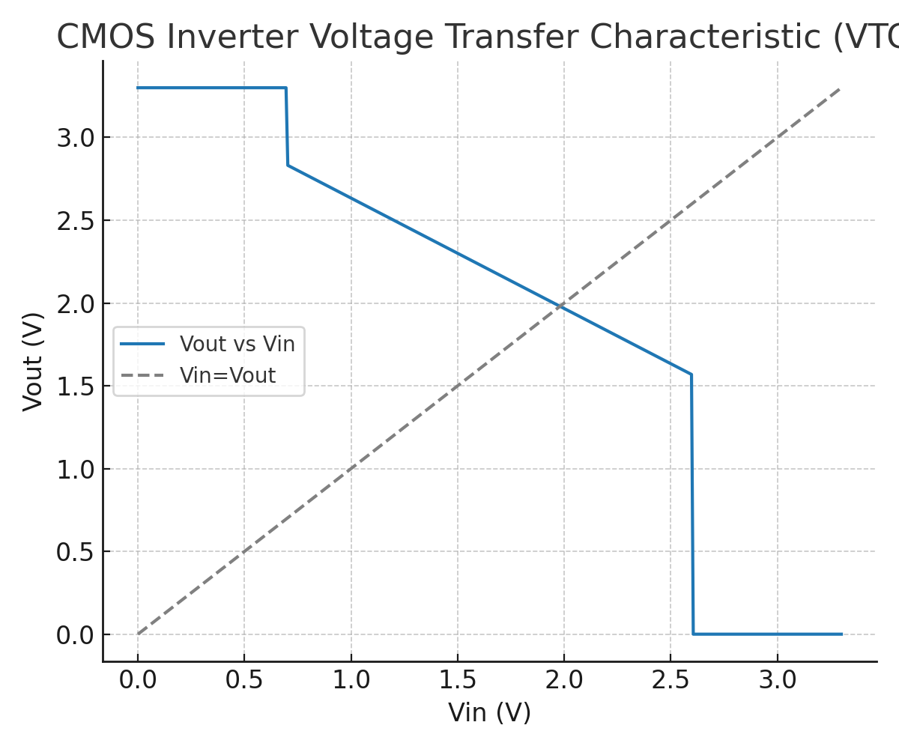
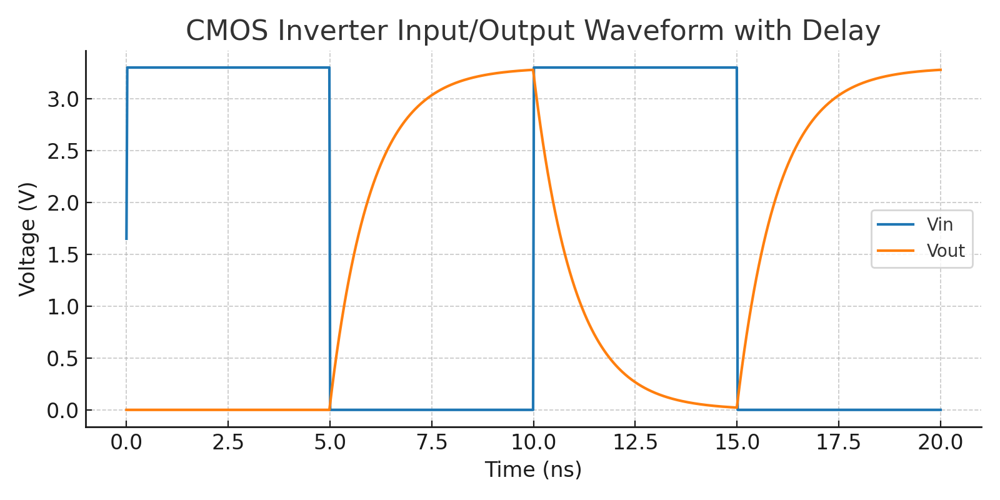

---

# 1.5 CMOSインバータの構造と動作  
*1.5 Structure and Operation of CMOS Inverter*

---

## 🎯 本節のねらい｜Objective

本節では、nMOS と pMOS を組み合わせた基本構成である **CMOSインバータ**について、  
**構造・動作原理・電圧制御・電力特性**を中心に学びます。  

*This section explains the basic **CMOS inverter**, constructed from an nMOS and pMOS pair, focusing on its **structure, operation principle, voltage control, and power characteristics**.*

---

## 🔹 CMOSインバータの構造｜CMOS Inverter Structure

- **pMOS**：ソース端子が VDD に接続（Pull-up）  
- **nMOS**：ソース端子が GND に接続（Pull-down）  
- **ゲート**：IN（共通入力）  
- **ドレイン**：OUT（共通出力）  

📘 **図1.5-1：CMOSインバータの構造図と回路記号**  
*Figure 1.5-1: Structure and Symbol of CMOS Inverter*  

---

## 🔹 電圧伝達特性（VTC）｜Voltage Transfer Characteristic

CMOSインバータの入出力関係を電圧で表すと、次のような **S字カーブ**になります。  
しきい値電圧 $V_M$ を境に、出力が急激に反転します。  

📈 **図1.5-2：CMOSインバータの電圧伝達特性（VTC）**  
*Figure 1.5-2: CMOS Inverter Voltage Transfer Characteristic*  

---

## 🔹 入出力波形とスイッチング遅延｜Input-Output Waveform with Delay

実際の動作では、負荷容量による **遅延** が発生します。  
入力が矩形波で変化しても、出力は遅れて反転します。  

📈 **図1.5-3：CMOSインバータの入出力波形（遅延付き）**  
*Figure 1.5-3: CMOS Inverter Input/Output Waveform with Delay*  

---

## 🔹 消費電力とCMOSの利点｜Power Consumption and Advantages

CMOSインバータは、以下の点で優れています：  

- **静的電流なし**：IN が一定であれば、pMOS または nMOS のどちらかが OFF  
- **スイッチング時のみ電流が流れる**（動的電力）  

💡 これにより、CMOSは以下のような特性を持つ：  

- **低消費電力（Low Power）**  
- **高集積（High Density）**  
- **高信頼性（High Reliability）**  

> 動的消費電力は次式で表されます：  
> $P = \alpha \, C_L \, V_{DD}^2 \, f$  
>  
> - $\alpha$: スイッチング確率  
> - $C_L$: 負荷容量  
> - $V_{DD}$: 電源電圧  
> - $f$: 動作周波数  

---

## ✅ まとめ｜Summary

| 項目 | 内容（日本語） | 内容（英語） |
|------|----------------|---------------|
| 基本構成 | pMOS + nMOS | pMOS + nMOS pair |
| 出力論理 | 入力の論理反転 | Logical inversion of input |
| 電力特性 | 静的電流ゼロ、動的電力小 | Zero static current, low dynamic power |
| 意義 | CMOSは**標準的論理回路構成素子** | CMOS is the **standard logic gate building block** |

---

## 📎 次章への接続｜Next Chapter

次章では、このCMOSインバータの応用として、**AND, OR, NAND, NOR, XORなどの基本論理回路**の構成方法を学びます。  

📂 `chapter2_comb_logic/`：**組み合わせ回路の設計と構成**

---

[← 戻る / Back to Chapter 1: Materials Top](./README.md)
