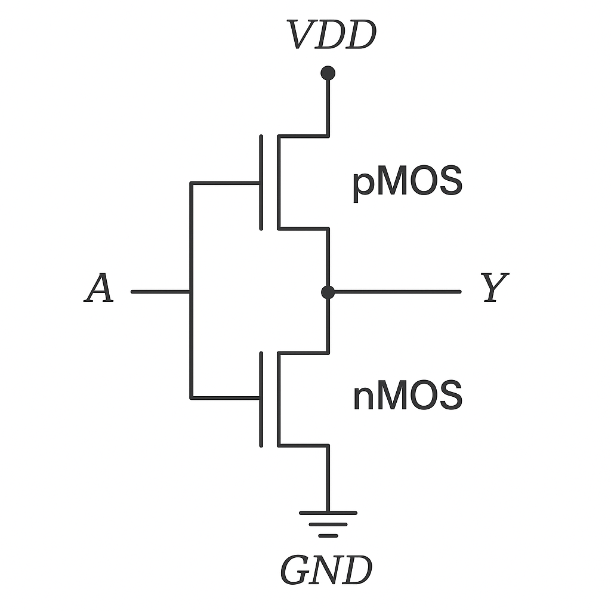
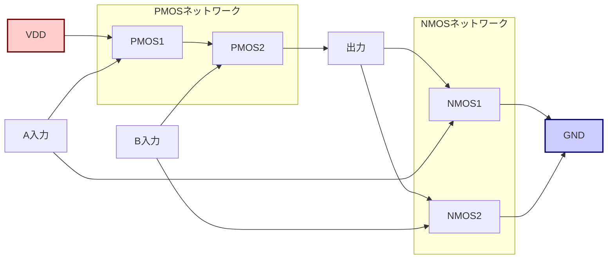
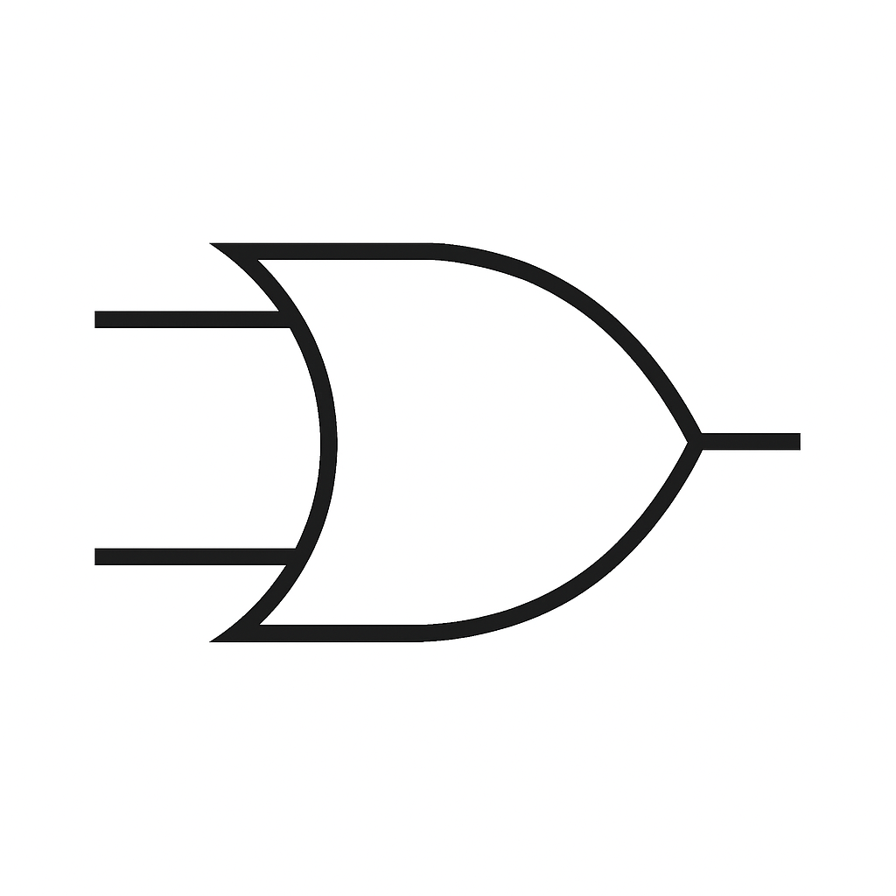

---

# 2.1 基本論理ゲートとCMOS構成  
**2.1 Basic Logic Gates and CMOS Structures**

---

## 🎯 本節のねらい｜Goal of This Section

本節では、論理回路の最小単位である **基本ゲート（AND, OR, NOT）** について学びます。  
それぞれの**論理式、真理値表、回路記号、CMOS構成**を対応付けて理解し、MOSトランジスタがどのように論理動作を実現しているかを明らかにします。  
> This section introduces the **fundamental logic gates (AND, OR, NOT)** and explains how **logic expressions, truth tables, gate symbols, and CMOS structures** correspond. You'll also learn how MOS transistors implement logic behavior.

---

## 🔹 NOT（インバータ）｜Inverter

### ▶ 論理式 / Logic Expression：

$$
Y = \overline{A}
$$

### ▶ 真理値表 / Truth Table：

| A | Y |
|---|---|
| 0 | 1 |
| 1 | 0 |

### ▶ 回路記号 / Gate Symbol：

### ▶ CMOS構成 / CMOS Structure：

- **pMOS（上）**：A = 0 のとき ON → VDD を出力に接続  
- **nMOS（下）**：A = 1 のとき ON → 出力を GND に接続  
> - **pMOS (top):** ON when A = 0 → connects output to VDD  
> - **nMOS (bottom):** ON when A = 1 → connects output to GND

出力ノードは、pMOSとnMOSのドレインが接続された**中点**。Aの値に応じて、**VDDかGNDのどちらか一方**に導通します。  
> The output node (drain midpoint) is connected to either VDD or GND depending on the input.

---

## 🔹 ANDゲート｜AND Gate

### ▶ 論理式 / Logic Expression：

$$
Y = A \cdot B
$$

### ▶ 真理値表 / Truth Table：

| A | B | Y |
|---|---|---|
| 0 | 0 | 0 |
| 0 | 1 | 0 |
| 1 | 0 | 0 |
| 1 | 1 | 1 |

### ▶ 回路記号 / Gate Symbol：

### ▶ CMOS構成（NAND + NOT）/ CMOS Structure (NAND + Inverter)：

- CMOSでは、**ANDゲートは通常 NANDゲート＋インバータで構成**されます。  
> In CMOS, an AND gate is typically built using a **NAND gate followed by an inverter**.

- **NAND構成**：pMOS並列／nMOS直列  
> - **pMOS in parallel**, **nMOS in series** → NAND output

- 最後に **NOT** を接続して AND を実現  
> Final inverter reverses NAND output to get AND behavior.

---

## 🔹 ORゲート｜OR Gate

### ▶ 論理式 / Logic Expression：

$$
Y = A + B
$$

### ▶ 真理値表 / Truth Table：

| A | B | Y |
|---|---|---|
| 0 | 0 | 0 |
| 0 | 1 | 1 |
| 1 | 0 | 1 |
| 1 | 1 | 1 |

### ▶ 回路記号 / Gate Symbol：

### ▶ CMOS構成（NOR + NOT）/ CMOS Structure (NOR + Inverter)：

- ORゲートは、**NORゲート＋インバータ**で構成されます。  
> OR gates are typically built as a **NOR gate followed by an inverter**.

- **NOR構成**：pMOS直列／nMOS並列  
> - **pMOS in series**, **nMOS in parallel** → NOR output

- 最後に **NOT** を接続して OR を実現  
> Final inverter reverses NOR output to get OR behavior.

---

## ✅ まとめ｜Summary

| 項目 / Aspect | 内容 / Key Point |
|---------------|------------------|
| 理解の統一     | 論理式・真理値表・記号・CMOS構成の一貫理解が重要 |
| CMOS基本構造   | NAND / NORが基本ゲートとして活用される           |
| トランジスタ直感 | nMOS直列＝AND的、pMOS並列＝OR的構造を意識       |

> It's essential to **integrate logic expressions, truth tables, symbols, and CMOS design**.  
> In CMOS, **NAND and NOR are fundamental**, with AND/OR gates constructed via inversion.  
> Physically, think of **nMOS in series as AND-like**, and **pMOS in parallel as OR-like**.

---

📎 **次節へ：[`2.2_nand_nor_xor.md`](./2.2_nand_nor_xor.md)**  
> **Next section:** Extended gates — NAND, NOR, XOR

---

[← 戻る / Back to Chapter 2: Combinational Logic Top](./README.md)

