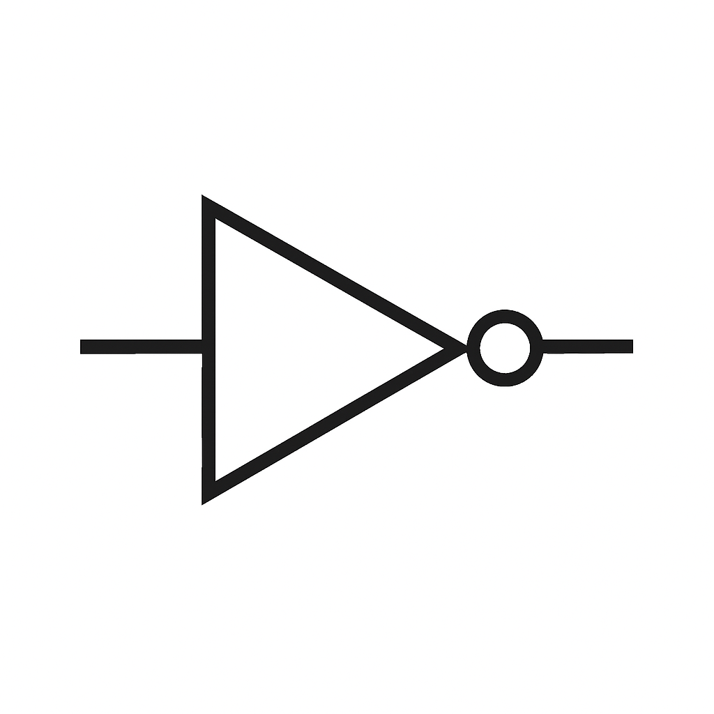
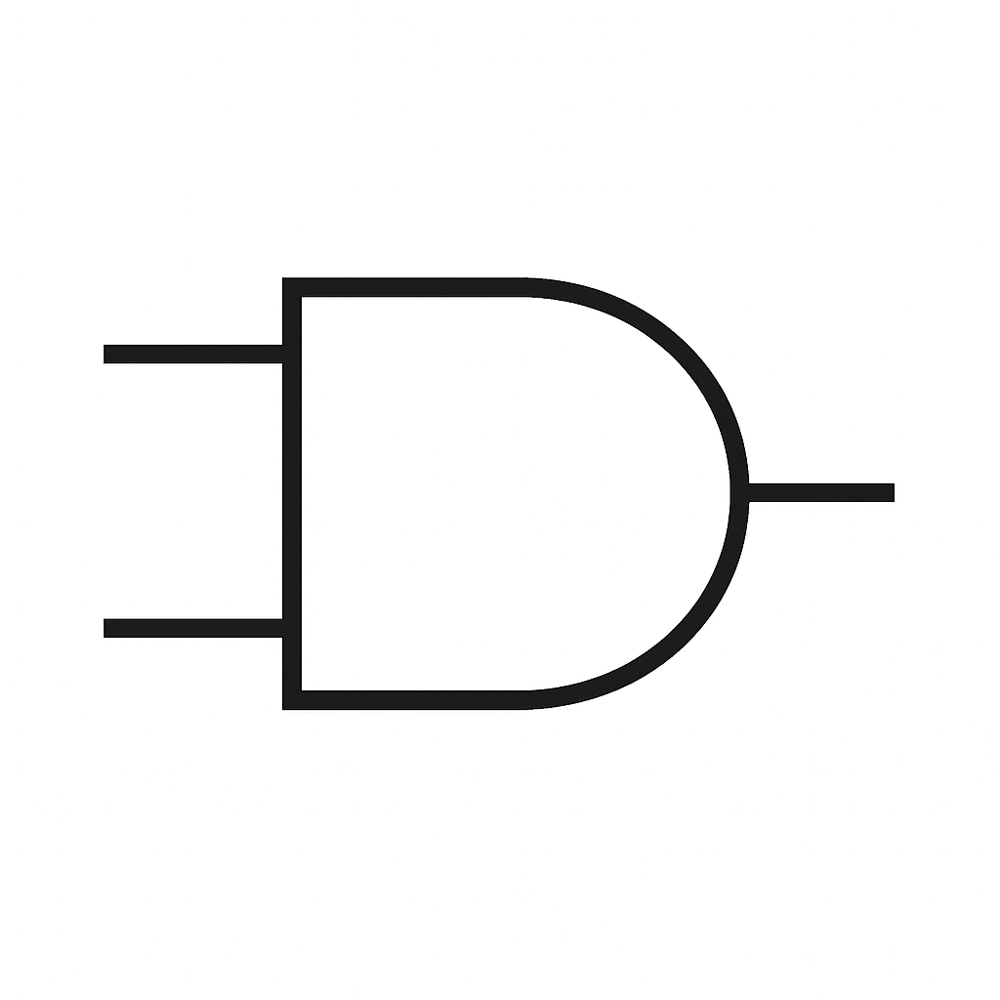

# 2.1 基本論理ゲートとCMOS構成

本節では、論理回路の最小単位である**基本ゲート（AND, OR, NOT）**について学びます。  
それぞれの論理式、真理値表、回路記号、CMOS構成を対応付けて理解し、MOSトランジスタがどのように論理動作を実現しているかを明らかにします。

---

## 🔹 NOT（インバータ）

### 論理式：

$Y = \\overline{A}$

### 真理値表：

| A | Y |
|---|---|
| 0 | 1 |
| 1 | 0 |

### 回路記号：

### CMOS構成：
- pMOS（上）：ON になるのは A=0 のとき → VDD を出力へ
- nMOS（下）：ON になるのは A=1 のとき → GND を出力へ

> ``

---

## 🔹 ANDゲート

### 論理式：

$Y = A \\cdot B $

### 真理値表：

| A | B | Y |
|---|---|---|
| 0 | 0 | 0 |
| 0 | 1 | 0 |
| 1 | 0 | 0 |
| 1 | 1 | 1 |

### 回路記号：

### CMOS構成（NAND + NOT）：
- ANDゲートは CMOS構成では通常 **NANDゲート＋インバータ** で構成されます。
- NAND構成：nMOS直列 / pMOS並列 → 否定付き出力
- 最後に NOT を接続し、AND動作を実現

> ``

---

## 🔹 ORゲート

### 論理式：

$Y = A + B$

### 真理値表：

| A | B | Y |
|---|---|---|
| 0 | 0 | 0 |
| 0 | 1 | 1 |
| 1 | 0 | 1 |
| 1 | 1 | 1 |

### 回路記号：
> ``

### CMOS構成（NOR + NOT）：
- ORゲートも CMOS構成では **NORゲート＋インバータ** により構成されます。
- NOR構成：nMOS並列 / pMOS直列 → 否定付き出力
- 最後に NOT を接続し、OR動作を実現

> ``

---

## ✅ まとめ

- 基本ゲート（NOT, AND, OR）の動作は、真理値表とCMOS構造で一貫して理解可能
- CMOS論理設計では、**NAND/NORを基本ブロック**とし、他のゲートを構成
- 次節では、これら否定付きゲート（NAND, NOR）とXOR、さらに**CMOSトランジスタの最小構成数**にも着目していきます

---

📎 次節：[`2.2_nand_nor_xor.md`](./2.2_nand_nor_xor.md)
