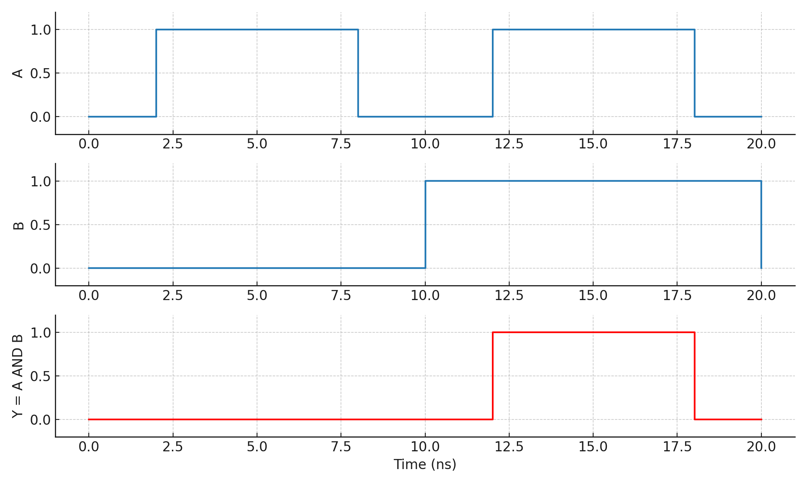

---

# 2.3 真理値表と波形による論理動作の検証  
**2.3 Logic Verification Using Truth Tables and Timing Diagrams**

---

## 🎯 本節のねらい｜Goal of This Section

本節では、論理回路の正しい動作を確認するための基本的な方法として、  
**真理値表（Truth Table）** と **タイミング波形（Timing Diagram）** を用いた検証方法を学びます。  
> In this section, we learn how to verify logic circuits using **truth tables** and **timing diagrams**—essential tools for validating digital behavior.

---

## 📋 真理値表の基本｜Basics of Truth Tables

組み合わせ論理回路では、すべての入力パターンに対して出力が一意に定まります。  
その対応関係を一覧化したものが **真理値表（Truth Table）** です。  
> A combinational circuit’s output is uniquely defined for every input pattern.  
> A **truth table** provides a complete listing of these input–output relationships.

### ✅ 例：2入力ANDゲート｜Example: 2-input AND Gate

| A | B | Y = A・B |
|---|---|----------|
| 0 | 0 | 0 |
| 0 | 1 | 0 |
| 1 | 0 | 0 |
| 1 | 1 | 1 |

---

## ⏱ タイミング波形の読み方｜Reading Timing Diagrams

タイミング波形は、**時間軸に沿った入力変化と出力応答の視覚表現**です。  
デジタルでは `"0"` は Low（GND）、`"1"` は High（VDD）として描かれます。  
> Timing diagrams visualize input transitions and output responses over time.  
> "0" = Low (GND), "1" = High (VDD)

### 📈 図2.3-2：ANDゲートのタイミング波形｜Example: AND Gate Waveform

- A, B がともに High（1）になるタイミングでのみ出力Yが High。  
- 出力遷移の瞬間や遅延時間を見ることで、**動作の正当性と回路の応答性**を評価できます。  
> Output Y becomes High only when both A and B are High.  
> By observing transition timing, we can verify logic and response behavior.

---

## 👀 波形から論理機能を読み取る訓練｜Practice: Deriving Logic from Waveforms

波形から以下の観点で論理機能を推測する訓練を行います。  
> Practice reading waveforms by observing the following aspects:

- どの入力変化で出力が変化したか  
- High/Low がどれくらい続いているか  
- 同じ入力変化に対して出力が一貫しているか  
> - Which input caused output changes?  
> - How long are the High/Low periods?  
> - Is the behavior consistent across cycles?

### 📈 XORゲートの例｜XOR Gate Example

> 図2.3-3：XORゲートのタイミング波形（代表例）  
> ``

---

## 🔁 実践：複数ゲートの組合せ｜Practice: Combined Logic Circuits

複雑な回路では、**中間信号（internal nodes）**を含めて解析が必要です。  
真理値表や波形におけるすべてのノードの挙動を確認しましょう。  
> In more complex logic, intermediate signals must also be verified.  
> Use both truth tables and waveforms to analyze full circuit behavior.

### 📈 AND–XOR 複合回路の波形｜Timing Diagram: AND–XOR Composite

> 図2.3-4：AND–XOR複合回路の波形  
> ``

---

## ✅ まとめ｜Summary

| 🇯🇵 日本語 | 🇺🇸 English |
|----------|------------|
| 真理値表は、**論理回路の全入力パターンに対する出力の定義表**です。 | A **truth table** lists outputs for all possible input combinations. |
| タイミング波形は、**回路の応答性・動作確認に有効な可視化手段**です。 | A **timing diagram** allows verification of temporal response and delay. |
| **論理式 → 真理値表 → 波形**という流れで理解を深めます。 | Follow the logic: **equation → truth table → waveform** for solid understanding. |

---

📎 **次節へ：[`2.4_mux_and_selector.md`](./2.4_mux_and_selector.md)**  
> **Next:** Multiplexers and selectors in digital logic

---

[← 戻る / Back to Chapter 2: Combinational Logic Top](./README.md)

