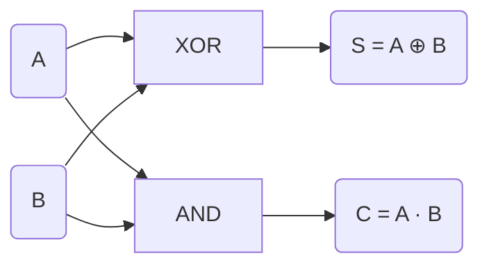
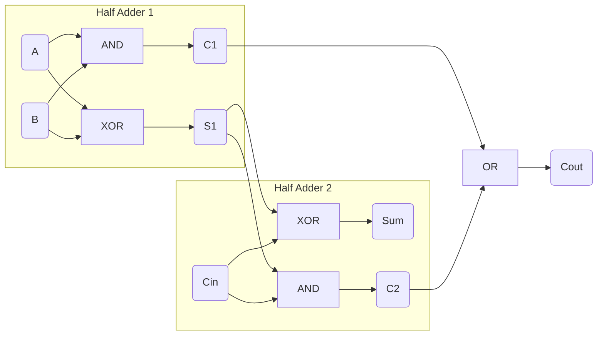
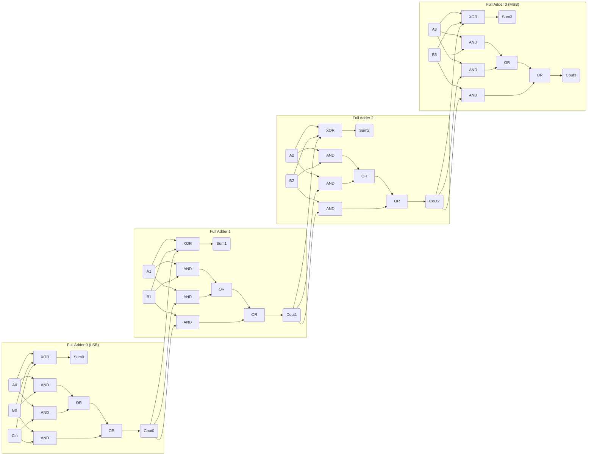

---

# 2.5 半加算器と全加算器の構成  
**2.5 Structure of Half and Full Adders**

---

## 🎯 本節のねらい｜Goal of This Section

本節では、デジタル回路で最も基本的かつ重要な演算処理である  
**加算器（Adder）** の構成を学びます。  
> This section focuses on the fundamental logic blocks—**Half Adder** and **Full Adder**—used in digital addition.

---

## 🔹 半加算器（Half Adder）  
### 🇯🇵 2入力ビットの加算を行う最小構成回路  
### 🇺🇸 A minimal logic block that adds two single-bit inputs

- **入力 / Inputs**：A, B（1ビット）  
- **出力 / Outputs**：
  - **Sum（S）** = A ⊕ B  
  - **Carry（C）** = A・B

### 📋 真理値表｜Truth Table

| A | B | S = A ⊕ B | C = A・B |
|---|---|-----------|----------|
| 0 | 0 |     0     |    0     |
| 0 | 1 |     1     |    0     |
| 1 | 0 |     1     |    0     |
| 1 | 1 |     0     |    1     |

### 📘 図2.5-1：半加算器の構成図（Mermaid）

> XOR generates the sum, AND generates the carry output.

---

## 🔹 全加算器（Full Adder）  
### 🇯🇵 キャリー入力付き1ビット加算器  
### 🇺🇸 A 1-bit adder with carry-in support

- **入力 / Inputs**：A, B, C\_in（キャリー入力）  
- **出力 / Outputs**：
  - **Sum（S）** = A ⊕ B ⊕ C\_in  
  - **Carry（C\_out）** = A・B + B・C\_in + A・C\_in

### 📋 真理値表｜Truth Table

| A | B | C_in | S | C_out |
|---|---|------|---|-------|
| 0 | 0 | 0    | 0 | 0     |
| 0 | 0 | 1    | 1 | 0     |
| 0 | 1 | 0    | 1 | 0     |
| 0 | 1 | 1    | 0 | 1     |
| 1 | 0 | 0    | 1 | 0     |
| 1 | 0 | 1    | 0 | 1     |
| 1 | 1 | 0    | 0 | 1     |
| 1 | 1 | 1    | 1 | 1     |

### 📘 図2.5-2：全加算器構成図（2段HA構成、Mermaid）

> Sum is computed through two XOR gates, while carry is derived by combining two intermediate AND outputs via OR.

---

## 🔹 多ビット加算器への拡張  
### 🇯🇵 複数の全加算器を直列接続  
### 🇺🇸 Building multi-bit adders by chaining Full Adders

- **C\_out of previous stage → C\_in of next**
- **リップルキャリー方式 / Ripple Carry**：構造は簡易だが、**遅延は段数に比例**

### 📘 図2.5-3：4ビットリップルキャリー加算器（Mermaid・簡潔版）

> さらに簡潔にしたい場合は、各ステージを `Full Adder` 1ブロック（XOR/AND/ORの内部詳細を省略）にして、`Cout` を次段 `Cin` へ接続するだけの図も用意できます。

---

## ✅ まとめ｜Summary

| 🇯🇵 日本語 | 🇺🇸 English |
|-----------|------------|
| 半加算器は **1ビットの加算を最小構成で実現** | Half Adder performs 1-bit addition with minimal logic |
| 全加算器は **キャリー入力込みの基本加算器** | Full Adder handles carry-in and forms the basis for multi-bit adders |
| 複数段接続で **nビット加算器に拡張可能** | Full Adders can be cascaded to build n-bit adders |
| 加算器は **ALUやプロセッサの中核要素** | Adders are essential in ALUs and processors |

---

📎 次節：[`2.6_fsm_intro.md`](./2.6_fsm_intro.md)  
> **Next**: Introduction to Sequential Circuits and FSM (Finite State Machine)

---

[← 戻る / Back to Chapter 2: Combinational Logic Top](./README.md)
