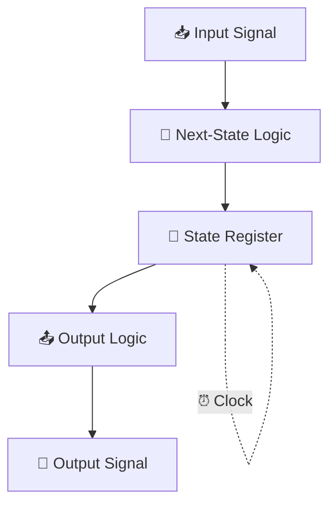
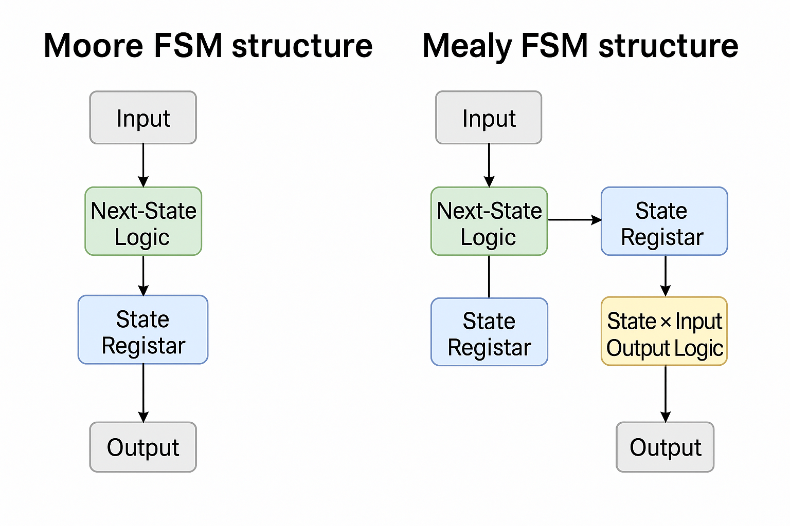

---

# 2.6 有限状態機械（FSM）の導入と状態制御の基本  
**2.6 Introduction to Finite State Machine (FSM) and State Control**

---

## 🎯 本節のねらい｜Goal of This Section

本節では、これまで扱ってきた**組み合わせ回路（Combinational Logic）**の知識を踏まえて、  
**有限状態機械（FSM）**の考え方と基本構成を学びます。  
> This section introduces the concept and structure of **Finite State Machines (FSMs)** based on prior knowledge of combinational logic.

FSMは**時間と状態に依存して動作する順序回路**であり、  
SoCや制御回路設計に不可欠な中核概念です。

---

## 🔹 組み合わせ回路とFSMの違い  
**🔸 Difference: Combinational vs. Sequential Logic**

| 観点 / Viewpoint | 組み合わせ回路 / Combinational Logic | FSM（順序回路） / FSM (Sequential Logic) |
|------------------|---------------------------------------|-------------------------------------------|
| **出力** / Output | 入力のみに依存 / Depends only on inputs | 入力と状態に依存 / Depends on inputs + state |
| **記憶要素** / Memory | なし / None | 状態レジスタあり / Has state registers |
| **例** / Examples | AND, OR, MUX | Counter, Serial Receiver, Controller |

---

## 🔹 FSMの基本構成｜Basic Structure of FSM

FSMは以下の**3要素**から構成されます：  
> FSM consists of the following three components:

1. **状態（State） / State**：現在の内部動作モードを記憶  
2. **状態遷移（Transition） / Transition**：条件に応じて次の状態へ移動  
3. **出力（Output） / Output**：現在の状態や入力に基づいて出力が決まる

📘 図2.6-1：FSMの基本構成図｜FSM Structure (Input–State–Output)  
> [📎 GitHubでMermaidフローチャートを確認](https://github.com/Samizo-AITL/Edusemi-v4x/blob/main/chapter2_comb_logic/2.6_fsm_intro.md)


---

## 🔹 状態遷移図と状態遷移表  
**🔸 State Diagram and State Table**

FSMの動作は次の方法で視覚化できます：  
> FSM behavior can be visualized using:

- **状態遷移図 / State Transition Diagram**  
- **状態遷移表 / State Transition Table**

📘 図2.6-2：状態遷移図の例（S0 ⇄ S1）｜Example State Diagram  


---

## 🔹 Moore型とMealy型 FSM  
**🔸 Moore vs. Mealy Machine**

| 型 / Type | 出力依存 / Depends on | 特徴 / Characteristics |
|-----------|------------------------|--------------------------|
| **Moore型** | 状態のみ / Only state | 出力が安定、設計しやすい / Stable outputs, easier to design |
| **Mealy型** | 状態＋入力 / State + input | 出力が即時反応、回路は小型化可能 / Immediate response, more compact |

📘 図2.6-3：Moore型とMealy型の構成比較図  


---

## 🔹 HDL記述との接続（概要）  
**🔸 HDL (Verilog) Example – Basic FSM**

FSMは**HDL（Hardware Description Language）**を使って記述されます。  
以下は簡易的なFSMの例です：

```verilog
always @(posedge clk) begin
  case (state)
    S0: if (in) state <= S1;
    S1: if (!in) state <= S0;
  endcase
end
```

> ※詳細なFSM設計は、**第5章：RTL設計編**で扱います  
> Detailed FSM coding will be covered in **Chapter 5 (RTL Design)**.

---

## ✅ まとめ｜Summary

| 🇯🇵 日本語 | 🇺🇸 English |
|-----------|------------|
| FSMは**状態に応じて動作する順序回路**である | FSM is a **sequential circuit that depends on state** |
| 組み合わせ回路に**クロック＋レジスタ要素**を加えた構成 | FSM adds **clock and memory** to combinational logic |
| 設計では**状態図・状態表・HDL記述**を活用する | Use **state diagrams, tables, and HDL** to design FSMs |
| 本節は概念理解が中心、実装は今後の章で学ぶ | This section focuses on concept; implementation comes later |

---

📎 前節：[`2.5_half_full_adder.md`](./2.5_half_full_adder.md)  
📎 次節：[`2.7_component_relationships.md`](./2.7_component_relationships.md)  
> **Next**: 整合的な論理ブロック設計へ – コンポーネント構造と連携設計へ

---

[← 戻る / Back to Chapter 2: Combinational Logic Top](./README.md)
