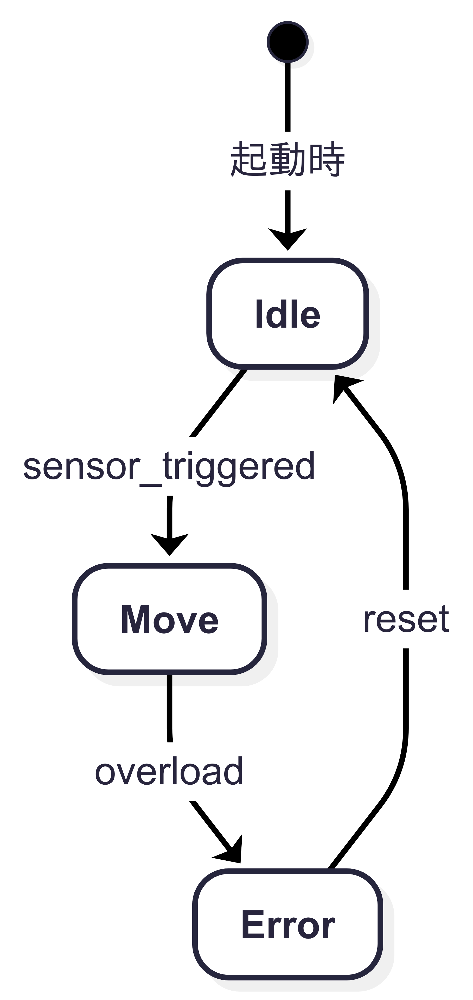

# 2.6 有限状態機械（FSM）の導入と状態制御の基本

本節では、これまで扱ってきた**組み合わせ回路**の知識をもとに、  
**時間的な変化に応じて動作する「有限状態機械（FSM）」**の考え方を簡潔に導入します。

FSMは、SoCや制御回路の設計において非常に重要な概念であり、  
本章ではその基本構造と動作モデルを理解することを目指します。

---

## 🔹 組み合わせ回路とFSMの違い

| 観点 | 組み合わせ回路 | FSM（順序回路） |
|------|----------------|----------------|
| 出力 | 入力のみに依存 | 入力と**状態**に依存 |
| メモリ | 持たない | **状態を保持** |
| 例 | AND, OR, MUX | カウンタ、シリアル受信、制御器 |

---

## 🔹 FSMの基本構成

FSM（Finite State Machine）は、以下の3つの要素から構成されます：

1. **状態（State）**：現在の動作モードを記憶  
2. **状態遷移（Transition）**：入力に応じた次の状態への移動  
3. **出力（Output）**：現在の状態または状態＋入力に基づく出力

> 図2.6-1：FSMのブロック構成図（入力・状態・出力）  
> ``

---

## 🔹 状態遷移図と状態遷移表

FSMは**状態遷移図**または**状態遷移表**によって動作を視覚的に表現します。

### 状態遷移図（例）：

- 状態：S0, S1
- 入力：X（1bit）
- 出力：Y（1bit）

> 図2.6-2：簡易FSMの状態遷移図（2状態）
<!-- 教材用：FSM状態遷移図（1/4サイズ） -->


---

## 🔹 Moore型とMealy型

| 型 | 出力が依存するもの | 特徴 |
|----|--------------------|------|
| Moore | 状態のみ | 出力が状態により安定 |
| Mealy | 状態＋入力 | 出力変化が早いが設計注意 |

> 図2.6-3：Moore型とMealy型の比較構成図  
> ``

---

## 🔹 HDL記述や実装との接続（簡易紹介）

FSMは、実際の設計では Verilog などの**ハードウェア記述言語（HDL）**で以下のように記述されます：

```verilog
always @(posedge clk) begin
  case (state)
    S0: if (in) state <= S1;
    S1: if (!in) state <= S0;
  endcase
end
```

> ※詳細な記述や設計は、**第5章**または**実践編**で扱います。

---

## ✅ まとめ

- FSMは、**状態を保持しながら入力に応じて振る舞いを変える回路**
- 組み合わせ回路に**クロックと記憶要素（レジスタ）**を加えた構成
- 本節では概念と動作モデルの理解に留め、実装は今後の章で扱う

---

📎 本節終了：次節では、演算・選択・制御ブロックの関係性を整理する  
[`2.7 コンポーネント関係図`](./2.7_component_relationships.md) に進みます。
