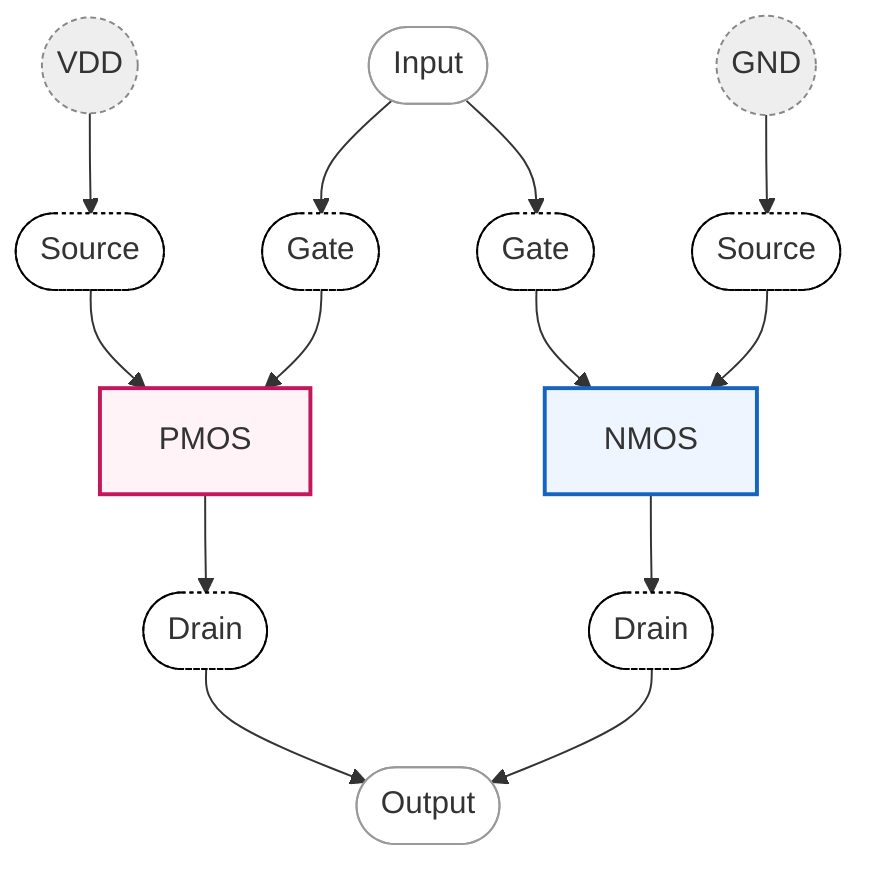
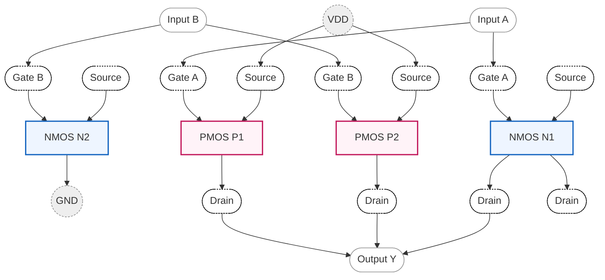

```mermaid
flowchart TB
classDef pmos fill:#fff3f8,stroke:#c2185b,stroke-width:2px;
classDef nmos fill:#eef5ff,stroke:#1565c0,stroke-width:2px;
classDef rail fill:#eeeeee,stroke:#888,stroke-dasharray:3 2;
classDef term fill:#fff,stroke:#000,stroke-dasharray:2 2;
classDef net  fill:#ffffff,stroke:#999;

%% Rails / IO
VDD((VDD)):::rail
GND((GND)):::rail
A([Input]):::net
Y([Output]):::net

%% PMOS
PG([Gate]):::term
PD([Drain]):::term
PS([Source]):::term
P[PMOS]:::pmos

%% NMOS
NG([Gate]):::term
ND([Drain]):::term
NS([Source]):::term
N[NMOS]:::nmos

%% Connectivity PMOS
A --> PG --> P
P --> PD --> Y
VDD --> PS --> P

%% Connectivity NMOS
A --> NG --> N
N --> ND --> Y
GND --> NS --> N
```

```mermaid
flowchart TB
classDef pmos fill:#fff3f8,stroke:#c2185b,stroke-width:2px;
classDef nmos fill:#eef5ff,stroke:#1565c0,stroke-width:2px;
classDef rail fill:#eeeeee,stroke:#888,stroke-dasharray:3 2;
classDef term fill:#fff,stroke:#000,stroke-dasharray:2 2;
classDef net  fill:#ffffff,stroke:#999;

VDD((VDD)):::rail
GND((GND)):::rail
A([Input A]):::net
B([Input B]):::net
Y([Output Y]):::net

%% PMOS P1
P1[PMOS P1]:::pmos
P1G([Gate A]):::term
P1D([Drain]):::term
P1S([Source]):::term

%% PMOS P2
P2[PMOS P2]:::pmos
P2G([Gate B]):::term
P2D([Drain]):::term
P2S([Source]):::term

%% NMOS N1
N1[NMOS N1]:::nmos
N1G([Gate A]):::term
N1D([Drain]):::term
N1S([Source]):::term

%% NMOS N2
N2[NMOS N2]:::nmos
N2G([Gate B]):::term
N2D([Drain]):::term
N2S([Source]):::term

%% Connectivity PMOS (parallel)
A --> P1G --> P1
VDD --> P1S --> P1
P1 --> P1D --> Y

B --> P2G --> P2
VDD --> P2S --> P2
P2 --> P2D --> Y

%% Connectivity NMOS (series)
A --> N1G --> N1
N1 --> N1D --> Y
N1S --> N1 --> N2D
B --> N2G --> N2
N2S --> N2 --> GND
```

