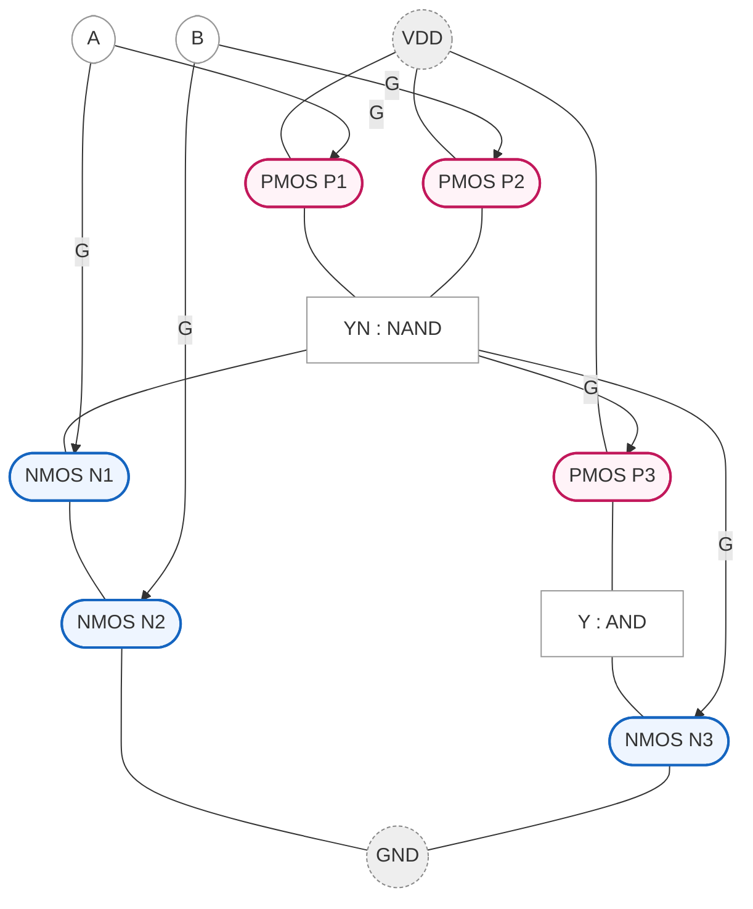

```mermaid
flowchart TB
%% ===== Styles =====
classDef pmos fill:#fff3f8,stroke:#c2185b,stroke-width:2px;
classDef nmos fill:#eef5ff,stroke:#1565c0,stroke-width:2px;
classDef rail fill:#eeeeee,stroke:#888,stroke-dasharray:3 2;
classDef net  fill:#ffffff,stroke:#999;

%% ===== Rails / IO =====
VDD((VDD)):::rail
GND((GND)):::rail
A[A]:::net
Y[Y]:::net

%% ===== Devices =====
P([PMOS P]):::pmos
N([NMOS N]):::nmos

%% ===== Connectivity =====
VDD --- P --- Y
Y   --- N --- GND
A --|G| P
A --|G| N
```

```mermaid
flowchart TB
classDef pmos fill:#fff3f8,stroke:#c2185b,stroke-width:2px;
classDef nmos fill:#eef5ff,stroke:#1565c0,stroke-width:2px;
classDef rail fill:#eeeeee,stroke:#888,stroke-dasharray:3 2;
classDef net  fill:#ffffff,stroke:#999;

VDD((VDD)):::rail
GND((GND)):::rail
A[A]:::net
B[B]:::net
Y[Y = NAND(A,B)]:::net

%% Devices
P1([PMOS P1]):::pmos
P2([PMOS P2]):::pmos
N1([NMOS N1]):::nmos
N2([NMOS N2]):::nmos

%% Pull-up (parallel)
VDD --- P1 --- Y
VDD --- P2 --- Y

%% Pull-down (series)
Y --- N1 --- N2 --- GND

%% Gates
A --|G| P1
B --|G| P2
A --|G| N1
B --|G| N2
```


```mermaid
flowchart TB
classDef pmos fill:#fff3f8,stroke:#c2185b,stroke-width:2px;
classDef nmos fill:#eef5ff,stroke:#1565c0,stroke-width:2px;
classDef rail fill:#eeeeee,stroke:#888,stroke-dasharray:3 2;
classDef net  fill:#ffffff,stroke:#999;

VDD((VDD)):::rail
GND((GND)):::rail
A[A]:::net
B[B]:::net
YN[YN = NAND(A,B)]:::net
Y[Y = AND(A,B)]:::net

%% NAND core (4T)
P1([PMOS P1]):::pmos
P2([PMOS P2]):::pmos
N1([NMOS N1]):::nmos
N2([NMOS N2]):::nmos
VDD --- P1 --- YN
VDD --- P2 --- YN
YN  --- N1 --- N2 --- GND
A --|G| P1;  B --|G| P2
A --|G| N1;  B --|G| N2

%% Inverter (2T)
P3([PMOS P3]):::pmos
N3([NMOS N3]):::nmos
VDD --- P3 --- Y
Y   --- N3 --- GND
YN --|G| P3
YN --|G| N3
```

```mermaid
flowchart TB
classDef pmos fill:#fff3f8,stroke:#c2185b,stroke-width:2px;
classDef nmos fill:#eef5ff,stroke:#1565c0,stroke-width:2px;
classDef rail fill:#eeeeee,stroke:#888,stroke-dasharray:3 2;
classDef net  fill:#ffffff,stroke:#999;

VDD((VDD)):::rail
GND((GND)):::rail
A[A]:::net
B[B]:::net
Y[Y = NOR(A,B)]:::net

P1([PMOS P1]):::pmos
P2([PMOS P2]):::pmos
N1([NMOS N1]):::nmos
N2([NMOS N2]):::nmos

%% PUN series / PDN parallel
VDD --- P1 --- P2 --- Y
Y   --- N1 --- GND
Y   --- N2 --- GND

A --|G| P1;  B --|G| P2
A --|G| N1;  B --|G| N2
```


# CMOS Gates in Mermaid (GitHub-compatible)
*CMOSゲートを Mermaid で表す雛形（GitHub の Mermaid 仕様で動作確認用）。*

> **注意 / Note**  
> GitHub の Mermaid では `=` をノードラベルに含めるとパースエラーになります。  
> 矢印ラベルは `--> |text|` を使い、1行に複数文を書かないようにしてください。

---

## 1) CMOS Inverter (2T)


---

## 2) 2-input NAND (4T)


---

## 3) 2-input AND (NAND + Inverter = 6T)


---

## 4) 2-input NOR (4T)

