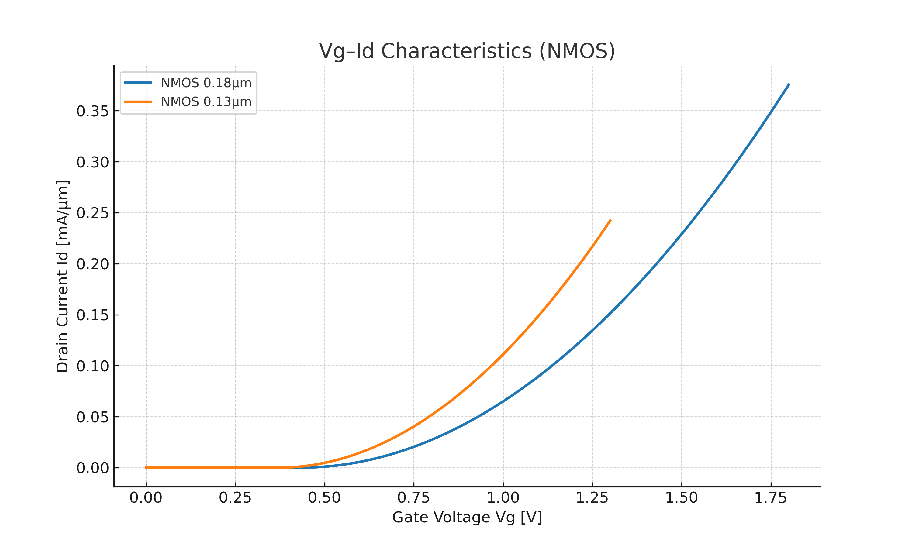
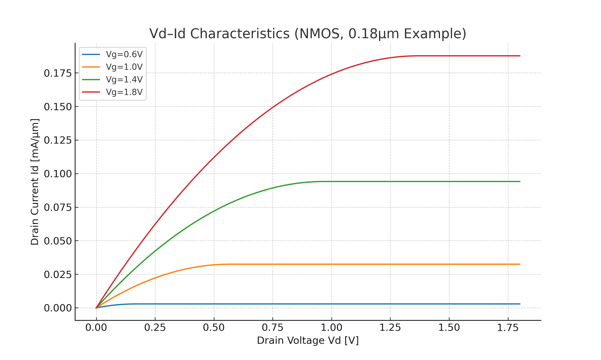
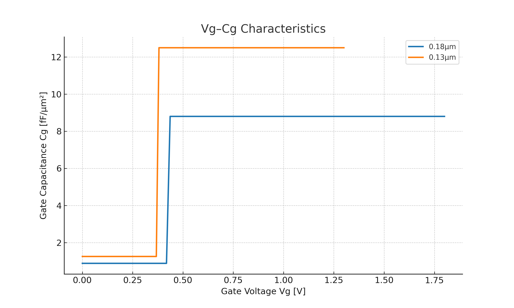

# 📎 付録B1: 0.18µm / 0.13µm MOSトランジスタ基礎特性  
**Appendix B1: Basic MOSFET Characteristics for 0.18µm / 0.13µm**

---

## 📝 概要 / Overview
**日本語**  
本付録では、0.18µmおよび0.13µmロジックプロセスにおけるMOSトランジスタの代表的な基礎特性を整理します。閾値電圧、ゲート酸化膜厚、移動度、飽和電流、リーク電流などを比較し、設計・教育における指針とします。  
現時点では教育用の簡易二乗則モデルで生成した特性グラフを掲載していますが、将来的に **ngspice + BSIM3モデル** による実測に近いシミュレーション結果へ置き換える予定です。

**English**  
This appendix summarizes representative basic characteristics of MOS transistors in 0.18µm and 0.13µm logic processes. Key parameters such as threshold voltage, gate oxide thickness, mobility, saturation current, and leakage current are compared for design and educational purposes.  
Currently, graphs are generated using a simplified square-law model for educational purposes, with plans to replace them with **ngspice + BSIM3 model** simulations in the future.

---

## 📊 基礎パラメータ比較 / Basic Parameter Comparison

| 項目 / Parameter | 単位 / Unit | **0.18 µm NMOS** | **0.18 µm PMOS** | **0.13 µm NMOS** | **0.13 µm PMOS** |
|---|---|---|---|---|---|
| チャネル長 Leff | nm | 180 | 180 | 130 | 130 |
| ゲート酸化膜厚 Tox | nm | 3.8〜4.0 | 3.8〜4.0 | 2.5〜2.7 | 2.5〜2.7 |
| 閾値電圧 Vth | V | 0.40〜0.45 | -0.40〜-0.45 | 0.35〜0.40 | -0.35〜-0.40 |
| 飽和電流 Idsat @ Vgs=Vdd | mA/µm | 0.55〜0.65 | 0.25〜0.30 | 0.70〜0.80 | 0.35〜0.40 |
| リーク電流 Ioff | nA/µm | 0.1〜1 | 0.1〜1 | 0.5〜5 | 0.5〜5 |
| 移動度 μn/μp | cm²/V·s | 500〜550 | 200〜250 | 450〜500 | 180〜220 |
| ゲート容量密度 Cox | fF/µm² | 8.6〜9.0 | 8.6〜9.0 | 12〜13 | 12〜13 |
| 供給電圧 Vdd | V | 1.8 | 1.8 | 1.2〜1.5 | 1.2〜1.5 |

---

## 📈 特性グラフ（簡易モデル版） / Characteristic Graphs (Simplified Model)

> **条件**: 単位幅（W=1µm）で規格化、教育用二乗則モデルで作成。将来BSIM3版に置き換え予定。

  
  
  

---

## 🔍 教育的ポイント / Educational Insights

**日本語**
- 酸化膜の薄膜化によりゲート容量密度が増加し、高速動作に寄与。  
- Vthの低下に伴うリーク電流増加は、低電力設計における重要課題。  
- 0.18µmはsky130と同様に1.8V駆動で扱いやすく、教育向け評価に最適。  
- 0.13µmは低電圧駆動・高周波動作の理解に適し、先端設計の橋渡しとして有効。

**English**
- Thinner oxide increases gate capacitance density, enabling higher-speed operation.  
- Lower Vth results in higher leakage current, a critical issue in low-power design.  
- 0.18µm, like sky130, operates at 1.8V, making it ideal for educational evaluation.  
- 0.13µm suits understanding of low-voltage, high-frequency operation, bridging to advanced nodes.

---

## 📦 参考: ngspice用BSIM3デッキ一式 + プロッタースクリプト  
**Reference: ngspice BSIM3 Decks + Plotter Script**

本付録のグラフをBSIM3モデルで再生成するためのデッキとスクリプトを用意しています。  
教育用のプレースホルダモデルを同梱していますが、実務では実PDKのBSIM3モデルに置き換えて使用してください。

📥 [BSIM3 Simulation Package (ngspice)](../assets/bsim3_pkg_with_models.zip)

**内容 / Contents**
- `README.md` – 実行手順  
- `decks/bsim3_vg_id.sp` – Vg–Id 特性（0.18µm/0.13µm NMOS）  
- `decks/bsim3_vd_id.sp` – Vd–Id 特性（0.18µm NMOS、Vgステップ）  
- `decks/bsim3_vg_cg.sp` – Vg–Cg 特性（0.18µm/0.13µm NMOS）  
- `models/bsim3_018.lib` – 教育用0.18µm NMOSモデル（BSIM3v3）  
- `models/bsim3_013.lib` – 教育用0.13µm NMOSモデル（BSIM3v3）  
- `tools/plot_bsim3_csv.py` – CSVからPNGを生成するPythonスクリプト

---

## 📡 今後の実測データ入手方法 / Future Acquisition of Measured Data

**日本語**  
将来的には、教育用プロセス（例: SkyWater sky130）の実測データを取得し、本付録のシミュレーション結果と比較します。具体的な入手方法は以下の通りです。  

1. **Google/SkyWater Shuttle Program**  
   - OpenMPW Shuttleを利用して設計したテストチップを無料製造。  
   - [https://developers.google.com/silicon](https://developers.google.com/silicon)  

2. **TinyTapeout / Efabless経由での有償試作**  
   - 小規模設計のMPW試作サービス。  
   - [https://tinytapeout.com/](https://tinytapeout.com/)  

3. **大学・教育機関の共同研究**  
   - 大学研究室や教育プロジェクトと連携し、実測チップデータを共有。  

4. **既存公開データセットの活用**  
   - SkyWater関連GitHubや論文の実測波形データを収集。  

**English**  
In the future, measured data from educational processes (e.g., SkyWater sky130) will be obtained and compared with the simulation results in this appendix. Potential sources include:

1. **Google/SkyWater Shuttle Program**  
   - Fabricate test chips for free via OpenMPW Shuttle.  
   - [https://developers.google.com/silicon](https://developers.google.com/silicon)  

2. **TinyTapeout / Efabless Paid MPW Services**  
   - Small-scale MPW prototyping service.  
   - [https://tinytapeout.com/](https://tinytapeout.com/)  

3. **University and Educational Collaborations**  
   - Partner with universities or educational projects to share measured chip data.  

4. **Public Dataset Utilization**  
   - Gather measured waveform data from SkyWater-related GitHub repos or academic publications.

---

🔙 [第4章に戻る / Back to Chapter 4](../f_chapter4_mos_basics/README.md)
