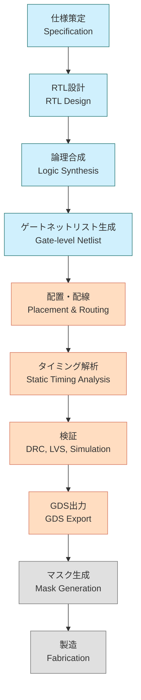

---

# 5.1 SoC設計全体フローと開発視点  
**5.1 Overview of SoC Design Flow and Development Perspective**

---

SoC（System on Chip）は、**複数の機能を単一チップに統合した高集積IC**です。  
その設計には、**論理・物理・検証・製造までの多段階プロセス**が必要です。

> SoC (System on Chip) integrates multiple functions into a single chip.  
> Its design involves **multiple phases** from logic and physical design to verification and manufacturing.

---

## 🗺️ SoC設計の全体フロー（概要図）  
**🗺️ SoC Design Flow (Process Diagram)**

> 各ステップでEDAツールを活用  
> EDA tools are used at each step

---

## 🔧 工程別の概要と関係性  
**🔧 Flow Summary by Phase**

| 工程 / Phase            | 目的 / Purpose                         | 出力 / Output              | ツール例 / Example Tools           |
|-------------------------|----------------------------------------|-----------------------------|-------------------------------------|
| RTL設計 / RTL Design    | 機能記述（HDLコード） / Functional Coding | RTLコード / HDL Files       | Verilog, SystemVerilog, Vivado     |
| 論理合成 / Synthesis    | ゲート変換 / Gate Mapping              | ネットリスト / Netlist      | Yosys, Design Compiler              |
| 配置配線 / P&R          | 物理配置 / Physical Placement          | レイアウト / Layout         | OpenROAD, Innovus                   |
| タイミング解析 / STA    | 遅延検証 / Timing Verification         | STAレポート / STA Reports   | OpenSTA, PrimeTime                  |
| 検証 / Verification     | DRC/LVS等の整合確認 / Physical Check  | DRC/LVSレポート / Reports   | Magic, Calibre                      |
| テスト挿入 / Test Insert| DFT構造追加 / DFT Implementation      | テストパターン / Test Vectors | Tessent, OpenDFT                  |
| GDS出力 / GDS Export    | 製造データ出力 / Final Manufacturing Data | GDSIIファイル / GDSII File | KLayout, Klayout                    |

---

## 🧠 開発視点の分業構造  
**🧠 Design Roles and Team Division**

| 区分 / Area           | 担当内容 / Responsibility                                  |
|------------------------|------------------------------------------------------------|
| 🟦 フロントエンド / Front-end | RTL記述、検証、合成、DFT構造設計 / RTL, Verification, Synthesis, DFT |
| 🟥 バックエンド / Back-end   | 配置配線、STA、DRC/LVS、GDS生成 / Layout, STA, Verification |
| 🟨 検証・テスト / Verification & Test | シミュレーション、パターン生成 / Simulation, Test Pattern Design |

> 📌 分業を理解した上で、**一貫設計フローの体験的学習**が効果的です。  
> 📌 Experience-based learning across full flow is ideal after understanding team roles.

---

## 🎓 教育的観点での導入ポイント  
**🎓 Educational Entry Points**

| 観点 / Perspective           | 解説 / Explanation                                                 |
|------------------------------|---------------------------------------------------------------------|
| ツールの役割理解 / Tool Roles | 各EDAツールが設計・検証・製造にどう関与するかを理解               |
| データフローの把握 / Data Flow | RTL → Netlist → Layout → GDS のデータ遷移を演習で体感               |
| 分業と連携 / Team Collaboration | フェーズ間インターフェース（STAやDFT）を意識した統合設計演習が効果的 |

---

## 🧭 次節への接続  
**🧭 Lead-in to Next Section**

SoC設計の出発点は、**標準セルライブラリ（Standard Cell Library）**の理解から始まります。  
次節では、**論理合成と物理設計に不可欠な構成単位**である標準セルの構造と設計法を扱います。

👉 [**5.2 標準セルとセルベース設計｜Standard Cell-Based Design**](5.2_standard_cell_based_design.md)

---

[← 戻る / Back to Chapter 5: SoC Design Flow Top](./README.md)
