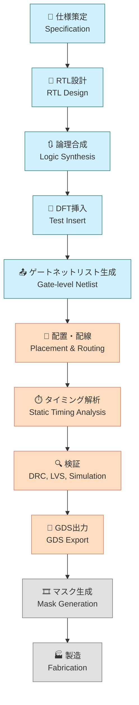

---

# 5.1 SoC設計全体フローと開発視点  
**5.1 Overview of SoC Design Flow and Development Perspective**

---

SoC（System on Chip）は、**複数の機能を単一チップに統合した高集積IC**です。  
その設計には、**論理設計・物理設計・検証・製造までの多段階プロセス**が必要です。

> SoC (System on Chip) integrates multiple functions into a single chip.  
> Its design involves **multiple phases**, including logic design, physical design, verification, and manufacturing.

---

## 🗺️ SoC設計の全体フロー（Mermaid図＋色分け＋アイコン）  
**🗺️ SoC Design Flow with Colored Mermaid Diagram and Icons**

> 🎯 各ステップでEDAツールを活用し、役割分担とデータ連携が重要となります。  
> EDA tools are essential at every step; team coordination and data flow are critical.

---

## 🔧 工程別の概要と関係性  
**🔧 Flow Summary by Phase**

| 工程 / Phase            | 目的 / Purpose                             | 出力 / Output              | ツール例 / Example Tools           |
|-------------------------|--------------------------------------------|-----------------------------|-------------------------------------|
| RTL設計 / RTL Design    | 機能記述（HDLコード） / Functional Coding   | RTLコード / HDL Files       | Verilog, SystemVerilog, Vivado     |
| 論理合成 / Synthesis    | ゲート変換 / Gate Mapping                  | 合成ネットリスト / Netlist  | Yosys, Design Compiler              |
| DFT挿入 / Test Insert   | テスト容易化構造の追加 / Insert DFT Logic | DFT付きNetlist / DFT Netlist | Tessent, OpenDFT                    |
| 配置配線 / P&R          | 論理の物理配置 / Physical Placement        | レイアウト / Layout         | OpenROAD, Innovus                   |
| タイミング解析 / STA    | 遅延検証 / Timing Verification             | STAレポート / STA Reports   | OpenSTA, PrimeTime                  |
| 検証 / Verification     | DRC/LVS等の整合確認 / Physical Check       | DRC/LVSレポート / Reports   | Magic, Calibre                      |
| GDS出力 / GDS Export    | 製造用データ生成 / Manufacturing Data Export | GDSIIファイル / GDSII File | KLayout, Klayout                    |

---

## 🧠 開発視点の分業構造  
**🧠 Design Roles and Team Division**

| 区分 / Area           | 担当内容 / Responsibility                                        |
|------------------------|------------------------------------------------------------------|
| 🟦 フロントエンド / Front-end | RTL設計、合成、DFT設計 / RTL, Synthesis, DFT                        |
| 🟥 バックエンド / Back-end   | 配置配線、STA、物理検証、GDS出力 / Layout, STA, Verification, GDS |
| ⬜️ 製造 / Manufacturing     | マスク作成、ウエハ製造 / Mask Generation, Fabrication              |

> 💡 分業を理解した上で、**一貫設計フローの体験的学習**が特に効果的です。  
> 💡 Once you understand the division of roles, experience-based learning across the entire flow becomes highly effective.

---

## 🎓 教育的観点での導入ポイント  
**🎓 Educational Entry Points**

| 観点 / Perspective             | 解説 / Explanation                                                   |
|--------------------------------|----------------------------------------------------------------------|
| ツールの役割理解 / Tool Roles   | 各EDAツールがどの工程で何を支援するのかを理解                         |
| データフローの把握 / Data Flow | RTL → Netlist → Layout → GDS の変換を演習形式で体感                     |
| 分業と連携 / Team Collaboration | STAやDFTなどのフェーズ連携を意識した統合設計の演習が有効                |
| DFTの導入意義 / Role of DFT     | テスト挿入の段階での構造理解と製造テストとの関係性を教育的に強調できる |

---

## 🧭 次節への接続  
**🧭 Lead-in to Next Section**

SoC設計の出発点は、**標準セルライブラリ（Standard Cell Library）**の理解から始まります。  
次節では、**論理合成と物理設計の基盤となる構成単位**としての標準セルについて解説します。

👉 [**5.2 標準セルとセルベース設計｜Standard Cell-Based Design**](5.2_standard_cell_based_design.md)

---

[← 戻る / Back to Chapter 5: SoC Design Flow Top](./README.md)
