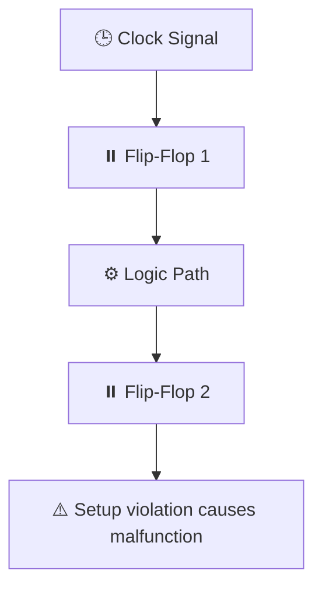

---

# 5.3 クロックとタイミング設計（STA入門）  
**5.3 Clock and Timing Design (Introduction to STA)**

SoC設計においては、複数のフリップフロップが同期して動作するため、  
**クロック設計とタイミング整合性の確保（Timing Closure）**が非常に重要です。

> Clock design and timing closure are crucial in SoC design,  
> where multiple flip-flops operate in synchronization.

---

## 🕰️ なぜタイミング設計が重要か？  
**🕰️ Why Is Timing Design Important?**

### ▶ 時間軸での信号整合性（Mermaid形式）｜Signal Alignment on Time Axis



- 遅延が大きすぎると「セットアップ違反」
- 早すぎると「ホールド違反」になる

---

## 🧭 STA（Static Timing Analysis）とは？  
**🧭 What Is STA?**

### ▶ 定義｜Definition

- **全てのクロック駆動経路について、静的にタイミングを検証する手法**
- 各信号がタイミング制約を満たすかを評価

> A static analysis method that checks if all clock-driven paths  
> meet their timing constraints without simulation.

### ▶ なぜ「静的」？｜Why "Static"?

- 最悪遅延（Worst-case delay）を網羅的に評価
- シミュレーション不要で高速かつ網羅的

---

## 📐 基本用語｜Key Terminology

| 用語 / Term        | 意味 / Meaning |
|--------------------|----------------|
| セットアップ時間    | クロック前にデータが安定すべき最小時間 |
| ホールド時間        | クロック後にデータが保持されるべき最小時間 |
| スラック（Slack）  | 許容遅延と実遅延の差（余裕） |
| クロックスキュー    | クロック信号の到達時間差 |

---

## 🧰 タイミング対策例｜Timing Design Techniques

| 課題 / Problem       | 対策 / Mitigation |
|----------------------|-------------------|
| セットアップ違反     | セル遅延の最適化／高速セルに置換／パイプライン追加 |
| ホールド違反         | インバータ追加／配線遅延の調整 |
| クロックスキュー     | クロックツリー合成（CTS）でのスキュー均等化 |

---

## 🎓 教育演習例｜Educational Exercises

| 演習内容 / Exercise | 学習目的 / Goal |
|---------------------|------------------|
| STAレポート解析     | 違反検出とスラック理解 |
| クロック経路観察     | CTS後の分配経路と遅延の可視化 |
| スラック調整実験     | セル変更による遅延変動の理解 |

---

## 🚦 OpenSTAの活用｜Using OpenSTA

- `OpenSTA` により、sky130等の設計に対してSTA検証が可能
- `.lib`（セル遅延情報）、`.sdc`（制約条件）を用いる

```bash
read_liberty sky130.lib
read_verilog netlist.v
read_sdc constraints.sdc
report_checks
```

> A powerful open-source STA tool that verifies setup/hold constraints  
> in standard-cell-based designs using liberty and SDC files.

---

## 📘 まとめと次節への導入  
**📘 Summary & Next Section**

STAは、**タイミング整合性と高信頼性設計の要**です。  
次節では、電源、リセット、I/Oといった**回路の基盤インフラ**の設計方法を学びます。

👉 [**5.4 電源・リセット・I/O設計の基礎｜Power, Reset, and I/O Design**](5.4_power_io_design.md)

---

[← 戻る / Back to Chapter 5: SoC Design Flow Top](./README.md)
