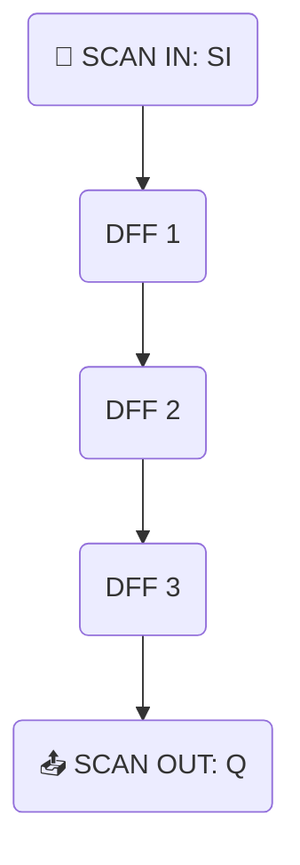

# 5.5 テスト構造（スキャン、JTAG、BIST）  
**5.5 Test Structures: Scan, JTAG, and BIST**

SoCなどの大規模ICでは、製造後の機能検証・不良検出のために、  
**テスト容易化設計（DFT: Design for Testability）** が不可欠です。  
> In large-scale ICs like SoCs, **Design for Testability (DFT)** is essential for post-fabrication validation and defect detection.

本節では、**スキャン構造・JTAG・BIST**などの基本概念と実装方法を学びます。  
> This section introduces key concepts and implementations of **scan chains, JTAG, and BIST**.

---

## 🎯 テスト構造の目的と分類  
**🎯 Purpose and Classification of Test Structures**

### ▶ なぜテストが必要か？｜Why is Testing Necessary?

- 配線断線・トランジスタ故障・製造ばらつきによる**不良検出**  
> Detect faults like wire breaks, transistor defects, or process variations  
- **大規模回路の内部状態を観測・制御**  
> Observe and control internal states of complex circuits not fully observable from I/Os

### ▶ 主な手法と分類｜Main Test Methods

| 🔍 手法 / Method | 概要 / Description |
|------------------|--------------------|
| 🔁 スキャン（Scan） | FFを直列化して状態観測を可能に |
| 🔌 JTAG           | 標準規格のテストアクセスポート |
| 🧠 BIST           | 回路自身による自己検査機構     |

---

## 🔁 スキャンチェーンの基礎  
**🔁 Basics of Scan Chains**

### ▶ 構造イメージ（Mermaid形式）｜Structure Image (Mermaid)

[GitHubでMermaidフローチャートを確認する](https://github.com/Samizo-AITL/Edusemi-v4x/blob/main/chapter5_soc_design_flow/5.5_test_structures.md)



- **スキャンイン（SI）**でFFにデータ入力  
> Input data via **Scan-In (SI)**
- 回路駆動後に**スキャンアウト**で状態取得  
> Observe final states via **Scan-Out**
  
### ▶ モード切替｜Mode Switching

| 🔧 信号名 | 機能 / Function |
|-----------|------------------|
| `scan_enable` | 通常／スキャンモード切替（0→通常, 1→スキャン） |

---

## 🔌 JTAG（IEEE 1149.1）  
**🔌 JTAG Interface (IEEE 1149.1)**

- 標準的な**テストアクセスポート（TAP）**規格  
> A standard **Test Access Port (TAP)** interface
- TDI→TDOの**バウンダリスキャン**により、ピン制御やデバッグが可能  
> Enables **boundary scan**, debug, and signal control

### ▶ 主な用途｜Use Cases

| 🛠️ 用途 / Use Case | 説明 / Description |
|---------------------|--------------------|
| 🏭 製造テスト        | 接続／短絡の検出     |
| 🐞 デバッグ          | 内部信号の確認・制御 |
| 💾 書き込み          | FPGA/MCUへのプログラム転送（例：SWD） |

---

## 🧠 BIST（自己検査機構）  
**🧠 Built-In Self Test (BIST)**

- 回路内に**テストパターン生成器（PG）**と**応答評価器（OR）**を持つ  
> Embeds **Pattern Generator (PG)** and **Output Response Analyzer (ORA)** within the circuit  
- 外部テストベクタなしで自己診断可能  
> Enables self-testing without external input patterns

### ▶ 実装例｜Implementation Examples

| 📦 種類 / Type | 対象 / Target      | 説明 / Description |
|----------------|--------------------|--------------------|
| MBIST          | メモリ（SRAM等）   | 読み書き検査パターンの自動生成 |
| LBIST          | ロジックブロック   | ランダムパターンによる機能検証 |

---

## 📐 DFT挿入の設計フロー  
**📐 Design Flow for DFT Insertion**

```
1. 論理合成後のネットリスト取得  
2. スキャンチェーン・テスト構造挿入  
3. 配置配線中にスキャンを考慮  
4. テストベクタ生成（DFTツールまたはATE連携）
```

> 📌 スキャンは**配線制約やSTAにも影響**するため、早期計画が重要  
> Scan logic affects layout and STA, requiring early design planning

---

## 🎓 教育的演習例｜Educational Exercises

| 🎓 テーマ / Theme | 🧪 内容 / Description |
|-------------------|------------------------|
| スキャン挿入とシミュレーション | `scan_enable` によるFF切替を可視化 |
| JTAG波形解析                | TDI/TDOの信号変化を観察 |
| 簡易BIST回路設計            | メモリテストの擬似実装と結果比較 |

---

## 📘 まとめと次章への導入  
**📘 Summary and Next Chapter**

テスト構造は、**製造後の品質保証・不良検出**のための要です。  
> Test structures are essential for **quality assurance and defect detection after fabrication**.

次章では、SoC完成後の**ウエハテスト、パッケージング、最終検査**など、  
製品として市場に出るまでの工程を学びます。  
> The next chapter covers **wafer-level testing, packaging, and final inspection** before product shipment.

👉 [第6章 テストとパッケージ｜Chapter 6: Test and Packaging](../chapter6_test_and_package/README.md)

---

[← 戻る / Back to Chapter 5: SoC Design Flow Top](./README.md)
