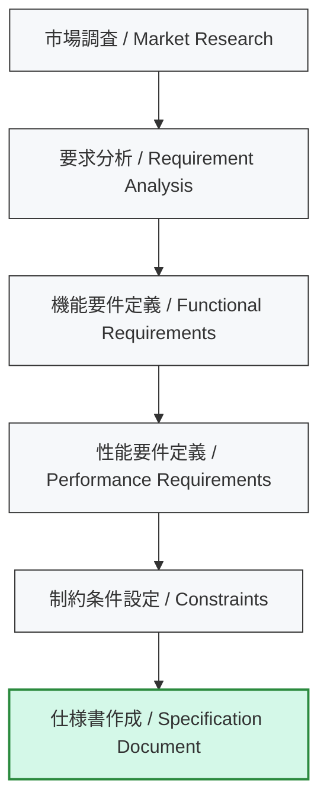

---

# 📘 基礎編 第5a.1節 : 仕様策定のプロセス  
**Fundamentals Chapter 5a.1 : Specification Process**

---

## 🗒 導入｜Introduction

| 🇯🇵 日本語 | 🇺🇸 English |
|-----------|-----------|
| SoC設計の成功は、最初の**仕様策定**でほぼ決まります。要求が曖昧なまま設計を進めると、後工程で手戻りが発生し、コスト・スケジュールに大きな影響を与えます。 | The success of SoC design is largely determined by the **specification process**. If requirements are vague, rework in later stages will cause significant cost and schedule impacts. |

---

## 🎯 節の目的｜Section Objectives

| 🇯🇵 日本語 | 🇺🇸 English |
|-----------|-----------|
| - SoC開発初期に必要な仕様策定の流れを理解する | - Understand the flow of specification definition required at the beginning of SoC development |
| - 機能要件・性能要件・制約条件の分類と整理方法を学ぶ | - Learn how to classify and organize functional requirements, performance requirements, and constraints |
| - PoCや量産移行を見据えた仕様の作り方を習得する | - Acquire methods of defining specifications with PoC and mass production in mind |

---

## 📝 仕様策定の基本フロー｜Basic Flow of Specification Definition

📍 **解説**  
- **市場調査**：対象市場の規模・競合・規格動向を把握  
- **要求分析**：顧客・社内要望を機能単位に整理  
- **要件定義**：性能と制約を数値化し、開発指針を確定  
- **仕様書作成**：全関係者が合意できる形に文書化  

---

## 📌 仕様策定で定義すべき項目｜Items to Define in Specification

| **項目** | **日本語説明** | **English Description** | **チェックポイント** |
|------|-----------|---------------------|-----------------|
| **機能要件** | 実装すべき機能や動作 | Functions and behaviors to be implemented | 必要機能の抜け漏れがないか |
| **性能要件** | 処理速度、スループット、消費電力など | Processing speed, throughput, power consumption | 定量化されているか（例：100 MB/s以上） |
| **制約条件** | 電源電圧範囲、温度条件、EMI規格など | Power voltage range, temperature conditions, EMI standards | 実現可能な範囲か |
| **拡張性** | 将来の機能追加や拡張に備えた余裕 | Allowance for future features and expansions | PoC後に改修可能か |
| **コスト目標** | 開発コスト・製造コスト | Development and manufacturing costs | 予算と整合しているか |

---

## 🔍 仕様策定の注意点｜Points to Consider

- **曖昧な表現を避ける**  
  ❌「高速」「低消費電力」  
  ✅「100 MB/s以上」「動作電流 50 mA以下」
- **評価方法を明記する**（どう測定・合否判定するか）
- **PoCで確認可能な指標を優先**（初期段階で実証しやすい項目から固める）

---

## 📎 仕様書例（付録）｜Specification Examples (Appendix)

📘 **[第5a.1a付録：仕様書フォーマットと具体例](appendix_5a1_spec_example.md)**  
実際の仕様書フォーマットと記入例を解説。

---

## 🔗 関連ページ｜Related Pages

- [📘 第5a.2節：モジュール選定の基準と事例](5a.2_module_selection.md)  
- [📘 第5a章 README](README.md)  

---

## 👤 著者・ライセンス｜Author & License

| 項目｜Item | 内容｜Details |
|------------|----------------------------|
| **著者｜Author** | 三溝 真一（Shinichi Samizo） |
| **GitHub** | [Samizo-AITL](https://github.com/Samizo-AITL) |
| **Email** | [shin3t72@gmail.com](mailto:shin3t72@gmail.com) |
| **ライセンス｜License** | MIT License（再配布・改変自由） Redistribution and modification allowed |

---

## 🔙 戻る｜Back to Chapter 5a
**🏠 [第5a章トップへ戻る｜Back to Chapter 5a Top](README.md)**
