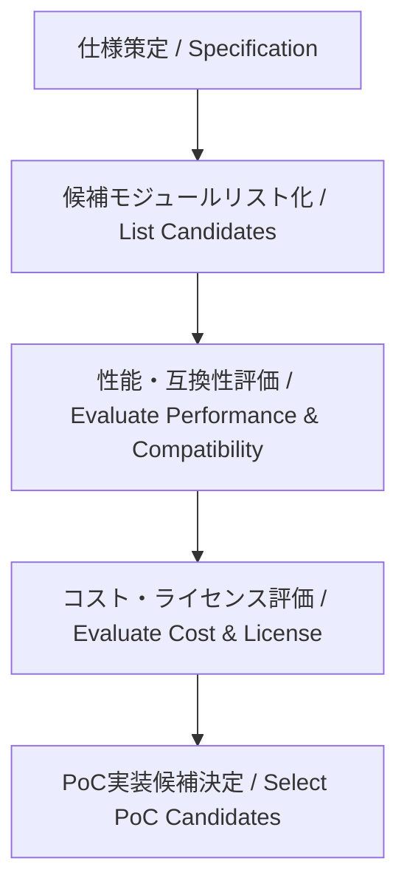

---

# 📘 基礎編 第5a.2節 : モジュール選定の基準と事例  
**Fundamentals Chapter 5a.2 : Module Selection Criteria and Examples**

---

## 🎯 節の目的｜Section Objectives

| 🇯🇵 日本語 | 🇺🇸 English |
|-----------|-----------|
| - SoC設計における主要モジュールの種類と役割を理解する | - Understand the types and roles of key modules in SoC design |
| - モジュール選定の基準を整理し、PoCや量産に適した構成を判断できるようにする | - Learn the criteria for selecting modules suitable for PoC and mass production |
| - モジュール間のインターフェースや互換性を評価できるようにする | - Acquire the ability to evaluate interfaces and compatibility between modules |

---

## 🛠 モジュール選定の基本方針｜Basic Principles for Module Selection

1. **性能要件との適合性**  
   - 処理速度、スループット、消費電力などの性能指標を満たすか  
2. **インターフェース互換性**  
   - 外部通信IF、内部バスIF、メモリIFとの接続が可能か  
3. **実装容易性**  
   - FPGAやシミュレーション環境で容易に検証できるか  
4. **ライセンス・コスト**  
   - IPコアの利用条件やライセンス費用が予算に収まるか  
5. **拡張性・保守性**  
   - 将来的な機能追加や改善が可能か

---

## 📌 代表的なモジュールと選定基準｜Representative Modules and Selection Criteria

| モジュール | 選定基準例 | 備考 |
|------------|-----------|------|
| **CPUコア** | 性能、命令セット互換性、ライセンス形態 | RISC-V, ARM, MIPSなど |
| **DSP** | 演算精度、MAC性能、消費電力 | 音声・画像処理向け |
| **メモリ** | 容量、速度、低電力特性 | SRAM, DDR, MRAM |
| **AMS** | 分解能、SNR、帯域幅 | ADC, DAC, PLL, センサIF |
| **I/Oモジュール** | 外部IFとの互換性、駆動能力 | Ethernet MAC, USB PHY等 |

---

## 📊 モジュール選定フロー（Mermaid図）

---

## 🔍 選定時の注意点｜Points to Consider

- PoCで使うIPと量産時のIPが同じでなくても良いが、**互換性のある置き換え先**を確保する  
- AMSや特殊I/Fは早期に候補を固定し、**パッケージやピン配置に反映**する  
- FPGAでの事前検証が困難な場合、**シミュレーション環境や評価ボードで代替検証**する

---

## 🔗 関連ページ｜Related Pages

- [第5a.1節：仕様策定のプロセス](5a.1_spec_process.md)  
- [第5a.3節：インターフェース設計と種類](5a.3_interface_design.md)  
- [第5a章 README](README.md)  

---

## 👤 著者・ライセンス｜Author & License

| 項目｜Item | 内容｜Details |
|------------|----------------------------|
| **著者｜Author** | 三溝 真一（Shinichi Samizo） |
| **GitHub** | [Samizo-AITL](https://github.com/Samizo-AITL) |
| **Email** | [shin3t72@gmail.com](mailto:shin3t72@gmail.com) |
| **ライセンス｜License** | MIT License（再配布・改変自由） Redistribution and modification allowed |

---

## 🔙 戻る｜Back to Chapter 5a
**🏠 [第5a章トップへ戻る｜Back to Chapter 5a Top](README.md)**
