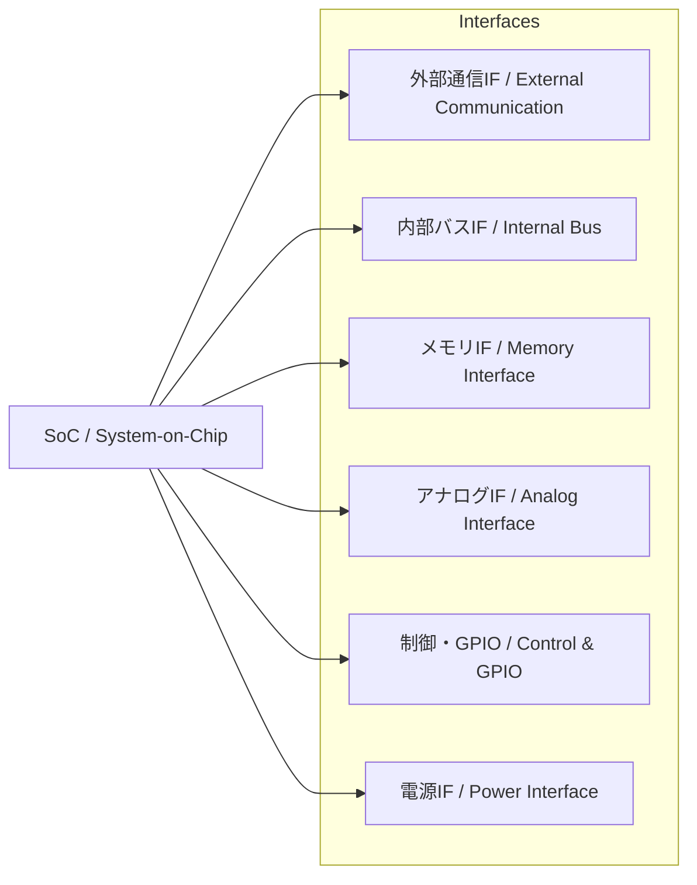

---

# 📘 基礎編 第5a.3節 : インターフェース設計と種類  
**Fundamentals Chapter 5a.3 : Interface Design and Types**

---

## 🎯 節の目的｜Section Objectives

| 🇯🇵 日本語                                                                                  | 🇺🇸 English                                                                                       |
|---------------------------------------------------------------------------------------------|---------------------------------------------------------------------------------------------------|
| - SoC設計におけるインターフェース（IF）の役割を理解する                                     | - Understand the role of interfaces (IF) in SoC design                                           |
| - 外部通信・内部バス・メモリ・アナログ・制御・電源の各IF種類と特徴を整理する                 | - Learn the types and characteristics of external communication, internal bus, memory, analog, control, and power interfaces |
| - 選定基準と設計上の注意点を学び、PoCや量産で問題のないIF構成を計画できるようにする         | - Learn selection criteria and design considerations to plan IF configurations suitable for PoC and mass production |

---

## 🔌 インターフェースの分類｜Classification of Interfaces

| 種類｜Type                  | 例｜Examples                               | 選定基準｜Selection Criteria                  |
|-----------------------------|--------------------------------------------|-----------------------------------------------|
| **外部通信IF / External Communication** | Ethernet, USB, PCIe, CAN, UART, SPI, I²C | データレート / Data rate, 規格準拠 / Compliance, ケーブル長 / Cable length |
| **内部バスIF / Internal Bus**           | AMBA (AXI/AHB/APB), Wishbone, TileLink   | 帯域幅 / Bandwidth, レイテンシ / Latency, IP互換性 / IP compatibility |
| **メモリIF / Memory Interface**         | DDR4/5, LPDDR, SRAM, MRAM                | 容量 / Capacity, 速度 / Speed, 低電力性 / Low power |
| **アナログIF / Analog Interface**       | ADC, DAC, LVDS, MIPI CSI/DSI             | 分解能 / Resolution, 帯域幅 / Bandwidth, 信号品質 / Signal quality |
| **制御/GPIO / Control & GPIO**          | GPIO, PWM, Interrupt lines               | 本数 / Pin count, 駆動能力 / Drive strength, 電圧レベル / Voltage level |
| **電源IF / Power Interface**            | Power pins, PMIC, Voltage monitor        | 電圧レール数 / Number of rails, リップル許容 / Ripple tolerance |

---

## 📊 IF構成例（Mermaid図｜LR・右側1列）

---

## 🛠 IF設計のポイント｜Points for IF Design

1. **帯域幅の見積もり / Bandwidth Estimation**  
   - データ転送量から必要帯域を算出し、IF規格を選定する  
   - Calculate required bandwidth from data throughput and choose the appropriate standard
2. **レイテンシとリアルタイム性 / Latency & Real-time Requirements**  
   - 制御用途では応答遅延の上限を考慮  
   - Consider maximum response delay for control applications
3. **互換性と将来拡張 / Compatibility & Future-proofing**  
   - 将来の規格や代替IFへの移行を想定  
   - Plan for future standards and alternative interfaces
4. **物理層の制約 / Physical Layer Constraints**  
   - 配線長、インピーダンス、ESD保護など  
   - Routing length, impedance, and ESD protection
5. **FPGA PoCでの検証性 / FPGA PoC Verification**  
   - PoC環境で実装可能なIFを優先  
   - Prioritize IFs that can be implemented in PoC environments

---

## ⚠️ 設計時の注意点｜Points to Consider

- **規格の組み合わせによる衝突**（例：I/O電圧の不一致）  
  **Conflicts between standards** (e.g., I/O voltage mismatch)
- **クロックドメインの分離と同期設計**  
  **Clock domain separation and synchronization**
- **信号品質の確保（SI/PI解析）**  
  **Maintaining signal quality (SI/PI analysis)**

---

## 📋 インターフェース性能概要｜Interface Performance Overview

| インターフェース / Interface | 最大速度（理論値） / Max Speed | 典型距離 / Typical Distance | 主用途 / Main Applications |
|-----------------------------|-------------------------------|-----------------------------|----------------------------|
| **I²C (Std/Fast)**           | 100 / 400 kbps                | ～1 m                       | センサ制御 / Sensor control |
| **SPI**                     | ～50 Mbps                     | 数十 cm                     | LCD制御 / LCD control      |
| **UART**                    | ～1 Mbps                      | 数 m                        | デバッグ / Debug           |
| **USB 3.x**                  | 5 Gbps                        | 数 m                        | 外部I/O / External I/O     |
| **Ethernet (1G)**            | 1 Gbps                        | ～100 m                     | ネットワーク / Networking  |
| **DDR4-3200**                | 3.2 Gbps                      | 数 cm                       | メインメモリ / Main memory |

> **詳細な速度・レイテンシ・用途マップは[5a.3a付録](5a.3a_interface_speed_map.md)を参照**

---

## 🔗 関連ページ｜Related Pages

- [第5a.2節：モジュール選定の基準と事例](5a.2_module_selection.md)  
- [第5a.4節：PoCへの接続](5a.4_linking_poc.md)  
- [第5a章 README](README.md)  

---

## 👤 著者・ライセンス｜Author & License

| 項目｜Item | 内容｜Details |
|------------|----------------------------|
| **著者｜Author** | 三溝 真一（Shinichi Samizo） |
| **GitHub** | [Samizo-AITL](https://github.com/Samizo-AITL) |
| **Email** | [shin3t72@gmail.com](mailto:shin3t72@gmail.com) |
| **ライセンス｜License** | MIT License（再配布・改変自由） Redistribution and modification allowed |

---

## 🔙 戻る｜Back to Chapter 5a
**🏠 [第5a章トップへ戻る｜Back to Chapter 5a Top](README.md)**
