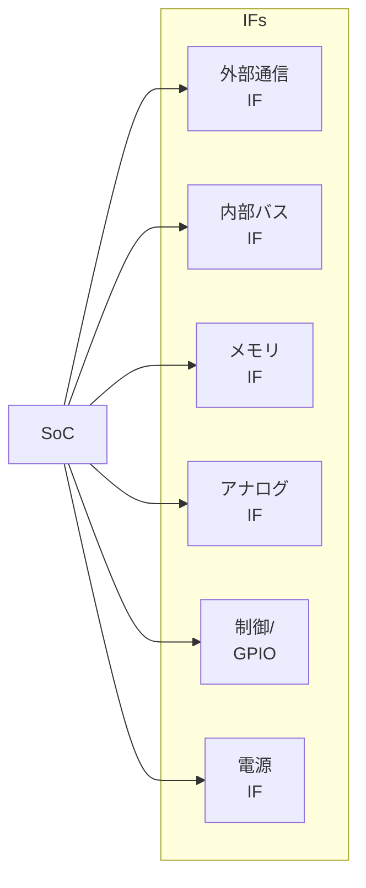

# 📘 基礎編 第5a.3節 : インターフェース設計と種類  
**Fundamentals Chapter 5a.3 : Interface Design and Types**

---

## 🎯 節の目的｜Section Objectives

| 🇯🇵 日本語 | 🇺🇸 English |
|-----------|-----------|
| - SoC設計におけるインターフェース（IF）の役割を理解する | - Understand the role of interfaces (IF) in SoC design |
| - 外部通信・内部バス・メモリ・アナログ・制御・電源の各IF種類と特徴を整理する | - Learn the types and characteristics of external communication, internal bus, memory, analog, control, and power interfaces |
| - 選定基準と設計上の注意点を学び、PoCや量産で問題のないIF構成を計画できるようにする | - Learn selection criteria and design considerations to plan IF configurations suitable for PoC and mass production |

---

## 🔌 インターフェースの分類｜Classification of Interfaces

| 種類 | 例 | 選定基準 |
|------|---|----------|
| **外部通信IF** | Ethernet, USB, PCIe, CAN, UART, SPI, I²C | データレート、規格準拠、ケーブル長 |
| **内部バスIF** | AMBA (AXI/AHB/APB), Wishbone, TileLink | 帯域幅、レイテンシ、IP互換性 |
| **メモリIF** | DDR4/5, LPDDR, SRAM, MRAM | 容量、速度、低電力性 |
| **アナログIF** | ADC, DAC, LVDS, MIPI CSI/DSI | 分解能、帯域幅、信号品質 |
| **制御/GPIO** | GPIO, PWM, 割り込み線 | 本数、駆動能力、電圧レベル |
| **電源IF** | 電源ピン、PMIC、電圧監視 | 電圧レール数、リップル許容 |

---

## 📊 IF構成例（Mermaid図：LR・右側1列）

---

## 🛠 IF設計のポイント｜Points for IF Design

1. **帯域幅の見積もり**  
   - データ転送量から必要帯域を算出し、IF規格を選定する
2. **レイテンシとリアルタイム性**  
   - 制御用途では応答遅延の上限を考慮する
3. **互換性と将来拡張**  
   - 将来のバージョン規格や代替IFへの移行を想定
4. **物理層の制約**  
   - 配線長、インピーダンス、ESD保護などの実装要件
5. **FPGA PoCでの検証性**  
   - PoC環境で実装可能なIFを優先

---

## 🔍 設計時の注意点｜Points to Consider

- **規格の組み合わせによる衝突**（例：I/O電圧の不一致）
- **クロックドメインの分離と同期設計**
- **信号品質の確保**（SI/PI解析を上流段階から計画）

---

## 🔗 関連ページ｜Related Pages

- [第5a.2節：モジュール選定の基準と事例](5a.2_module_selection.md)  
- [第5a.4節：PoCへの接続](5a.4_linking_poc.md)  
- [第5a章 README](README.md)  

---

## 👤 著者・ライセンス｜Author & License

| 項目｜Item | 内容｜Details |
|------------|----------------------------|
| **著者｜Author** | 三溝 真一（Shinichi Samizo） |
| **GitHub** | [Samizo-AITL](https://github.com/Samizo-AITL) |
| **Email** | [shin3t72@gmail.com](mailto:shin3t72@gmail.com) |
| **ライセンス｜License** | MIT License（再配布・改変自由） Redistribution and modification allowed |

---

## 🔙 戻る｜Back to Chapter 5a
**🏠 [第5a章トップへ戻る｜Back to Chapter 5a Top](README.md)**
