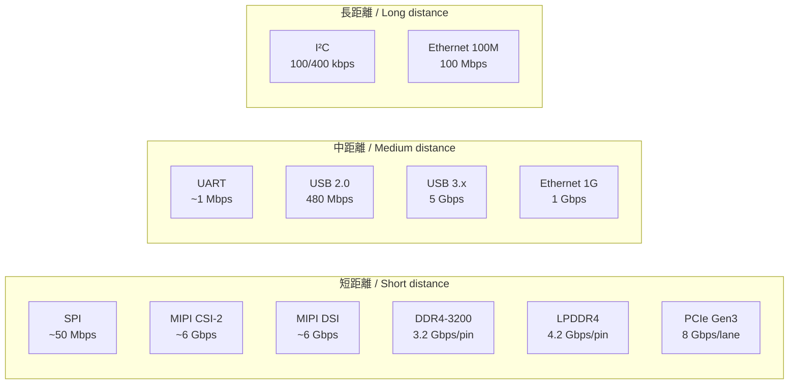

# 📎 基礎編 第5a.3a付録 : インターフェース性能比較マップ  
**Fundamentals Appendix 5a.3a : Interface Performance Comparison Map**

---

## 🎯 付録の目的｜Purpose of This Appendix

| 🇯🇵 日本語 | 🇺🇸 English |
|-----------|-----------|
| 各種インターフェースの**速度・レイテンシ・距離・用途**を一目で比較できるようにする | Provide a side-by-side comparison of various interfaces in terms of **speed, latency, distance, and applications** |
| PoC段階と量産段階での**最適IF選定の判断材料**とする | Serve as a decision-making reference for selecting the optimal interface at PoC and mass production stages |

---

## 📊 インターフェース性能比較表｜Interface Performance Table

| インターフェース / Interface | 最大速度（理論値） / Max Speed | レイテンシ / Latency | 典型距離 / Typical Distance | 主用途 / Main Applications |
|-----------------------------|-------------------------------|---------------------|-----------------------------|----------------------------|
| **I²C (Std/Fast)**           | 100 / 400 kbps                | 高 / High           | ～1 m                       | センサ制御 / Sensor control |
| **SPI**                     | ～50 Mbps                     | 低 / Low            | 数十 cm                     | LCD制御、外部ADC/DAC / LCD control, external ADC/DAC |
| **UART**                    | ～1 Mbps                      | 中 / Medium         | 数 m                        | デバッグ、設定 / Debug, configuration |
| **USB 2.0**                  | 480 Mbps                      | 低 / Low            | 数 m                        | 外部I/O、データ転送 / External I/O, data transfer |
| **USB 3.x**                  | 5 Gbps                        | 低 / Low            | 数 m                        | 高速外部I/O / High-speed external I/O |
| **Ethernet (100M/1G)**       | 100 Mbps / 1 Gbps              | 中 / Medium         | ～100 m                     | ネットワーク接続 / Networking |
| **PCI Express Gen3**         | 8 Gbps/lane                    | 低 / Low            | 数十 cm                     | 高速内部接続 / High-speed internal connection |
| **DDR4-3200**                | 3.2 Gbps/pin                   | 非常に低 / Very low | 数 cm                       | メインメモリ / Main memory |
| **LPDDR4**                   | 4.2 Gbps/pin                   | 非常に低 / Very low | 数 cm                       | モバイル用メモリ / Mobile memory |
| **MIPI CSI-2**               | ～6 Gbps/lane                  | 低 / Low            | 数十 cm                     | カメラ入力 / Camera input |
| **MIPI DSI**                 | ～6 Gbps/lane                  | 低 / Low            | 数十 cm                     | ディスプレイ出力 / Display output |

---

## 🗺 性能マップ（帯域幅 vs 距離）｜Performance Map (Bandwidth vs Distance)

---

## 🛠 設計での使い方｜How to Use in Design

- **PoC段階**では実装容易性とFPGA互換性を優先  
  *At PoC stage, prioritize ease of implementation and FPGA compatibility*
- **量産段階**では信号品質・規格適合・EMC対策を重視  
  *At mass production stage, focus on signal integrity, standard compliance, and EMC countermeasures*
- 高速IFは**配線長・レイアウト制約**が大きくなるため、早期に基板・パッケージ設計と連携  
  *High-speed IFs require early co-design with PCB and package designers due to length/layout constraints*

---

## 🔙 戻る｜Back

**⬅ [第5a.3節：インターフェース設計と種類](5a.3_interface_design.md)**  
**🏠 [第5a章トップ](README.md)**
