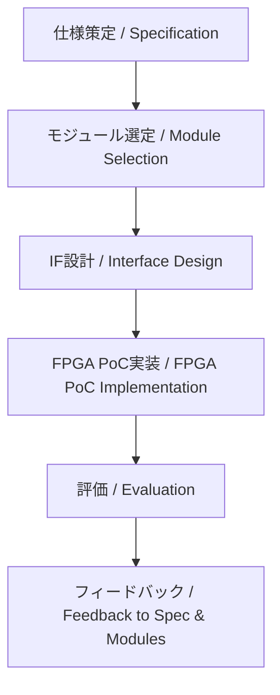

---

# 📘 基礎編 第5a.4節 : PoCへの接続  
**Fundamentals Chapter 5a.4 : Linking to PoC**

---

## 🗒 導入｜Introduction

| 🇯🇵 日本語 | 🇺🇸 English |
|-----------|-----------|
| 本節では、上流工程で決定した仕様・モジュール・インターフェース（IF）を、PoC（Proof of Concept）に接続し、実機やFPGAを用いて検証する流れを解説します。また、AMS混載環境や物理制約の観点から、PoC設計の重要なチェックポイントと、結果を設計へフィードバックする方法を整理します。 | This section explains how to link specifications, modules, and interfaces (IF) decided in the upstream process to the Proof of Concept (PoC) and verify them using FPGA or hardware. It also covers important checkpoints for PoC design from AMS mixed-signal and physical constraint perspectives, and how to feed results back into the design. |

---

## 🎯 節の目的｜Section Objectives

| 🇯🇵 日本語 | 🇺🇸 English |
|-----------|-----------|
| - 上流工程で決定した仕様・モジュール・IFをPoCに接続する流れを理解する | - Understand how to link upstream specifications, modules, and interfaces to PoC |
| - FPGA実装やAMS混載検証の観点からPoC設計の要点を把握する | - Learn key PoC design points for FPGA implementation and AMS verification |
| - PoCの結果を仕様やモジュール構成にフィードバックする方法を学ぶ | - Learn how to feed PoC results back into specifications and module configurations |

---

## 🔗 PoCへの接続フロー｜Flow for Linking to PoC

> 💡 GitHubでMermaid図を確認  
> [🔗 View on GitHub (5a.4_linking_poc.md)](https://github.com/Samizo-AITL/Edusemi-v4x/blob/main/chapter5a_spec_module_if/5a.4_linking_poc.md)

---

## 🛠 PoC実装で確認すべき項目｜Key Items to Verify in PoC

| **項目 / Item** | **日本語説明 / Description (JP)** | **English Description (EN)** |
|-----------------|----------------------------------|--------------------------------|
| **機能確認** | 仕様通りの動作をしているか | Verify if the system operates as specified |
| **性能評価** | 処理速度・スループット・遅延を計測 | Measure processing speed, throughput, and latency |
| **IF動作確認** | 外部通信や内部バスが正しく動作するか | Verify external communication and internal bus operation |
| **AMS混載検証** | アナログ・デジタル間の干渉や性能劣化の有無 | Check for interference or performance degradation between analog and digital |
| **物理制約評価** | 熱・電源・EMIなどの物理条件を確認 | Check thermal, power, and EMI conditions |

---

## 📌 フィードバックの重要性｜Importance of Feedback

- **設計初期での修正コスト削減**  
  Early feedback from PoC reduces modification costs in later stages.  
- **仕様・モジュール構成の改善**  
  Use PoC findings to refine specifications and module configurations.  
- **次世代・派生製品への応用**  
  Leverage results for next-generation and derivative products.

---

## 🔍 設計時の注意点｜Points to Consider

1. **FPGAと量産ASICの差異を明記**  
   Document differences in constraints between FPGA PoC and mass production ASIC.  
2. **AMSや高速IFの早期検証**  
   Test analog/mixed-signal and high-speed IF under near-real conditions early.  
3. **物理解析結果の統合**  
   Integrate FEM, SI/PI, EMI results into PoC evaluation for realistic constraints.

---

## 🔗 関連ページ｜Related Pages

- [📘 第5a.3節：インターフェース設計と種類](5a.3_interface_design.md)  
- [📘 第5章：SoC設計フローとEDAツール](../chapter5_soc_design_flow/README.md)  
- [📘 第5a章 README](README.md)  

---

## 👤 著者・ライセンス｜Author & License

| 項目｜Item | 内容｜Details |
|------------|----------------------------|
| **著者｜Author** | 三溝 真一（Shinichi Samizo） |
| **GitHub** | [Samizo-AITL](https://github.com/Samizo-AITL) |
| **Email** | [shin3t72@gmail.com](mailto:shin3t72@gmail.com) |
| **ライセンス｜License** | MIT License（再配布・改変自由） Redistribution and modification allowed |

---

## 🔙 戻る｜Back to Chapter 5a
**🏠 [第5a章トップへ戻る｜Back to Chapter 5a Top](README.md)**
