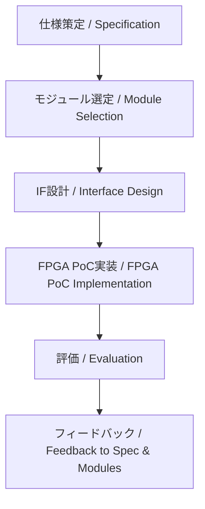

---

# 📘 基礎編 第5a.4節 : PoCへの接続  
**Fundamentals Chapter 5a.4 : Linking to PoC**

---

## 🎯 節の目的｜Section Objectives

| 🇯🇵 日本語 | 🇺🇸 English |
|-----------|-----------|
| - 上流工程で決定した仕様・モジュール・IFをPoC（Proof of Concept）に接続する流れを理解する | - Understand how to link the specifications, modules, and interfaces decided in the upstream process to the Proof of Concept (PoC) |
| - FPGA実装やAMS混載検証の観点からPoC設計の要点を把握する | - Learn key points of PoC design from the perspective of FPGA implementation and AMS mixed-signal verification |
| - PoCの結果を仕様やモジュール構成にフィードバックする方法を学ぶ | - Learn how to feed back PoC results into specifications and module configurations |

---

## 🔗 PoCへの接続フロー｜Flow for Linking to PoC

---

## 🛠 PoC実装で確認すべき項目｜Key Items to Verify in PoC

| 項目 | 日本語説明 | English Description |
|------|-----------|---------------------|
| **機能確認** | 仕様通りの動作をしているか | Does it function as specified? |
| **性能評価** | 処理速度・スループット・遅延を計測 | Measure processing speed, throughput, and latency |
| **IF動作確認** | 外部通信や内部バスが正しく動作するか | Verify external communication and internal bus operation |
| **AMS混載検証** | アナログ・デジタル間の干渉や性能劣化の有無 | Check for interference or performance degradation between analog and digital |
| **物理制約評価** | 熱・電源・EMIなどの物理条件を確認 | Check thermal, power, and EMI conditions |

---

## 📌 フィードバックの重要性｜Importance of Feedback

- PoCで得られた知見は**仕様書とモジュール構成に即反映**
- 量産設計に移行する前に**問題点を洗い出す**
- 評価結果は**次世代設計や派生製品にも活用可能**

---

## 🔍 設計時の注意点｜Points to Consider

- FPGA実装の制約が量産時の制約と異なる場合があるため、**差異を明記**しておく
- AMSや高速IFはPoC段階で**実動作環境に近い条件で試験**
- 物理解析（FEM, SI/PI, EMI）結果を早期に取り込む

---

## 🔗 関連ページ｜Related Pages

- [第5a.3節：インターフェース設計と種類](5a.3_interface_design.md)  
- [第5章：SoC設計フローとEDAツール](../chapter5_soc_design_flow/README.md)  
- [第5a章 README](README.md)  

---

## 👤 著者・ライセンス｜Author & License

| 項目｜Item | 内容｜Details |
|------------|----------------------------|
| **著者｜Author** | 三溝 真一（Shinichi Samizo） |
| **GitHub** | [Samizo-AITL](https://github.com/Samizo-AITL) |
| **Email** | [shin3t72@gmail.com](mailto:shin3t72@gmail.com) |
| **ライセンス｜License** | MIT License（再配布・改変自由） Redistribution and modification allowed |

---

## 🔙 戻る｜Back to Chapter 5a
**🏠 [第5a章トップへ戻る｜Back to Chapter 5a Top](README.md)**
