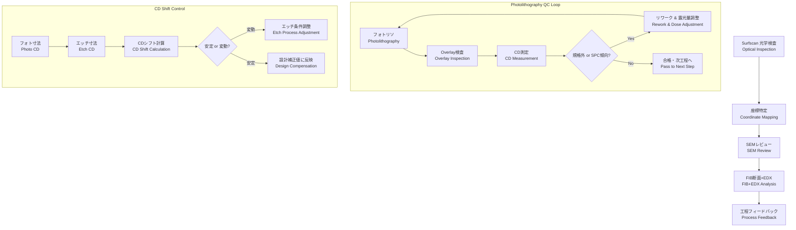

---

# 6.3a プロセス工程内のフィードバック  
**6.3a In-Process Feedback in Semiconductor Manufacturing**

完成チップの不良解析（6.3）が「最終的な原因究明」であるのに対し、  
**プロセス工程内のフィードバック (*in-process feedback*)** は、製造途中での検査・モニタリング結果を工程条件へ反映し、  
**歩留まり改善 (*yield improvement*) と再発防止 (*recurrence prevention*)** を実現する仕組みです。  

---

## 🔍 工程内欠陥解析とフィードバック  
**Defect Inspection and Process Feedback**

1. **光学式異物検査 (*optical defect inspection*)**  
   - *Surfscan*（KLA）でウェハ表面をレーザースキャンし、異物を座標マッピング。  

2. **欠陥座標特定・分類 (*defect coordinate identification & classification*)**  
   - 検出された欠陥を座標データ（*WaferID, die coordinate, (x,y)*)として記録。  
   - 系統的欠陥かランダム欠陥かをクラスタ解析。  

3. **SEMレビュー (*SEM review*)**  
   - 欠陥座標をSEMで観察し、**形状 (*morphology*)** を確認。  
   - 例：パーティクル (*particle*), スクラッチ (*scratch*), パターン欠陥 (*pattern defect*)。  

4. **FIB断面＋元素分析 (*FIB cross-section + EDX analysis*)**  
   - *FIB*で断面を作製 → STEM/EDXで構造と元素を特定。  
   - 例：Cu粒子 (*Cu particle*), レジスト残渣 (*resist residue*), CMP由来スクラッチ (*CMP-induced scratch*)。  

5. **工程フィードバック (*process feedback*)**  
   - 欠陥の発生工程を特定し、装置・条件に反映。  
   - 例：スパッタ装置部品摩耗 (*sputter chamber part wear*),  
         CVDパーティクル (*CVD particle contamination*),  
         CMPパッド摩耗 (*CMP pad wear*)。  

---

## 🛰️ フォトリソQCループとSPC調整  
**Photolithography QC Loop and SPC Adjustment**

1. **フォトリソ (*photolithography*)**  
   - レジスト塗布 → 露光 → 現像。  

2. **合わせ検査 (*overlay inspection*)**  
   - 既存パターンと新規レイヤーの位置ずれ (*overlay error*) を測定。  

3. **レジスト寸法測定 (*CD measurement*)**  
   - CD-SEMでレジストの線幅 (*critical dimension, CD*) を測定。  

4. **規格外検出 (*out-of-spec detection*)**  
   - 規格値を超えた場合は不合格と判定。  

5. **リワーク (*rework*)**  
   - レジストを剥離し (*resist strip*)、再露光。  

6. **SPCによる傾向検出 (*trend detection via SPC*)**  
   - 管理図 (*control chart*) でCDやOverlayの推移を監視。  
   - 例：平均を超えて **連続上昇／下降** する場合、装置ドリフトと判断。  

7. **露光量・フォーカス調整 (*exposure dose & focus adjustment*)**  
   - Stepper/Scannerの条件を微調整し、次ロットから適用。  

---

## ⚖️ CDシフト管理と工程間フィードバック  
**CD Shift Control and Cross-Step Feedback**

フォトリソで形成した寸法と、エッチング後の寸法には差が生じます。  
これを **CDシフト (*critical dimension shift*)** と呼びます。

$$
CD_{shift} = CD_{Etch} - CD_{Photo}
$$

### ● 原因と影響｜*Causes & Effects*
- **過エッチング (*over-etch*)** → 寸法が細くなる  
- **アンダーエッチ (*under-etch*)** → 寸法が太くなる  
- **プラズマ条件ドリフト**（RFパワー、ガス流量、圧力）  
- **側壁反応・異方性**によるプロファイル変化  

### ● フィードバックの実務｜*Feedback to Etching Process*
- CDシフトが **安定して一定** → 設計ルール上の補正値として考慮  
- CDシフトが **変動して不安定** → エッチング条件にフィードバック  
  - プラズマ条件（RF、ガス流量、圧力）最適化  
  - エッチ時間補正  
  - 装置クリーニング・メンテナンス  

### ● SPCによる監視｜*SPC Monitoring*
- CDシフトをロットごとに測定 → 管理図にプロット  
- **連続して上昇/下降傾向**があれば、エッチ工程のドリフトと判断  
- 条件補正を実施し、次ロットに反映  

---

## 📊 フローチャート (Mermaid)

---

## ✅ 教材ポイント｜*Educational Takeaways*

- 工程内フィードバックは **「欠陥解析ループ」「フォトリソQCループ」「CDシフト管理」** の三本柱で構成される。  
- SPCは単なる規格外検出ではなく、**傾向監視による予防調整**が核心。  
- CDシフトは **フォトとエッチを跨ぐ協調制御**の代表例であり、寸法制御の本質を示す。  
- 半導体製造のQCは **不良を直すのではなく、次ロットを改善する学習サイクル** である。  

---

[← 戻る / Back to Chapter 6: Test and Package Top](./README.md)
