---

# 6.4 パッケージ工程：実装と信頼性確保  
**6.4 Package Process: Assembly and Reliability Assurance**

---

ウエハテストを通過した良品チップは、**物理的・電気的に保護されたパッケージへと実装**される。  
> Good dies that pass wafer testing are physically and electrically packaged to ensure functionality and protection.

パッケージ工程では、**製品の実装信頼性と長期耐久性を確保すること**が最大の目的である。  
> The primary goal is to ensure **long-term mechanical and electrical reliability**.

---

## 🎯 パッケージ工程の目的｜Purpose of Package Assembly

| 項目 | 目的（日本語） | Purpose (English) |
|------|----------------|-------------------|
| 電気的接続 | 外部とのI/O接続 | Establish external I/O interface |
| 機械的保護 | 衝撃・環境耐性 | Mechanical protection (impact, environment) |
| 放熱 | 熱拡散構造の設計 | Heat dissipation (thermal paths) |
| 隔離 | 湿度・振動などからの保護 | Isolation from moisture, vibration, etc. |

---

## 📦 主なパッケージ方式｜Package Types Overview

| 種類 / Type | 特徴 / Features | 用途 / Applications |
|-------------|------------------|----------------------|
| **ワイヤボンディング（WB）**<br>Wire Bonding | Al/金ワイヤでI/O接続<br>成熟・安価 | 標準デバイス全般 |
| **フリップチップ（FC）**<br>Flip Chip | バンプで裏面接続<br>高周波・高放熱 | CPU, GPU, RF |
| **COF（Chip On Film）** | フレキ上に直接実装<br>薄型対応 | ディスプレイICなど |
| **CSP（Chip Scale Package）** | チップサイズに近い<br>超小型 | モバイル、ウェアラブル |

---

## 🧰 実装ステップの例（WB型）  
**Example: Wire Bonding Package Flow (Mermaid)**

> 代表的なWBフロー。装置や材料で前後することがあります。  
> *Typical WB flow; steps may vary by equipment/materials.*

```mermaid
flowchart TB
  A["1. ダイシング / Dicing"] --> B["2. ピックアップ・ダイアタッチ / Pick & Place (Die Attach)"]
  B --> B2["2a. 接着剤プリベーク / Adhesive Pre-bake"]
  B2 --> C["3. ワイヤボンディング / Wire Bonding (US/Force/Time)"]
  C --> D["4. モールド封止 / Encapsulation (Molding)"]
  D --> E["5. ポストモールドキュア / Post Mold Cure"]
  E --> F["6. 切断・成形 / Singulation & Forming"]
  F --> G["7. 外観・電気検査 / Visual & E-Test"]
  G --> H{"歩留まり判定 / Yield Gate"}
  H -->|OK| I["8. 出荷/次工程へ / To Shipping or Next Stage"]
  H -->|NG| J["不良解析 / Failure Analysis (FIB/OBIRCH/X-ray)"]
  J -.-> C

  %% 管理ポイント
  A -.清浄度 / Cleanliness .- C
  C -.ボンド引張/剪断 / Pull & Shear .- G
  D -.ボイド/反り管理 / Voids & Warpage .- G
```



---

## ⚠️ 工程上の注意点｜Critical Risks and Controls

| リスク / Risk | 対策例 / Countermeasures |
|---------------|--------------------------|
| ワイヤ断線・剥離 | 超音波出力/位置制御・高さ検査 |
| 気泡・異物混入 | モールド条件の最適化・清浄化 |
| 熱膨張差（CTE）によるストレス | 基板/封止材の選定・熱解析実施 |
| 湿気／残渣によるクラック | ベーキング・清浄度管理・ラミネート対策 |
| パッケージ剥離 | 断面FIB/SEMによる構造再評価 |

---

## 📚 教材的意義｜Educational Perspective

- パッケージは単なる“外装”ではなく、**品質・信頼性を保証する最終防壁**である  
  > Not just a container—it's the **final guard for quality and reliability**.

- 実装工程の失敗は、**後工程や出荷後の不良を引き起こすリスク**が高い  
  > Assembly failure can result in **post-shipment field failures**.

- 「どこでも・いつまでも・確実に動く」製品にするための、**熱・応力・環境を考慮した統合設計が求められる**  
  > Requires **integrated design for thermal, stress, and environmental performance**.

---

## 💡 ChatGPT活用プロンプト｜Prompt for Learners

```markdown
「フリップチップとワイヤボンディングの信頼性差を、熱ストレスと実装密度の観点から比較せよ」
```
---

## 🔗 関連資料｜Related Documents

- [**COF Packaging and System-Level Evaluation**](./docs/COF_SystemDK.md)  
  → **フレキ基材（COF）の製造フロー、NCPによる狭ピッチ実装、誘電率変化が与える信号ノイズ影響、熱・応力・EMI/EMC評価**までを詳細解説。  
  *Covers COF substrate process, NCP-based fine-pitch bonding, dielectric constant effects on noise, and system-level reliability/EMC evaluation.*  

- [**6.3 Failure Analysis**](./6.3_failure_analysis.md)  
  → **パッケージ不良の根因特定**に必須のFIB断面解析、OBIRCHによるリークパス検出などを解説。  
  *Essential FA methods such as FIB cross-sectioning and OBIRCH leakage path detection for package defect root cause analysis.*  

---

## ⬆️ 戻る / Back to Related Indexes

| 項目 / Item | 説明 / Description | Links |
|-------------|-------------------|-------|
| 📖 Chapter 6 Top | テスト・パッケージ章トップへ戻る<br>*Back to Test & Package* | [](https://samizo-aitl.github.io/Edusemi-v4x/chapter6_test_and_package/) [](https://github.com/Samizo-AITL/Edusemi-v4x/tree/main/chapter6_test_and_package) |
| 🧩 Advanced Packaging | 先端パッケージ技術（2.5D/3D, Fan-Out, SiP）<br>*Advanced packaging overview* | [](https://samizo-aitl.github.io/Edusemi-Plus/Assembly-Integration/Advanced-Packaging/) [](https://github.com/Samizo-AITL/Edusemi-Plus/tree/main/Assembly-Integration/Advanced-Packaging) |
| 📘 特別編 第2a章 SystemDK | 熱・応力・ノイズ制約の設計対応<br>*SystemDK: Thermal, Stress, Noise constraints* | [](https://samizo-aitl.github.io/Edusemi-v4x/f_chapter2a_systemdk/) [](https://github.com/Samizo-AITL/Edusemi-v4x/tree/main/f_chapter2a_systemdk) |


