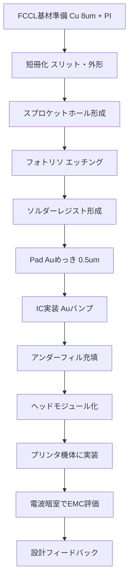
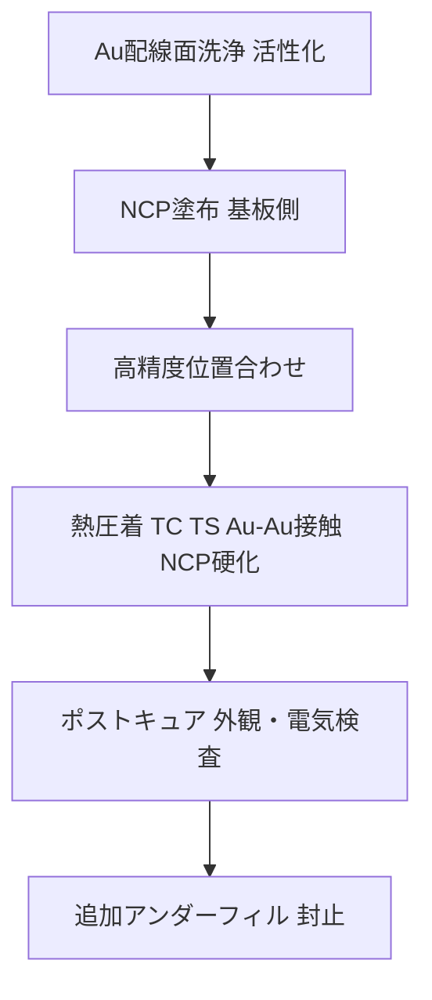

---

# 📦 COF Packaging and System-Level Evaluation  
**COFパッケージングとシステムレベル評価**

---

## ⚠️ 本資料の前提 / Disclaimer
本資料は **COF (Chip on Film) に関する一般技術的な内容**を教育目的で整理したものであり、  
特定企業・製品固有の機密情報には触れていません。  
> This document summarizes **general COF packaging technology** for educational use.  
> It does not include confidential or company-specific data.

---

## 1. 🧩 基材と材料 / Substrate and Materials
- **FCCL基材**: 薄型銅箔（約 8 µm）＋ポリイミドフィルム  
- **加工**: ロールから短冊にスリット加工し、搬送用スプロケットホールを形成  
- **表面粗さ (Ra, Rz)**: 実装信頼性や導通に直結するため重要  

---

## 2. 🖌 パターニングと表面処理 / Patterning and Surface Treatment
- **配線形成**: フォトリソ＋エッチングで微細配線を形成  
- **保護膜**: 緑色ソルダーレジストを塗布し、パッドのみを開口  
- **パッド処理**: 直 Au めっき（約 0.5 µm）  
  - Ni バリアなしでも Cu 拡散影響は限定的  
  - 加速試験（HTS/HAST/85-85）でシート抵抗変化はほぼなし  

---

## 3. ⚙️ IC実装とアンダーフィル / IC Assembly and Underfill
- **方式**: フリップチップ実装（Au バンプ接合）  
- **補強**: アンダーフィル樹脂で機械的・絶縁的強化  
  - 異電位配線間は確実に樹脂を充填  
  - デザインルール: 「必ず樹脂が配線間に入り込む」ことを保証  

---

## 4. 📡 システム評価 / System Evaluation
- **実装階層**: COF単体 → ヘッドモジュール → プリンタ機体  
- **EMC評価**: 電波暗室で放射・伝導・感受性を評価  
- **知見**: 基材の誘電率 (Dk)、誘電正接 (Df)、吸湿特性が  
  **システム全体のEMI/EMC挙動に大きく影響**  

---

## 5. 🧪 NCP接合の適用例 / Example of NCP Bonding
- **用途**: アクチュエータの Au 配線と IC 接続  
- **導通機構**: Au–Au 金属接触、NCPは補強・空隙充填・防湿  
- **実装ルール**  
  - Au 表面の洗浄・活性化必須  
  - Pad 周囲に NCP 逃げ領域を設計  
  - 信頼性試験で接触抵抗ドリフトを監視  

---

## 6. 🔄 プロセスフロー / Process Flow

### 📜 概要フロー

### 🔧 NCP接合フロー

---

## 7. 📊 比較・検討事項 / Comparative Considerations

### Ni/Au vs 直Auめっき
- Ni/Au: 保存性高い、だがコスト増  
- 直Au: 実装性良、シート抵抗安定  

### ロール基材 vs 短冊基材
- ロール: 高スループット、搬送自動化  
- 短冊: 高精度、試作向き  

### アンダーフィル有無
- 有: 信頼性高い、絶縁性良  
- 無: 熱伝導改善、だがリークリスク  

---

## 8. 🔍 接合方式の比較 / Bonding Method Comparison

| 項目 / Item          | **NCP** (Non-Conductive Paste) | **ACP** (Anisotropic Conductive Paste) | **ACF** (Anisotropic Conductive Film) |
|-----------------------|--------------------------------|-----------------------------------------|---------------------------------------|
| 材料形態 / Form       | ペースト (液状)               | ペースト (液状, 導電粒子含む)           | フィルム状 (導電粒子含む)              |
| 導通機構 / Conduction | Au–Au直接接触                  | 粒子が垂直方向で局所導通                | 粒子が垂直方向で局所導通                |
| 絶縁性 / Insulation   | 高い                          | 粒子分散に依存                          | 粒子分散に依存                          |
| 実装ピッチ / Pitch    | 超狭ピッチ対応可               | 狭ピッチ対応可                           | 狭ピッチ対応可 (FPCで実績多)           |
| プロセス性 / Process  | 塗布 → 熱圧着                  | 塗布 → 熱圧着                            | ラミネーション → 熱圧着                |
| リワーク性 / Rework   | 一部可能                       | 困難                                    | 困難                                   |
| 応用例 / Application  | Auバンプ実装, MEMS             | 小型モジュール, センサー                 | LCDドライバIC, FPC接続                  |
| 特徴 / Notes          | 接触抵抗安定性が高い           | 粒子均一性課題                          | 量産性高い、実績豊富                   |

---

## 9. 🧠 SystemDK視点のまとめ / SystemDK Summary
- COF基材の変更は「**材料 → パッケージ → モジュール → システム**」へ波及  
- EMC評価は **フィードバックループ**として機能し、単なる材料選択を超える  
- SystemDK的には、  
  **材料物性 → 実装信頼性 → 信号伝送特性 → EMC挙動**  
  の因果連鎖を理解することが必須  

---

## 10. 📚 学習課題例 / Learning Exercises
- **Q1.** 基材の誘電率 Dk が 0.5 増加した場合、特性インピーダンスと EMC 特性にどう影響するか？  
- **Q2.** NCP接合と ACF接合の違いを整理し、アクチュエータ実装に最適な方式を説明せよ。  

---

## 11. 🔥 熱設計の整合的整理 / Thermal Design (Consistent View)
**目的が2つある**ことを明確にする：  
1) **アクチュエータに熱を“伝えない”**（熱弱結合）  
2) **ICが出した熱を“どこへ逃すか”**（放熱経路の確保）  

### 11.1 アクチュエータへ伝えない（熱弱結合の設計）
- **低k層の連続**: PI / SR / UF を連続させ、熱伝導を遮断  
- **サーマルモート**: 銅面をネック化・メッシュ化して熱流路を分断  
- **バンプ配置**: アクチュエータ直下のバンプ/プレーンを最小化、GND/電源は遠側へ集約  
- **距離・折返し**: 数mmの距離確保、COFの折返し/固定点で熱の向きを変える  

### 11.2 ICの自己発熱を処理する（出口を用意）
- **スプレッダ/スティフナ**: IC裏面に銅スプレッダや金属スティフナを配置  
- **高k接着材**: IC裏面→筐体フレームへの**低R_th**接続を確保  
- **熱バス**: COF固定部から機体フレームへ熱を誘導するブリッジを設計  

> 🧩 まとめ：**COFは“遮断器として優秀”だが“放熱器にはならない”。**  
> アクチュエータ保護（熱弱結合）はCOF側で、IC温度管理（放熱先の創出）は**モジュール側**で行う。  
> これが整合したSystemDKの熱設計方針。

---

## 🔗 関連章 / Linked Chapters
- [`f_chapter2_chiplet_pkg/`](../f_chapter2_chiplet_pkg/) — Chiplet & Package Basics  
- [`d_chapter5_analog_mixed_signal/`](../d_chapter5_analog_mixed_signal/) — AMS & Physical Constraints  
- [`f_chapter4_fsm_pid_llm/`](../f_chapter4_fsm_pid_llm/) — Control SoC PoC Integration  
- [`chapter6_test_and_package/6.4_packaging.md`](../chapter6_test_and_package/6.4_packaging.md) — Package Process Basics
