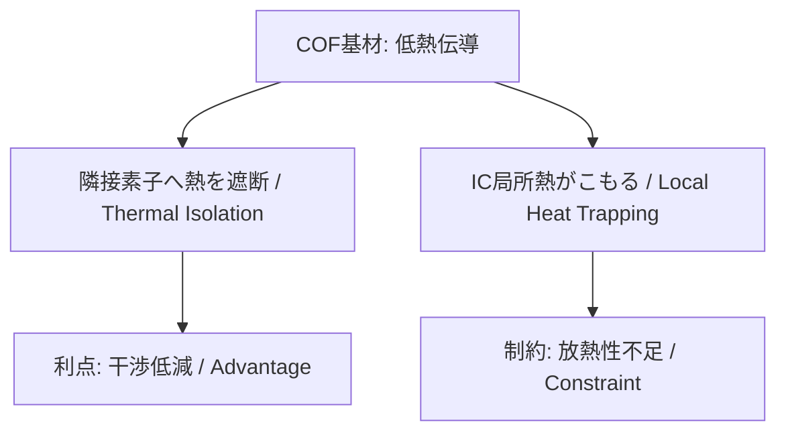

---

# 📦 COF Packaging and System-Level Evaluation  
**COFパッケージングとシステムレベル評価**  
*COF Packaging and System-Level Evaluation*

---

## ⚠️ 本資料の前提 / Disclaimer

本資料は **COF (Chip on Film) 技術に関する一般的かつ教育的な解説**を目的として作成したものです。  
*This document is intended as a general and educational overview of COF (Chip on Film) technology.*

- 特定企業・製品固有のプロセス条件や設計仕様には触れていません。  
  *It does not disclose any company-specific processes or proprietary specifications.*  
- 記載されている数値・フロー・試験内容は **公開情報や教育資料レベルの一般知識**に基づくものであり、実際の量産条件を示すものではありません。  
  *All numerical values, flows, and test descriptions are based on public domain or educational-level knowledge, not production parameters.*  
- 本資料は **教育・学習用途に限定**され、設計・製造に直接使用することは意図されていません。  
  *The content is for learning purposes only, and is not intended for direct use in design or manufacturing.*  

---

## 1. 🧩 COF基材製造 / COF Substrate Fabrication

- **FCCL基材**: 薄型Cu箔 (約8 µm) とポリイミドフィルムの積層  
  *FCCL substrate: Thin Cu foil (~8 µm) laminated with polyimide film*  
- **加工**: ロールから短冊にスリット加工、搬送用スプロケットホール形成  
  *Processing: Slit from roll into strips, form sprocket holes for transport*  
- **パターニング**: フォトリソ＋エッチングで微細配線形成  
  *Patterning: Fine wiring via photolithography and etching*  
- **保護膜**: ソルダーレジストで配線を被覆、パッドのみ開口  
  *Protective layer: Solder resist covers wiring, pads opened*  
- **パッド処理**: 直Auめっき（~0.5 µm）、Cu拡散は限定的  
  *Pad treatment: Direct Au plating (~0.5 µm), limited Cu diffusion*  

---

## 2. ⚙️ COF IC実装 / COF IC Assembly

- **接合方式**: フリップチップAuバンプ接合  
  *Bonding method: Flip-chip Au bump connection*  
- **補強**: アンダーフィル樹脂で充填し、機械的強度と絶縁性を確保  
  *Reinforcement: Underfill resin for mechanical strength and insulation*  
- **デザインルール**: 異電位配線間には確実に樹脂が入り込むことを保証  
  *Design rule: Ensure resin fills between different potential wirings*  
- **検証試験**: HTS/HAST/85-85によりシート抵抗やリーク安定性を確認  
  *Verification: HTS/HAST/85-85 tests for sheet resistance and leakage stability*  

---

## 3. 🔗 COFアクチュエータ実装 / COF–Actuator Assembly

- **COF端子 (Au) ⇔ アクチュエータ配線 (Au)** を **NCP (Non-Conductive Paste)** で接合  
  *Bond COF terminals (Au) to actuator wiring (Au) using NCP*  

- **導通機構**: Au–Au金属接触、NCPは空隙充填・補強・防湿に寄与  
  *Conduction: Au–Au metal contact, NCP fills voids, reinforces, and protects from moisture*  

- **NCP採用の理由 / Why NCP is used**  
  - **超狭ピッチ接合を実現するため、導電粒子を含まないNCPが必要**  
    *NCP without conductive particles is required to achieve ultra-fine-pitch bonding.*  
  - そのため、**COF端子もアクチュエータ実装配線もAuであることが必須**  
    *Thus, both COF terminals and actuator wiring must be Au.*  

### ⚠️ マイグレーションリスク / Migration Risk

- 狭ピッチで異電位配線が存在し、かつ **高電圧 (例: 30V)・高温高湿環境** では、金属マイグレーションのリスクが高まる  
  *When narrow-pitch, different-potential wirings exist under high voltage (e.g., 30V) and high temperature/humidity, the risk of metal migration increases.*  

- **Auはイオン化傾向が低くても完全に安全ではない**  
  *Even though Au has a low ionization tendency, it is not completely immune.*  

- 筆者の経験としても、**Au配線間でマイグレーション事例が発生**したことがある  
  *Based on the author’s experience, migration cases have occurred even between Au wirings.*  

- **設計・実装上の対策例 / Design & Implementation Countermeasures**  
  - 配線間隔を設計ルール以上に確保  
    *Ensure wiring spacing beyond minimum design rules*  
  - 防湿性の高い樹脂を適用し、イオン水分の介在を抑制  
    *Apply moisture-resistant resin to suppress ionic water intrusion*  
  - 高温高湿試験（85/85, HAST）でマイグレーションの進展有無を確認  
    *Check for migration progression through 85/85 and HAST tests*
    
---

## 4. 🧪 接合方式の比較 / Bonding Methods

| 項目 / Item          | **NCP** | **ACP** | **ACF** |
|-----------------------|---------|---------|---------|
| 材料形態 / Form       | ペースト (非導電) | ペースト (導電粒子含) | フィルム (導電粒子含) |
| *Form*                | Paste (non-conductive) | Paste (with conductive particles) | Film (with conductive particles) |
| 導通機構 / Conduction | Au–Au直接接触 | 粒子が垂直方向で導通 | 粒子が垂直方向で導通 |
| *Conduction*          | Direct Au–Au contact | Particles conduct vertically | Particles conduct vertically |
| 絶縁性 / Insulation   | 高い | 粒子分散に依存 | 粒子分散に依存 |
| *Insulation*          | High | Depends on particle dispersion | Depends on particle dispersion |
| 実装ピッチ / Pitch    | 超狭ピッチ対応 | 狭ピッチ対応 | 狭ピッチ対応 |
| *Pitch*               | Ultra-fine pitch capable | Fine pitch capable | Fine pitch capable |
| リワーク性 / Rework   | 一部可能 | 困難 | 困難 |
| *Reworkability*       | Partially possible | Difficult | Difficult |
| 主な応用 / Application| MEMS, Auバンプ | 小型モジュール, センサー | LCDドライバIC, FPC接続 |
| *Application*         | MEMS, Au bump | Small modules, sensors | LCD driver ICs, FPC connections |

---

## 5. 🔥 熱設計 / Thermal Design

- **COF基材の特徴**  
  - PI部分は熱伝導率が低く、隣接素子（例：アクチュエータ）への不要な熱流入を抑制  
    *PI has low thermal conductivity, suppressing unwanted heat transfer to adjacent devices (e.g., actuators).*  
  - 一方で、IC局所発熱の放熱は難しく、COF単体での熱拡散自由度は低い  
    *Conversely, dissipating local IC heat is difficult, limiting thermal spreading freedom within COF alone.*  

### ✅ 熱設計における「利点」と「制約」 / Advantages vs Constraints

| 観点 / Aspect | **利点（Advantage）** | **制約（Constraint）** |
|--------------|----------------------|-------------------------|
| 熱流入 / Heat Inflow | 隣接素子への不要な熱流入を防げる | — |
| 放熱 / Heat Dissipation | — | IC局所の熱がこもりやすい |
| 設計影響 / Design Impact | 熱干渉の低減 | 放熱経路を外部に必ず設計する必要あり |


### 🔄 熱挙動の因果関係 / Thermal Behavior Causal Flow



---

## 6. 📡 System評価 / System-Level Evaluation

### (1) COF単体評価  
- 開放/短絡検査 (Open/Short Test)  
- ICリーク測定 (Leak Current Measurement)  
- ファンクションテスト (Logic/Functionality Test)  
- 耐久試験: Heat Cycle  
  *Durability Test: Heat Cycle*  
  - 例: **JEDEC JESD22-A104** (–40℃〜125℃, 500 cycles)  

### (2) COF + アクチュエータ実装評価  
- 開放/短絡検査  
  *Open/Short Test*  
- PZTセグメントのオープン/ショート検査  
  *Open/Short Test of PZT Segments*  
- 耐久試験  
  - Heat Cycle（例: JESD22-A104 準拠）  
  - **PZT耐久試験（例: 180億パルスで特性劣化5%以内）**  
    *PZT endurance test (e.g., within 5% degradation after 18 billion pulses)*  
  - 高温高湿試験 85/85（例: **JEDEC JESD22-A101**）  
    *85℃ / 85%RH high temperature humidity test*  
  - HAST試験（例: **JEDEC JESD22-A110**）  
    *Highly Accelerated Stress Test under pressure steam*  

### (3) ヘッドモジュール評価  
- 印字機能検査（Functional Printing Test）  
  *Functional printing test*  
- 吐出特性試験（Jetting Characteristics Test）  
  *Jetting characteristics test*  
- 耐久試験  
  - Heat Cycle（例: JESD22-A104 準拠）  
  - PZT耐久（パルス駆動による劣化確認）  
    *PZT endurance test (confirming degradation by pulse driving)*  
  - 吐出安定性試験（Jetting Stability over Long Duration）  
    *Long-term jetting stability test*  

### (4) プリンタ機体実装評価  
- 印字品質検査（Print Quality Test）  
  *Print quality test*  
- 耐久試験  
  - 長時間運転試験（印字品質維持、搬送・駆動系の安定性確認）  
    *Long-duration operation test (print quality retention, stability of transport and drive system)*  
  - 環境試験（温湿度、振動、塵埃影響など, 例: **IEC 60068-2**）  
    *Environmental tests (temperature/humidity, vibration, dust impact, etc.)*  

#### EMI/EMC試験 / EMI/EMC Evaluation

- **新規IC実装時の評価 / New IC Evaluation**  
  - I/O数やドライブ能力の変化により、スイッチングノイズ特性が変化  
  - 高速インターフェース追加による放射ノイズスペクトルの変動  
  *Changes in I/O and drive capability alter switching noise; faster interfaces affect EMI spectrum.*  

- **COF基材変更時の評価 / COF Substrate Evaluation**  
  - PIやフィラーの違いにより **誘電率 (Dk)** が変化  
  - **因果チェーン / Causal Chain:**  

    ```mermaid
    graph TB
      A[COF基材変更 / Substrate change] --> B[誘電率Dk変化 / Dk variation]
      B --> C[特性インピーダンス変動 / Impedance variation]
      C --> D[信号反射・クロストーク増大 / Reflections & Crosstalk]
      D --> E[放射EMI増加 / Increased EMI radiation]
    ```  

  - よって **基材変更だけでもEMC再評価が必要**  
  *Even a substrate change alone requires EMC re-evaluation.*  

- **相互影響の観点 / Mutual Influence**  
  - **COFがプリンタ全体に与える影響**（放射/伝導ノイズ源となる可能性）  
    *COF’s effect on the printer (potential source of radiated/conducted noise)*  
  - **プリンタ環境がCOF挙動に与える影響**（外来ノイズの感受性）  
    *Printer’s effect on COF (susceptibility to external noise)*  

---

## 7. 🧠 SystemDK視点まとめ / SystemDK Perspective

- COFは **基材 → IC実装 → アクチュエータ実装 → モジュール → システム** の階層構造で評価すべき  
  *COF should be evaluated hierarchically: substrate → IC assembly → actuator assembly → module → system.*  
- 熱・電気・信号・EMC特性が階層を超えて相互作用する  
  *Thermal, electrical, signal, and EMC properties interact across layers.*  
- SystemDK的には、  
  **材料物性 → 実装信頼性 → 信号伝送特性 → EMI/EMC挙動**  
  を因果関係として把握することが重要  
  *From the SystemDK viewpoint: material properties → assembly reliability → signal transmission → EMI/EMC behavior must be understood as causal chains.*  

---

## 8. 📚 学習課題例 / Learning Exercises

- **Q1.** COF基材の誘電率Dkが+0.5変化した場合、特性インピーダンス・EMC挙動にどう影響するか？  
  *If the dielectric constant Dk of the COF substrate increases by +0.5, how will it affect characteristic impedance and EMC behavior?*  
- **Q2.** NCPとACFの接合方式を比較し、アクチュエータ実装に最適な方式を論じよ。  
  *Compare NCP and ACF bonding methods, and discuss which is optimal for actuator assembly.*  
- **Q3.** COFの低熱伝導率が「利点」と「制約」になる事例をそれぞれ挙げよ。  
  *Give examples where COF’s low thermal conductivity is an advantage and where it is a constraint.*  

---

## 🔗 関連章 / Linked Chapters
- [`f_chapter2_chiplet_pkg/`](../f_chapter2_chiplet_pkg/) — Chiplet & Package Basics  
- [`d_chapter5_analog_mixed_signal/`](../d_chapter5_analog_mixed_signal/) — AMS & Physical Constraints  
- [`f_chapter4_fsm_pid_llm/`](../f_chapter4_fsm_pid_llm/) — Control SoC PoC Integration  
- [`chapter6_test_and_package/6.4_packaging.md`](../chapter6_test_and_package/6.4_packaging.md) — Package Process Basics  
