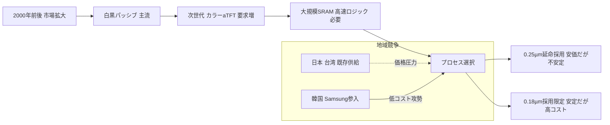
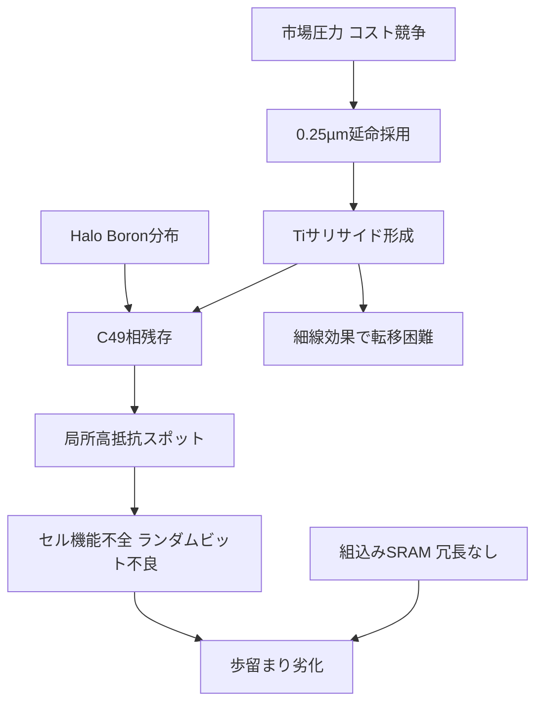

# 📊 図表候補

## 図1. Ti vs Co サリサイド比較

| 観点 | Tiサリサイド (TiSi₂) | Coサリサイド (CoSi₂) |
|---|---|---|
| 形成相 | C49(高抵抗) → C54(低抵抗) **転移が必要** | 直接低抵抗相を形成しやすい |
| 細線効果 | 強い（線幅縮小でC54化が困難） | 相対的に弱い |
| 不純物感受性 | **高**（B/As取り込みで相転移阻害・高抵抗スポット） | 低め |
| アニール依存性 | **強い**（温度・時間ウィンドウが狭い） | 中程度 |
| 工程マージン | **狭い** | 広い（量産安定性が高い） |
| 量産歩留まり | 0.25µmで不安定事例多い | 0.18µm以降で安定 |
| 代表世代 | 0.25µm | 0.18µm |

---

## 図2. 0.25µm vs 0.18µm 技術・コスト比較

| 項目 | 0.25µm | 0.18µm |
|---|---|---|
| サリサイド | **TiSi₂**（転移不全/細線効果/不純物影響） | **CoSi₂**（安定） |
| 素子分離 | LOCOS系/浅溝限定 | **STI + CMP**（複雑化） |
| マスク | （記載しない） | **OPC必須化でマスクコスト増** |
| 技術安定性 | **中〜低**（“ガラスのようなプロセス”） | **高** |
| ウェハ/総コスト | **低** | **高**（工程/マスク増） |
| LCDドライバー適性 | **カラーaTFT向けで延命採用** | コストで不利・採用限定 |

---

## 図3. LCDドライバー市場競争（概念図）

---

## 図4. SRAM 冗長有無の歩留まり感度シミュレーション

歩留まりモデル（ポアソン近似）

- 欠陥数 $N \sim \text{Poisson}(\lambda)$  
- 歩留まり $Y_k = e^{-\lambda}\sum_{i=0}^{k}\frac{\lambda^i}{i!}$  
  （$k$ = 冗長セル数）

| ケース | $\lambda$ | 冗長数 $k$ | 歩留まり $Y$ |
|---|---:|---:|---:|
| 暫定前・冗長なし | 0.30 | 0 | 0.7408 |
| 暫定前・1冗長   | 0.30 | 1 | 0.9632 |
| 暫定後・冗長なし | 0.10 | 0 | 0.9048 |
| 暫定後・1冗長   | 0.10 | 1 | 0.9953 |

---

## 図5. Boron吸収による高抵抗スポット模式図

**模式図の説明**

1. Halo BoronピークはS/Dエッジ直下に形成されやすい  
2. サリサイド形成・アニール時にBがTi/TiSi₂に拡散・取り込み  
3. 局所的にC49→C54転移が不完全 → 高抵抗スポットとして残存  
4. セル単位でランダム発生 → ランダムビット不良へ直結

（図は断面模式図を想定：  
- 上：ゲート（n⁺/p⁺ポリ）  
- 側：SiN/oxideサイドウォール  
- 下：活性領域＋Halo B  
- 上部にTiSi₂層、局所C49残存を赤で示す）

---

## 図6. 不具合因果関係図

