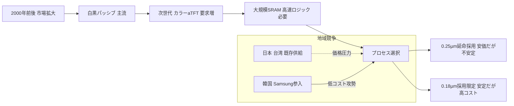
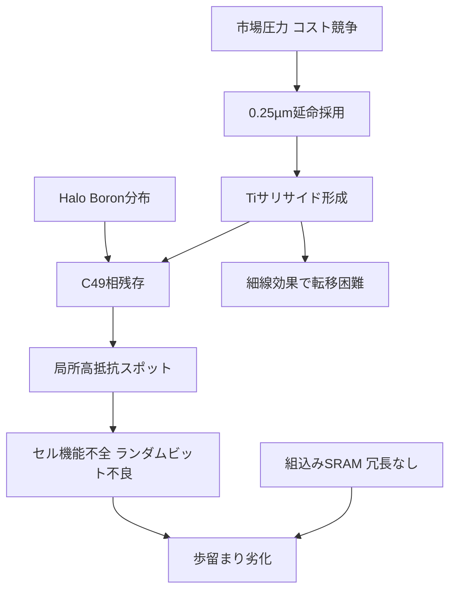

# 1. Introduction

半導体産業における技術進化は、微細化と性能向上の追求だけでなく、経済性や市場動向にも大きく影響されてきた。特に、世代移行の過渡期においては、次世代ノードの高コスト化を回避するために、既存ノード（レガシーノード）の継続利用が選択されることがある。しかし、この「レガシーノード再利用」には、潜在的な技術的不安定性や歩留まりリスクが内在している。  

本研究では、0.25µm世代において**「ガラスのようなプロセス」**（glass-like process）と揶揄されたTiサリサイド技術の不安定性に注目する。これは当時、ゲートおよびアクティブ領域の低抵抗化を狙った先端技術であったが、相転移不完全性や細線効果、BやAsとの相互作用、高抵抗化、そして極端に狭いプロセスマージンといった課題を抱えていた。その不安定さが製品不良や歩留まり悪化につながり、結果的に「壊れやすいプロセス」として現場で認識されるに至った。  

本研究の目的は、こうした**0.25µm「ガラスのようなプロセス」事例を歴史的に記録**し、さらに**技術的安定性と経済的合理性のトレードオフ構造**を抽出することである。これにより、工学教育において、単なる技術的成功事例だけでなく、市場・経済要因を含む失敗事例から学ぶ姿勢を育成することを目指す。  

---

# 2. Historical Background: 0.25µm vs 0.18µm

## 2.1 0.5µm〜0.35µm世代の流れ
0.5µm世代まではポリシリコンゲートが主流であり、ゲート抵抗が大きく回路速度の制約要因となっていた。0.35µm世代では、抵抗低減とRC遅延改善を目的にタングステンシリサイド (WSi) ゲートが導入された。  
ただし、この時代は**同極ゲート方式**（NMOS・PMOSともにn⁺ポリゲート）が主流であった。この場合、NMOSは自然に表面チャネルで十分な性能を発揮できたが、PMOSはゲート仕事関数の不整合によりしきい値が高く、駆動電流が不足した。そのためPMOSは**埋め込みチャネル (buried channel)** 構造を採用するのが一般的であった。しかし、埋め込みチャネルは短チャネル化に伴い制御が難しく、スケーリングの障害要因となった。  

## 2.2 0.25µm世代：異極ゲートとTiサリサイド
0.25µm世代からは、NMOSにn⁺ポリ、PMOSにp⁺ポリを用いる**異極ゲート方式**が本格採用され、PMOSもしきい値電圧が適正化されて**表面チャネル構造へ移行**した。これによりNMOSとPMOSの対称性が改善され、CMOS回路の性能バランスが向上した。  

さらに、ゲートおよびソース/ドレインの低抵抗化を目的に**Tiサリサイド (TiSi₂)** が導入された。これは先端技術であったが、以下のような課題を抱えていた。  

- **相転移問題**：TiSi₂はまず高抵抗相 (C49) を形成し、その後低抵抗相 (C54) へ転移する必要があるが、この転移は不完全になりやすく抵抗が高止まりした。  
- **細線効果**：線幅が縮小するとC54相への転移が困難になり、シート抵抗が急増。  
- **不純物との相互作用**：しきい値調整に用いられたBやAsがTiに吸収され、局所的な高抵抗スポットを形成。  
- **プロセスマージンの狭さ**：アニール温度や結晶方位に強く依存し、量産安定性が低下。  

こうした不安定性から、0.25µmプロセスは現場で**「ガラスのようなプロセス (glass-like process)」**と揶揄されることもあった。  

## 2.3 0.18µm世代：Coサリサイドとプロセス複雑化
0.18µm世代では、Tiサリサイドに代わって**Coサリサイド (CoSi₂)** が導入され、Ti特有の相転移問題や細線効果は大幅に軽減された。Coサリサイドは直接低抵抗相が得られるため、量産安定性が飛躍的に改善された。  

一方で、プロセスはさらに複雑化した。素子分離にはShallow Trench Isolation (STI) が導入され、平坦化にはCMPが不可欠となった。さらに、**この世代からエンジニアによる設計段階でのOPC追加が本格化し、マスク製作コストが大幅に増加した**。  
このように、**0.18µmは技術的には安定したが、製造コストは大きく上昇**することになった。  

## 2.4 市場背景：LCDパネルの世代交代とコスト競争
2000年前後、LCD市場では依然として**白黒パネル**が主流であり、これは**パッシブ型 (Passive Matrix LCD)** によって駆動されていた。白黒パネルドライバーICはロジック規模が小さく、動作周波数やメモリ容量の要求も低かったため、安定性の高い**0.35µmプロセス**で十分対応可能であった。  

しかし次世代では、**カラーパネルの普及**が始まった。カラー化は**アクティブ型 (Active Matrix LCD)**、すなわち**アモルファスTFT (aTFT)** 技術によって実現され、画素数の大幅増加と高速駆動が必要になった。このため、フレームバッファやラインメモリを構成する**大規模SRAMマクロの内蔵**が必須となり、より高性能な**0.25µmプロセス**の採用が求められた。  

ちょうど同じ時期、**Samsungの市場参入**によってLCDドライバー市場は急速にコスト競争が激化した。技術的には安定した**0.18µmプロセス**が存在したものの、その導入はSTIやCMP、さらに本格的なOPCを伴い、製造コストが大幅に増加していた。結果としてメーカー各社は、**安定性よりもコストを優先し、不安定さを抱えた0.25µmプロセスを採用・継続**する選択を迫られることになった。  

このように、LCDドライバー市場における**白黒→カラーへの世代交代**と**Samsung参入によるコスト競争**が重なったことが、0.25µmプロセス延命の決定的な要因であった。  

## 2.5 まとめ
- **0.5µm**：Polyゲート → 抵抗大  
- **0.35µm**：WSiゲート（同極ゲート） → NMOSは良好、PMOSは埋め込みチャネルで性能に限界。主に**白黒パネル（パッシブ型LCDドライバー）**に利用  
- **0.25µm**：異極ゲート＋Tiサリサイド → PMOSは表面チャネルへ移行し対称性改善。しかし不安定性から「ガラスのようなプロセス」と揶揄。それでも**カラーパネル（aTFTアクティブ型LCDドライバー）**に不可欠となり延命  
- **0.18µm**：Coサリサイド導入 → 技術的に安定化。ただしSTI・CMP・OPC必須化により**マスクコストを含む製造コストが増大**し、LCDドライバー用途では採用が限定的  

このように、0.25µmと0.18µmは、**「技術的安定性と経済的合理性のトレードオフ」**を象徴する対照的な世代であった。特にLCDドライバー市場においては、  
- 白黒（パッシブ型） → 0.35µm  
- カラー（aTFTアクティブ型） → 0.25µm  

という棲み分けが成立し、さらにSamsung参入によるコスト競争激化が、**不安定でも安価な0.25µmプロセスの延命を決定づけた**。

---

# 3. Case Study: 1Mbit SRAM with 30V Mixed Logic

## 3.1 製品背景
本ケーススタディは、2000年代初頭に開発された**アクティブ型 (aTFT) カラーパネル向けLCDドライバーIC**を対象とする。  
本製品は、パネル駆動用の**30V高耐圧トランジスタ**と、ロジック制御用の**3.3V CMOSロジック**を同一チップ上に集積した「30V Mixed Logic」構成であった。  

カラーパネル化に伴う画素数増加に対応するため、内部に**大規模な1Mbit SRAMマクロ**を内蔵し、フレームバッファやラインメモリをオンチップ化した。これによりタイミング制御や信号処理の高速化を実現することが狙いであった。  

ただし市場環境は厳しく、Samsungの本格参入によってLCDドライバー市場は急速にコスト競争が激化していた。このため、技術的な不安定性を認識しつつも、メーカーは**より安価な0.25µmプロセスを採用せざるを得なかった**。技術的に安定した0.18µmは存在していたが、STI・CMP・OPC必須化によるマスクコストや製造コストが高く、採用は困難であった。  

---

## 3.2 不具合現象
量産段階で、1Mbit SRAMマクロに**ランダムビット不良**が顕在化した。  
具体的には、製品テストでアドレス依存性のないランダムなセル不良が検出され、**単一ビットの不良がチップ全体の不良に直結**した。  

なお、当時の**組込みSRAMマクロ**には冗長回路（リダンダンシー）を備えないのが一般的であり、本製品も例外ではなかった。スタンドアロンメモリ製品のようにレーザーリペアで救済する手段は存在せず、このことが不良の深刻さを増幅した。  

---

## 3.3 開発制約
この不具合に十分な対策が講じられなかった背景には、次のような制約があった。  

- **プロセスリソース不足**  
  0.25µmは既に「レガシープロセス」と見なされ、ファウンドリやIDMの開発リソースは0.18µm以降に集中していた。そのため、0.25µm特有の課題に対する追加検証や工程改善のリソースが不足していた。  

- **設計文化の制約**  
  組込みSRAMマクロは「冗長を入れない」設計文化が一般的であり、歩留まり改善はプロセス条件でカバーする前提だった。設計段階での救済策を導入する余地がそもそも限られていた。  

- **開発スケジュールの制約**  
  カラーパネル普及のタイミングに合わせた市場投入が求められ、短納期開発が強制された。その結果、工程最適化や信頼性試験に十分な時間を割けなかった。  

---

## 3.4 物理的原因
詳細解析の結果、ランダムビット不良の直接原因は**Tiサリサイド形成における局所的な高抵抗スポット**であった。  

- **Halo Boronの吸収**  
  短チャネル効果を抑えるためのHalo Boronが、サイドウォール直下でTiに取り込まれた。  

- **相転移阻害**  
  TiSi₂は高抵抗相(C49)から低抵抗相(C54)へ転移する必要があるが、局所的なB存在により転移が阻害され、**高抵抗のC49相が残存**した。  

- **ランダム性の本質**  
  この現象は不純物分布や微細なプロセス変動に依存して発生したため、**製品間で異なるランダム不良**として現れた。  

因果関係をまとめると、  
**Halo Boron吸収 → Tiサリサイド相転移不全 → 局所高抵抗スポット形成 → SRAMセル不良**  
というメカニズムである。  

---

## 3.5 本事例の意義
本事例は、以下の点で教育的に重要である。  

- **設計要因とプロセス要因の複合不良**  
  冗長回路不在という設計慣行と、Tiサリサイドの不安定性というプロセス課題が重なり、致命的不良を引き起こした。  

- **レガシーノード再利用のリスク**  
  技術的に不安定であることを理解しながらも、市場・コスト要因から0.25µmを選択せざるを得なかった。この構造は、**経済性と技術安定性のトレードオフ**を象徴している。  

- **「偶発不良」の深刻さ**  
  ランダム不良は設計段階では予見しにくく、開発リソースも不足していたため対策が難しかった。  
  そのため、製品化段階で初めて顕在化する歩留まりリスクとなり、  
  レガシープロセスを採用する際の潜在的危険性を如実に示す事例であった。

---

# 4. Analysis of Failure and Review Limitations

## 4.1 技術要因
本不具合の根本原因は、**Tiサリサイド形成の不安定性**にあった。  
TiSi₂は高抵抗相 (C49) から低抵抗相 (C54) への相転移を必要とするが、この転移は線幅や温度条件に強く依存し、不完全に終わることが多かった。  
さらに、Halo Boronの一部がTiに吸収され、局所的に相転移を阻害し**高抵抗スポット**を形成した。これがSRAMセルのランダム不良を引き起こした。

---

## 4.2 設計要因
対象となった1Mbit SRAMマクロには**冗長回路が搭載されていなかった**。  
組込みSRAMマクロでは当時これが一般的であり、歩留まりはプロセス安定性に依存する設計文化であった。  
結果として、**単一ビット不良がチップ不良に直結する脆弱性**を抱えることになった。

---

## 4.3 経済要因
0.18µmプロセスはSTI・CMP・本格的OPCの導入によって**マスクコストを含め製造コストが大幅に上昇**していた。  
このため、価格競争の激しいLCDドライバー市場では採用が難しく、各社は**コスト優位のある0.25µmを延命利用**せざるを得なかった。

---

## 4.4 市場要因
2000年代初頭、LCDドライバー市場はSamsungの参入により急速にコスト競争が激化した。  
従来は日本・台湾勢が市場を支配していたが、Samsungの量産力とコスト攻勢は強力であり、**わずかな製造コスト差が致命的**となった。  
この圧力の下、各社は技術的に不安定と知りながらも、**安価な0.25µmを選択**するしかなかった。

---

## 4.5 設計レビュー (DR) の限界
設計レビューはルール適合性や形式的なチェックを中心としており、**統計的にランダムに発生する不良現象**を予見することは不可能であった。  
また、0.25µmは既にレガシープロセスであり、現場知見の共有や先端リソースの投入が不足していたため、問題はレビュー段階で顕在化しなかった。  
本事例は、**形式的レビューの限界と、レガシープロセスでの知識伝承不足**を示す典型であった。

---

## 4.6 Countermeasures（対策）
本不良は典型的なプロセスマターであり、対策はプロセス条件の改善に集中した。

- **暫定対応**  
  サイドウォールエッチをアンダーカット気味に調整し、Halo Boronとの干渉を緩和。  
  この処置によりランダムビット不良率は大幅に低下し、歩留まりは実用的水準に改善した。  
  ただしTiSi₂中にC49相が局所的に残存するリスクは依然残った。

- **恒久対応**  
  ランプアニール条件を最適化し、C54相への安定的転移を確立。  
  これによりC49残存は大幅に抑制され、プロセス安定性は改善した。  
  この過程でデバイス特性の変動が生じたため、パラメータの再取得とモデル更新が実施されたが、これは副次的な作業であり、根本解決はあくまで**プロセス改善そのもの**であった。

---

## 4.7 まとめ
本不具合は、  
- **技術的不安定性**（Tiサリサイド相転移と不純物吸収）  
- **設計文化**（組込みSRAMに冗長を持たない慣習）  
- **経済的圧力**（0.18µmの高コスト回避）  
- **市場構造**（Samsung参入によるコスト競争）  

が複雑に絡み合って顕在化した。  

設計レビューや形式的モデル更新では救えない典型的な**プロセスマター不良**であり、解決はプロセス条件の改善と世代交代（Coサリサイド導入）によって初めて実現した。  
本事例は、**レガシープロセスをコスト理由で延命する際に潜むリスク**と、**技術・設計・経済・市場要因の相互作用**を示す歴史的な教訓である。

---

# 5. Educational Application and Universality

## 5.1 教材化の方法
本事例は単なる歴史的回顧にとどまらず、工学教育の教材として活用できる価値を持つ。  
技術的不安定性・設計文化・経済的制約・市場要因が複合的に作用した点を可視化することで、学生に「現実の技術選択」の複雑さを理解させることができる。

- **因果関係図の活用**  
  プロセス条件（Tiサリサイド相転移不全）  
  → デバイス挙動（局所高抵抗スポット）  
  → SRAMマクロ構造（冗長なし）  
  → 不良顕在化（ランダムビット不良）  
  → 歩留まり低下・市場競争圧力  
  といった因果連鎖を図示し、技術と経済が結びつく構造を示す。

- **比較表の提示**  
  0.25µmと0.18µmを「技術安定性」と「製造コスト」で比較する。  
  → 0.25µm：不安定だが安価、0.18µm：安定だが高コスト。  
  この対比を通じて「技術的優位性と経済合理性のトレードオフ」を具体的に学ばせる。

- **演習問題の設定**  
  例題：「あなたが製品責任者なら、安価だが不安定な0.25µmを採用するか、安定だが高コストの0.18µmを採用するか？」  
  → 学生に議論させることで、単なる技術選択ではなく、市場・経済を含めた複合的判断の難しさを体感させる。

- **市場要因の組み込み**  
  技術的課題だけでなく、Samsung参入による価格破壊という市場要因をケースに組み込み、  
  技術選択が必ずしも「最良の技術」ではなく「最も市場に適合する技術」であることを理解させる。

---

## 5.2 普遍性
この事例は0.25µm世代に特有の問題ではなく、現代においても繰り返し見られる構造を示している。

- **技術安定性 vs 経済性のトレードオフ**  
  - 28nm FD-SOI は、FinFETに比べて性能面で劣るが、低コストと低消費電力を理由に再利用が進んでいる。  
  - 40nm BCD (Bipolar-CMOS-DMOS) は、より微細なノードが存在しても、高耐圧・低コストゆえに長期継続利用されている。  
  → 「安定だが高コスト」か、「安価だが制約あり」かの選択は現代でも同様に存在する。

- **偶発不良の不可避性**  
  本事例のランダムビット不良は設計段階で予測不能であり、最終的にはプロセス改善による歩留まり向上でしか解決できなかった。  
  現代の半導体でも、ランダム欠陥やプロセス変動は完全には排除できず、  
  「偶発不良は設計やモデルでは救えない」という教訓は普遍的である。

- **市場圧力の影響**  
  技術的に優れていても、コストや市場要因によって採用されないことは珍しくない。  
  本事例の0.25µm延命はその典型であり、現代の製造ノード選択や特殊プロセス（FD-SOI, BCDなど）の継続利用にも通じる。

---

## 5.3 教育的意義の整理
- 技術的不安定性・設計文化・経済的圧力・市場構造の相互作用を一つの事例で学べる。  
- 学生に「技術の良し悪し」だけでなく、「市場と経済が意思決定にどう影響するか」を理解させられる。  
- 歴史的失敗を教材化することで、**失敗から学ぶ文化**を工学教育に根付かせる契機となる。  
- また、FD-SOIやBCDのような現代の事例と接続させることで、**過去の教訓を現在の選択に応用する視点**を提供できる。

---

# 6. Conclusion

## 6.1 歴史的教訓
本事例は、0.25µm世代におけるTiサリサイド不安定性というプロセスマターが、設計文化・経済的制約・市場要因と結びついて深刻な不良に発展した典型例である。  
ここから得られる歴史的教訓は以下の通りである。

- **レガシーノードには潜在リスクが残存する**  
  技術的に「確立済み」とされる世代であっても、内部には潜在的な不安定要素が存在し得る。  
  特にサリサイドのような材料選択やプロセス条件は、微細化やデバイス構造との相互作用で予期せぬ問題を引き起こす可能性がある。

- **技術選択は技術合理性だけで決まらない**  
  本事例では、安定性を求めれば0.18µmが望ましかったが、経済性と市場競争の圧力から、あえて不安定な0.25µmが選ばれた。  
  すなわち、技術だけでなく経済的合理性・市場構造が設計選択を左右することが示された。

---

## 6.2 教育的意義
このような失敗事例を教育に活用することで、以下の意義がある。

- **失敗から学ぶ文化の育成**  
  成功事例だけでは「理想的な姿」しか見えない。  
  不安定な技術選択が市場圧力によって必然化されるという事例は、現実の意思決定を理解する教材となり、学生に「なぜ失敗が起きたか」を考察させる契機となる。

- **学際的な理解の促進**  
  半導体プロセスの物理、回路設計の制約、経済性、市場競争といった多面的な要因を一つの事例で学べる。  
  これにより学生は「工学は技術だけでなく、社会的・経済的文脈の中で成立する」ことを理解できる。

- **普遍性の獲得**  
  本事例は0.25µmに固有ではなく、現代のFD-SOIやBCDなどのレガシープロセス利用にも通じる。  
  したがって、過去の教訓を「今後の技術選択に生かす」教育的枠組みを構築できる。

---

## 6.3 展望
本研究で取り上げた「ガラスのようなプロセス」は一例に過ぎない。今後は以下の方向での展開が求められる。

- **他事例との体系化**  
  0.35µmのWSiゲート世代、0.18µm以降のCoサリサイド世代、さらにはSTIやCMP導入時の課題など、他のレガシープロセスにおける事例を整理し、体系的な「技術移行期の不安定性カタログ」を構築する。

- **教育カリキュラムへの統合**  
  大学・高専における半導体教育に、単なるデバイス物理や設計技術だけでなく、歴史的失敗事例を組み込む。  
  これにより学生は、現実の製品開発が「技術・設計・経済・市場」の総合判断であることを体感的に学ぶことができる。

- **産業界へのフィードバック**  
  レガシーノードの再利用や特殊用途プロセスの延命が行われる現代において、本事例の教訓を再認識することは、将来のリスク管理にも資する。  
  過去の「ガラスのようなプロセス」を参照することは、次世代製品開発の判断における警鐘となる。

---

## 6.4 結語
0.25µm世代のTiサリサイド不安定性は、単なる技術的瑕疵ではなく、経済性と市場構造が重なって顕在化した歴史的事件であった。  
本事例は、**「レガシーノード延命は常にリスクを伴う」**ことを示すとともに、工学教育においては失敗から学ぶ姿勢を育成する貴重な題材となる。  
過去の教訓を未来の意思決定に生かすことこそが、技術史教育の最大の意義である。

---

# 📊 図表候補

## 図1. Ti vs Co サリサイド比較

| 観点 | Tiサリサイド (TiSi₂) | Coサリサイド (CoSi₂) |
|---|---|---|
| 形成相 | C49(高抵抗) → C54(低抵抗) **転移が必要** | 直接低抵抗相を形成しやすい |
| 細線効果 | 強い（線幅縮小でC54化が困難） | 相対的に弱い |
| 不純物感受性 | **高**（B/As取り込みで相転移阻害・高抵抗スポット） | 低め |
| アニール依存性 | **強い**（温度・時間ウィンドウが狭い） | 中程度 |
| 工程マージン | **狭い** | 広い（量産安定性が高い） |
| 量産歩留まり | 0.25µmで不安定事例多い | 0.18µm以降で安定 |
| 代表世代 | 0.25µm | 0.18µm |

---

## 図2. 0.25µm vs 0.18µm 技術・コスト比較

| 項目 | 0.25µm | 0.18µm |
|---|---|---|
| サリサイド | **TiSi₂**（転移不全/細線効果/不純物影響） | **CoSi₂**（安定） |
| 素子分離 | LOCOS系/浅溝限定 | **STI + CMP**（複雑化） |
| マスク | （記載しない） | **OPC必須化でマスクコスト増** |
| 技術安定性 | **中〜低**（“ガラスのようなプロセス”） | **高** |
| ウェハ/総コスト | **低** | **高**（工程/マスク増） |
| LCDドライバー適性 | **カラーaTFT向けで延命採用** | コストで不利・採用限定 |

---

## 図3. LCDドライバー市場競争（概念図）

---

## 図4. SRAM 冗長有無の歩留まり感度シミュレーション

歩留まりモデル（ポアソン近似）

- 欠陥数 $N \sim \text{Poisson}(\lambda)$  
- 歩留まり $Y_k = e^{-\lambda}\sum_{i=0}^{k}\frac{\lambda^i}{i!}$  
  （ $k$ = 冗長セル数）

| ケース | $\lambda$ | 冗長数 $k$ | 歩留まり $Y$ |
|---|---:|---:|---:|
| 暫定前・冗長なし | 0.30 | 0 | 0.7408 |
| 暫定前・1冗長   | 0.30 | 1 | 0.9632 |
| 暫定後・冗長なし | 0.10 | 0 | 0.9048 |
| 暫定後・1冗長   | 0.10 | 1 | 0.9953 |

---

## 図5. Boron吸収による高抵抗スポット模式図

**模式図の説明**

1. Halo BoronピークはS/Dエッジ直下に形成されやすい  
2. サリサイド形成・アニール時にBがTi/TiSi₂に拡散・取り込み  
3. 局所的にC49→C54転移が不完全 → 高抵抗スポットとして残存  
4. セル単位でランダム発生 → ランダムビット不良へ直結

（図は断面模式図を想定：  
- 上：ゲート（n⁺/p⁺ポリ）  
- 側：SiN/oxideサイドウォール  
- 下：活性領域＋Halo B  
- 上部にTiSi₂層、局所C49残存を赤で示す）

---

## 図6. 不具合因果関係図

