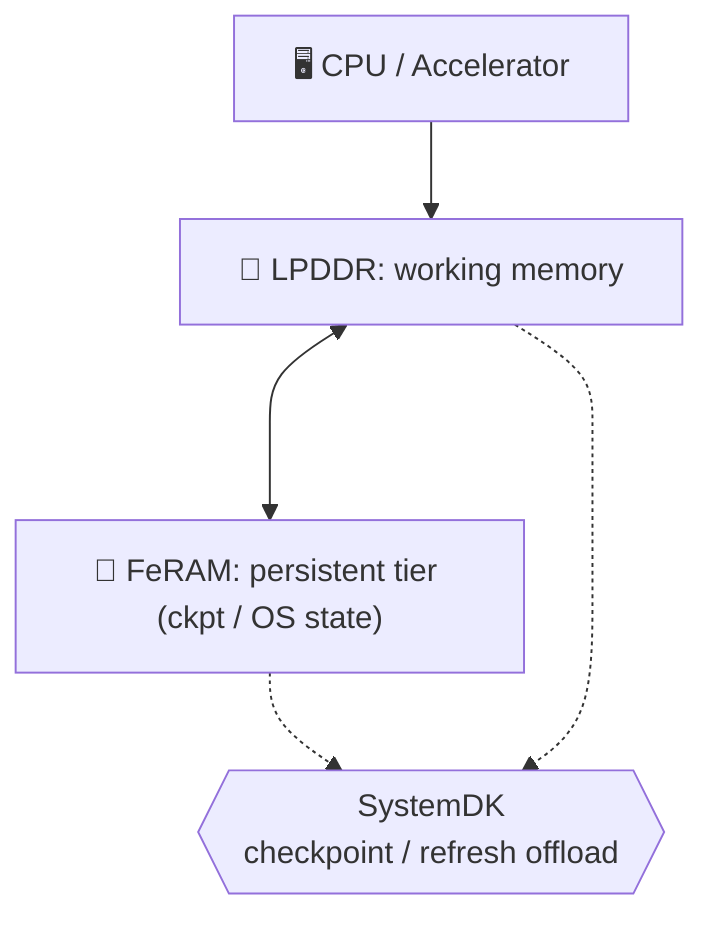

---

# 1.6 統合メモリ：LPDDR＋FeRAMによるモバイルエッジAI
*Hybrid Memory (LPDDR + FeRAM) for Mobile/Edge AI*

---

現在、モバイルエッジAI向けの標準メインメモリは **LPDDR** である。  
我々は **FeRAM** をチップレットとして実装し、不揮発機能を付与することで、低待機電力と  
**インスタントレジューム（電源断後も状態を保持し、即時復帰／瞬時再開できる機能）** を実現する。  
*In mobile edge AI, the dominant working memory is LPDDR. By adding FeRAM as a chiplet with non-volatility,  
we enable low standby power and instant resume (retaining state across power-off and resuming instantly).*  

この方式は **LPDDRの帯域効率を維持しつつ、チェックポイントやリフレッシュ抑制をFeRAMにオフロード**できるため、  
バランスの取れたハイブリッド構成を提供する。  
*This approach preserves LPDDR’s bandwidth efficiency while offloading checkpoints and refresh suppression to FeRAM,  
offering a well-balanced hybrid memory architecture.*  

---

## 🎯 1.6.1 目標と制約 / Goals & Constraints

- **目標**: 帯域効率維持・低待機電力・インスタントレジューム  
*Goals: maintain bandwidth efficiency, minimize standby power, enable instant resume.*  

- **制約**: 実装面積・BOMコスト・FeRAM耐久性  
*Constraints: die area, BOM, FeRAM endurance.*  

---

## 🏗️ 1.6.2 アーキテクチャ / Architecture

- **LPDDR** = メインワーキングメモリ  
*LPDDR = main working memory*  

- **FeRAM** = チェックポイント／OS状態／Cold領域の不揮発層  
*FeRAM = persistent tier for checkpoints, OS state, and cold data*  

- **統合** = チップレット／SiP統合＋SystemDK制御  
*Integration = chiplet/SiP packaging with SystemDK supervision*  

---

## 🚀 1.6.3 将来展開 / Path to HBM＋FeFET

将来の高帯域用途では **HBM＋FeFET** への置換が可能である。  
ただし、現行のモバイルSoC設計においては **LPDDR＋FeRAM** がより現実的かつ低コストであり、  
実装性と効率のバランスが取れている。  
*For future high-bandwidth use cases, HBM + FeFET can replace this scheme.  
However, in today’s mobile SoC designs, LPDDR + FeRAM offers a more practical and cost-efficient balance.*  

---

## 関連文書 / Related Documents

👉 [📄 LPDDR+FeRAM Chiplet Integration (PDF)](./LPDDR_FeRAM.pdf)  

👉 [📄 HBM+FeRAM Chiplet Integration (PDF)](./HBM_FeRAM_Chiplet_MobileEdgeAI.pdf)  
