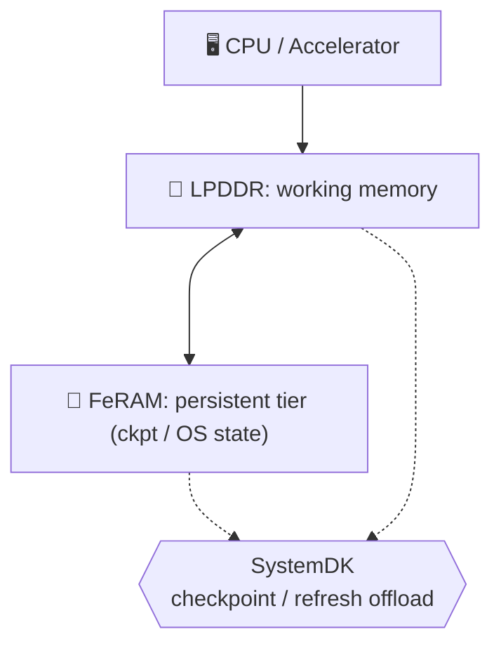
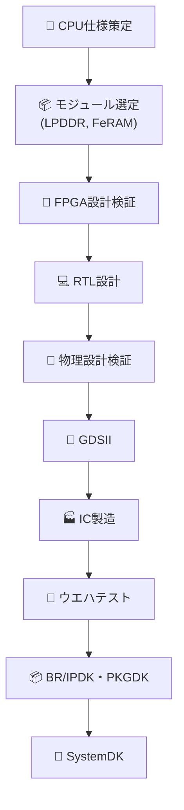
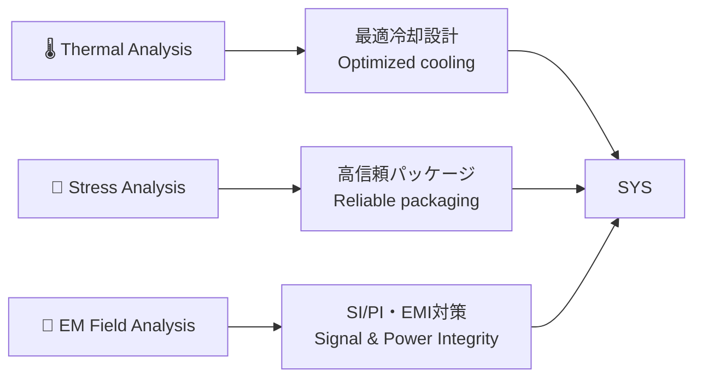

---

# 1.6 統合メモリ：LPDDR＋FeRAMによるモバイルエッジAI  
*Hybrid Memory (LPDDR + FeRAM) for Mobile/Edge AI*  

---

📌 **概要 / Overview**  
現在、モバイルエッジAI向けの標準メインメモリは **LPDDR** である。  
我々は **FeRAM** をチップレットとして実装し、不揮発機能を付与することで、低待機電力と  
**インスタントレジューム（電源断後も状態を保持し、即時復帰できる機能）** を実現する。  
*In mobile edge AI, LPDDR is the dominant working memory. By adding FeRAM as a chiplet with non-volatility,  
we enable low standby power and instant resume.*  

この方式は **LPDDRの帯域効率を維持しつつ、チェックポイントやリフレッシュ抑制をFeRAMにオフロード**できるため、  
バランスの取れたハイブリッド構成を提供する。  
*This approach preserves LPDDR’s bandwidth efficiency while offloading checkpoints and refresh suppression to FeRAM,  
offering a balanced hybrid memory architecture.*  

---

## 🎯 1.6.1 目標と制約 / Goals & Constraints

| **項目** | **内容 (日本語)** | *Description (English)* |
|----------|------------------|-------------------------|
| **目標 / Goals** | 帯域効率維持・低待機電力・インスタントレジューム | *Maintain bandwidth efficiency, minimize standby power, enable instant resume* |
| **制約 / Constraints** | 実装面積・BOMコスト・FeRAM耐久性 | *Die area, BOM cost, FeRAM endurance* |

---

## 🏗️ 1.6.2 アーキテクチャ / Architecture

- **LPDDR** = メインワーキングメモリ  
  *LPDDR = main working memory*  

- **FeRAM** = チェックポイント／OS状態／Cold領域の不揮発層  
  *FeRAM = persistent tier for checkpoints, OS state, and cold data*  

- **統合** = チップレット／SiP統合＋SystemDK制御  
  *Integration = chiplet/SiP packaging with SystemDK supervision*  

---

## 🔄 1.6.3 動作シナリオ / Operation Scenarios

| **フェーズ** | **日本語説明** | *English Description* |
|--------------|----------------|-----------------------|
| **推論時 / Inference** | LPDDR がアクティブに動作し、FeRAM がバックグラウンドでチェックポイント保存 | *LPDDR active, FeRAM stores checkpoints in background* |
| **スリープ時 / Sleep** | LPDDR 内容を消去、FeRAM が不揮発的に状態を保持 | *LPDDR cleared, FeRAM retains OS/application state* |
| **復帰時 / Resume** | FeRAM から状態をロード → 即時レジューム | *Reload from FeRAM enables instant resume* |

---

## 🏗️ 1.6.4 実装方式 / Implementation Options

| **方式** | **日本語説明** | *English Description* |
|----------|----------------|-----------------------|
| **Chiplet/SiP 統合** | LPDDRとFeRAMを2.5D/3D技術で統合。SystemDKで制御 | *Chiplet/SiP integration with SystemDK supervision* |
| **Monolithic困難性** | LPDDRは >700°C 高温アニール必須、FeRAMは 350–450°C で安定化。プロセス温度不一致 | *LPDDR requires >700°C anneal, FeRAM stabilizes at 350–450°C → process mismatch* |

---

## 📊 1.6.5 技術パラメータ比較 / Technology Parameters

| **項目** | **LPDDR (typ.)** | **FeRAM (typ.)** |
|----------|------------------|------------------|
| **アクセス遅延 / Access latency** | 15–60 ns | 80–150 ns |
| **保持特性 / Retention** | 揮発性 (32–64 ms) | 不揮発 (10⁷–10⁸ s ≈ years) |
| **書込みエネルギー / Write energy** | 中程度 | 低い |
| **耐久性 / Endurance** | >10¹⁶ アクセス | 10¹⁰–10¹² 書込み |
| **プロセス温度 / Process temp.** | >700 °C | 350–450 °C |
| **役割 / Role** | メインメモリ | チェックポイント／状態保持 |

---

## ⚡ 1.6.6 システムレベル効果 / System-Level Impact

| **指標** | **LPDDRのみ** | **LPDDR+FeRAM** |
|----------|----------------|-----------------|
| **スタンバイ電力 / Standby power** | 100% | 80–90% (10–20%削減) |
| **レジューム遅延 / Resume latency** | ms オーダー | 100–500 µs |
| **効率 / Effective energy efficiency** | 1.0× | 1.15–1.25× |

---

## 🚀 1.6.7 ロードマップ / Roadmap

| **期間** | **日本語説明** | *English Description* |
|----------|----------------|-----------------------|
| **短期 / Short-term** | LPDDR + FeRAM チップレット統合 (スマホ／ウェアラブル) | *LPDDR + FeRAM chiplet integration (smartphones/wearables)* |
| **中期 / Mid-term** | HBM + FeRAM (エッジAIサーバ、AI Box) | *HBM + FeRAM for edge AI servers and AI boxes* |
| **長期 / Long-term** | HBM + FeFET/ReRAM、Compute-in-Memory併用 | *HBM + FeFET/ReRAM, hybrid with Compute-in-Memory* |

---

## 📱 1.6.8 応用ユースケース / Mobile Edge AI Use Cases

- 🔋 **On-device inference**: アイドル時のスタンバイ電力削減  
  *Reduce standby energy during idle periods*  

- 🔄 **Federated / continual learning**: 頻繁なモデル更新のチェックポイントをFeRAMに退避  
  *Enable frequent model update checkpoints without DRAM refresh overhead*  

- 🎮 **Interactive AR/VR & Sensor Fusion**: サブms復帰でUX改善  
  *Support instant resume for AR/VR and sensor fusion*  

---

## 🌐 1.6.9 広範な含意 / Broader Implications

- ✅ **DRAMを主メモリとして維持**しつつ、FeRAMを補助層として導入  
- 📏 **小容量FeRAM**（数MB〜数十MB）で十分効果を発揮  
- 🛠️ **SystemDKによる協調最適化**: アーキテクチャ・パッケージ・OSを統合制御  

---

## 🚀 1.6.10 将来展開 / Path to HBM＋FeFET

将来の高帯域用途では **HBM＋FeFET** への置換が可能である。  
ただし、現行のモバイルSoC設計においては **LPDDR＋FeRAM** がより現実的かつ低コストであり、  
実装性と効率のバランスが取れている。  
*For future high-bandwidth use cases, HBM + FeFET can replace this scheme.  
However, in today’s mobile SoC designs, LPDDR + FeRAM offers a more practical and cost-efficient balance.*  

---

## 🛠️ 1.6.11 開発フロー / Development Flow

| **工程 / Step** | **内容 (日本語)** | *Description (English)* |
|-----------------|------------------|-------------------------|
| **CPU仕様策定 / CPU Specification** | アプリ要件に基づき演算性能・低消費電力・メモリ帯域を定義 | *Define compute, power, and memory requirements* |
| **モジュール選定 / Module Selection** | LPDDR・FeRAM容量・インタフェースを決定 | *Select LPDDR, FeRAM, interfaces* |
| **FPGA設計検証 / FPGA Prototype** | FPGA上でプロトタイプ構築・FeRAM連携検証 | *Prototype on FPGA, verify FeRAM integration* |
| **RTL設計 / RTL Design** | メモリコントローラ・チェックポイント制御をRTL化 | *Implement memory controller & checkpoint logic* |
| **物理設計検証 / Physical Design** | 配線遅延・電力・面積を解析 | *Verify layout timing, power, area* |
| **GDS / GDSII** | マスクデータ生成 | *Generate GDSII mask layout* |
| **IC製造 / Fabrication** | CMOS＋NVMプロセスでチップ製造 | *Fabricate IC with CMOS + NVM* |
| **ウエハテスト / Wafer Test** | BIST・プローブカードで特性確認 | *Wafer-level test with probe cards* |
| **BR/IPDK・PKGDK** | プロセス・パッケージ設計キットで実装最適化 | *Optimize design using BR/IPDK, PKGDK* |
| **SystemDK** | アーキテクチャ／パッケージ／OSの協調制御 | *System-level co-design with SystemDK* |

---

## 🔍 1.6.12 FEM解析 / FEM Analysis

| **解析領域 / Domain** | **内容 (日本語)** | *Description (English)* |
|-----------------------|------------------|-------------------------|
| **熱解析 / Thermal** | LPDDRとFeRAMの発熱分布をシミュレーションし、冷却設計を最適化 | *Simulate heat distribution and optimize cooling* |
| **応力解析 / Mechanical Stress** | TSV・バンプ・接着層での応力集中を評価し、パッケージ信頼性を確認 | *Evaluate stress at TSVs, bumps, adhesives for reliability* |
| **電磁界解析 / EM Field** | LPDDR高速I/OとFeRAM制御配線のクロストーク、SI/PIを検証 | *Verify crosstalk, SI/PI, EMI between LPDDR and FeRAM interconnects* |

---

## 📄 関連文書 / Related Documents

👉 [📄 LPDDR+FeRAM Chiplet Integration (PDF)](./LPDDR_FeRAM.pdf)  
👉 [📄 HBM+FeRAM Chiplet Integration (PDF)](./HBM_FeRAM_Chiplet_MobileEdgeAI.pdf)  
