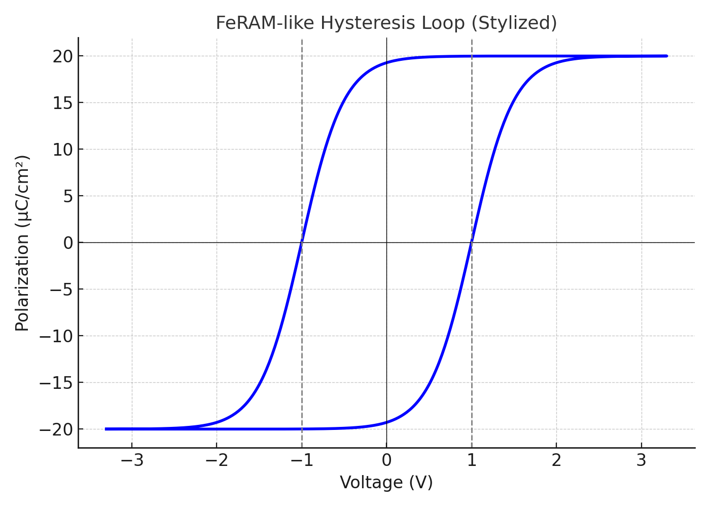
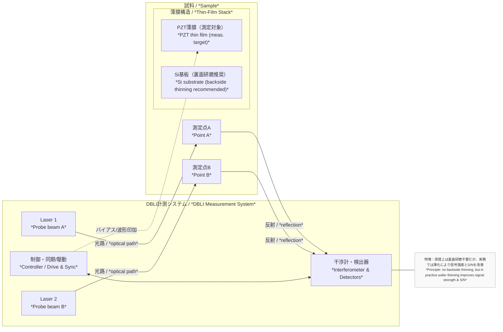

---

# FeRAM / 薄膜ピエゾ特性評価原理  
**FeRAM and Thin-Film Piezoelectric Characterization Principles**  
（教育資料・社外公開可 / *For educational and non-confidential use*）

---

## 1. FeRAMのヒステリシス特性評価  
*1. Hysteresis Characterization in FeRAM*

### ✅ 測定波形 / *Measurement Waveforms*
- **三角波入力 / *Triangular wave input***  
  → Pr, Pm, Vcなどの特性評価（標準的なヒステリシスループ）  
  → *Used to extract Pr, Pm, Vc; standard hysteresis loop measurement*

- **PUND法（Positive-Up Negative-Down） / *PUND Method***  
  → 実動作に近い矩形波で、スイッチング電流と非スイッチング電流を分離可能  
  → *Separates switching and non-switching currents, effective for extracting Pr*

### ✅ 主なパラメータ / *Key Parameters*

| 項目 / Item | 意味 / Meaning | 単位 / Unit |
|-------------|----------------|-------------|
| **Pm**  | 最大分極 / *Maximum polarization* | μC/cm² |
| **Pr**  | 残留分極 / *Remanent polarization* | μC/cm² |
| **Vc**  | 保証電圧 / *Coercive voltage* | V |
| **2Pr** | 記憶保持力の指標 / *Memory window* | μC/cm² |

### 📊 FeRAM ヒステリシスループ
**FeRAM Hysteresis Loop (Pr=15, Ps=20, Vc=1 V)**  

---

## 2. 薄膜ピエゾ特性とバタフライカーブ  
*2. Thin-Film Piezoelectric Properties and Butterfly Curve*

### ✅ アクチュエータ用途の理想 / *Ideal for Actuator Applications*
- **高Pm → 高変位ストローク / *High Pm → Large displacement stroke***  
- MEMSマイクロアクチュエータ、スピーカー、インクジェットなどで利用  
- *Used in MEMS micro-actuators, speakers, inkjet heads, etc.*

### ✅ バタフライカーブ / *Butterfly Curve*
- 横軸：印加電圧 / *Horizontal: Applied voltage*  
- 縦軸：変位量（nmオーダー） / *Vertical: Displacement (nm scale)*  
- 分極反転点で変位が非線形にジャンプ / *Nonlinear jump at polarization reversal*  
- ヒステリシスを持つ蝶型ループを形成 / *Forms a butterfly-shaped hysteresis loop*

## 🦋 薄膜ピエゾ バタフライカーブ
**Thin-Film Piezoelectric Butterfly Curve (±20 V)**  

---

## 3. 測定法：LDV / DBLI  
*3. Measurement Methods: LDV and DBLI*

### ✔ レーザードップラー変位計（LDV） / *Laser Doppler Vibrometer (LDV)*
- MEMS振動板構造が必要（裏面研磨を伴う）  
- *Requires MEMS diaphragm structure, often with backside thinning*  
- nmスケール変位の測定に適す  
- *Capable of nm-scale displacement measurement*

### ✔ DBLI（Double Beam Laser Interferometer, aixACCT Germany）
- **原理上は裏面研磨不要 / *In principle, no backside thinning required***  
- **フルウエハ対応 / *Compatible with full wafers***  
- ただし実際には、信号強度やS/N比改善のために**基板を100〜200µm程度まで裏面研磨するケースが多い**  
  *In practice, backside thinning to ~100–200 µm is often performed to improve signal strength and S/N ratio*  
- PZT薄膜の表面たわみをナノ精度で計測可能  
  *Measures PZT thin-film surface deflection with nanometer accuracy*  
- バタフライカーブや電界依存変位特性をそのまま抽出可能  
  *Direct extraction of butterfly curves and E-field dependent strain*

---

## 4. 比較と使い分け  
*4. Comparison and Application*

| 観点 / Aspect | FeRAM用途 / *FeRAM Use* | ピエゾアクチュエータ用途 / *Piezo Actuator Use* |
|---------------|--------------------------|---------------------------------|
| 主目的 / *Main Purpose* | 電気的記憶保持 / *Electrical data retention* | 機械的変位出力 / *Mechanical displacement output* |
| 評価波形 / *Test Waveforms* | 三角波 / PUND / *Triangular, PUND* | 矩形波 / LDV / DBLI / *Square wave, LDV, DBLI* |
| 測定対象 / *Measured Quantity* | 分極電流 / *Polarization current* | 表面変位（nm） / *Surface displacement (nm)* |
| 理想形状 / *Ideal Curve* | 縦長ヒステリシスループ / *Tall hysteresis loop* | バタフライカーブ / *Butterfly curve* |

---

## 5. 補足・教育応用  
*5. Notes and Educational Applications*

- DBLIやPUND法などの測定技術は、**材料開発段階からの迅速なスクリーニング**に有効  
  *Techniques such as DBLI and PUND are effective for rapid screening during material development*  
- 特定の企業仕様や試験条件を含まず、**教育資料・社外共有資料として安全に活用可能**  
  *Contains no confidential conditions; safe for educational and external sharing*

---

© 2025 Samizo-AITL. 教育利用・非機密用途 / *For educational and non-confidential use*
