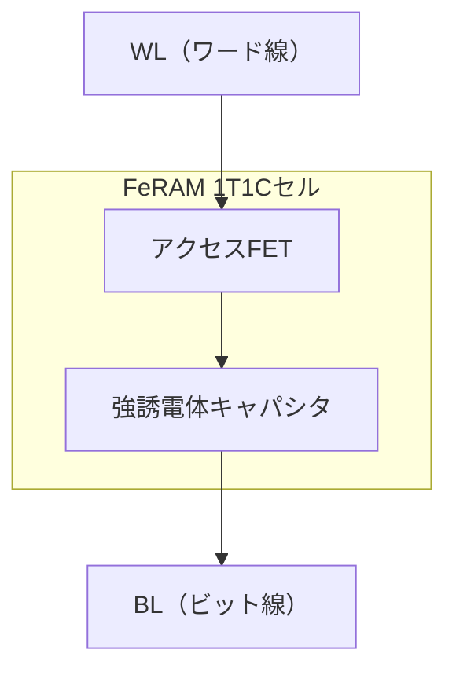

---

# 🔋 FeRAM（Ferroelectric Random Access Memory）｜FeRAM: Ferroelectric RAM

---

## 📘 概要｜Overview

**FeRAM（強誘電体RAM）**は、**不揮発性・高速性・高い書換え耐性**を併せ持つ次世代メモリです。  
**FeRAM (Ferroelectric RAM)** is a next-generation memory that combines **non-volatility, high speed, and high endurance**.

- **構造はDRAMと同様（1T1C）**｜Same structure as DRAM: 1 Transistor + 1 Capacitor (1T1C)
- **強誘電体材料（PZT, HfO₂）**でデータ保持｜Data retention using **ferroelectric materials (e.g., PZT, HfO₂)**
- **リフレッシュ不要、不揮発性**｜No refresh required, non-volatile

用途：組込み機器・アナログ混載LSI・車載制御など  
Applications: Embedded systems, mixed-signal LSI, automotive control

---

## 🔧 セル構造と動作原理｜Cell Structure & Operation

| 項目 | 内容（日本語） | 内容（English） |
|------|----------------|-----------------|
| 書き込み | 分極方向を電圧で制御（1 or 0） | Apply voltage to set polarization (1 or 0) |
| 読み出し | **破壊読み出し**＋再書き込みが必要 | **Destructive read**, followed by rewrite |
| キャパシタ材料 | PZT, HfO₂など | Materials such as PZT, HfO₂ |

---

## 📊 他メモリとの比較｜Comparison with Other Memories

| 特性 / Feature | FeRAM | SRAM | DRAM | Flash |
|----------------|-------|------|------|--------|
| 不揮発性 / Non-volatility | ◎ | × | × | ◎ |
| 書換耐性 / Write Endurance | ◎（10¹²回以上） | ◎ | ◎ | △（10⁴〜10⁵回） |
| 書換速度 / Write Speed | ◎（数10ns） | ◎ | ○ | ×（µs〜ms） |
| 消費電力 / Power | ◎（低） | ○ | △ | △ |
| セル面積 / Cell Area | △（1T1C） | △（6T） | ◎（1T1C） | ◎ |
| 読み出し方式 / Read Method | 破壊読み出し | 非破壊 | 非破壊 | 非破壊 |

---

## 🏭 実装と応用｜Implementation & Applications

| 分野 / Field | 特徴 / Feature | 活用例 / Example |
|-------------|----------------|------------------|
| 車載 / Automotive | 高信頼・温度安定性 | ECU、センサ制御 / ECU, sensor control |
| 医療 / Medical | 長寿命・低消費電力 | バイタル記録機器 / Vital sign recorders |
| 組込み / Embedded | 高速・省電力 | ファームウェア記録 / Firmware settings |
| アナログ混載 / AMS LSI | CMOS互換の不揮発性 | ADC/DAC SoC内蔵記憶 / On-chip memory for AMS |

---

## 🧪 材料技術と課題｜Materials & Scaling Challenges

| 材料 / Material | 特徴 / Feature | 備考 / Note |
|----------------|----------------|-------------|
| PZT | 高分極・実績豊富（Pb含む） | CMOS互換性に課題 / Pb issue |
| HfO₂ | CMOS互換・微細化対応 | FinFET対応、28nm以下対応可 |

**課題 / Issues**:

- 🔄 破壊読み出し → リライト頻度増による劣化  
  Destructive readout leads to wear due to rewrite
- 🔉 セル間干渉・読み出しノイズ  
  Crosstalk and read noise
- 🎯 センスアンプの感度が重要  
  Sense amplifier precision is critical

---

## 🧑‍🏫 教材的視点｜Educational Notes

- DRAMと構造類似 → **発展型メモリの位置づけ**  
  Same structure as DRAM → Advanced memory architecture
- 破壊読み出し → **信頼性設計の重要性**  
  Destructive read → Importance of reliability-aware design
- アナログLSIとの組み合わせ → **混載回路提案に展開可能**  
  Use with analog LSI → Extensible to mixed-signal applications

---

## 🔗 詳細プロセスフロー / Detailed Process Flow

FeRAMのプロセス実装に関心がある方は、以下の教材をご参照ください：

📘 **0.18μm FeRAM構想プロセスフロー（構造・条件・膜厚付き）**  
👉 [0.18um_FeRAM_ProcessFlow.md](./doc_FeRAM/0.18um_FeRAM_ProcessFlow.md)

- Pt/PZT/Ti構造による強誘電体キャパシタ形成工程を含む  
- AlOx保護膜、Wプラグ、Coサリサイドなどを網羅  
- 教育目的の構想プロセスとして三溝真一により設計

📘 **X線回折の原理とFeRAM/PZT応用（XRD教材）**  
👉 [xrd_principle_and_application.md](./doc_FeRAM/xrd_principle_and_application.md)

- 結晶構造、配向性、FWHM、シュラーの式、測定モード、装置構成などを網羅した基礎解説  
- FeRAMキャパシタの(111)配向確認や結晶性評価に直結する教材

📘 **FeRAM / 薄膜ピエゾ特性評価原理（ヒステリシス・変位・DBLI測定）**  
👉 [feram_piezo_evaluation_principles.md](./doc_FeRAM/feram_piezo_evaluation_principles.md)

- FeRAMのヒステリシスループ（Pm, Pr, Vc）とPUND法の原理解説  
- PZTアクチュエータのバタフライカーブ、DBLIによる変位評価手法を収録  

> 💡 メモリ用途とアクチュエータ用途に共通するPZT特性の理解に役立ちます。

📘 **HfZrO₂系強誘電体の水素工程適合性とFeFET動向**  
👉 [hfo2_h2_compat.md](./doc_FeRAM/hfo2_h2_compat.md)

- HfZrO₂の水素還元耐性と、CMOS準拠420 °C水素アニールへの対応性を解説  
- PZTとの違い、FeFETとの比較、BEOLプロセス統合の実用性に言及  
- FeRAMから次世代FeFETへの材料・構造進化の理解に有用
  
---

## 🔗 関連リンク｜Related Links

- [mram.md](./mram.md)：他の不揮発メモリとの比較  
  Comparison with MRAM and other nonvolatile memories
- [chapter4](../chapter4_mos_characteristics/)：MOS構造と誘電体互換性  
  MOS structure and dielectric compatibility
- [d_chapter5_analog_mixed_signal](../d_chapter5_analog_mixed_signal/)：AMSと不揮発メモリ活用  
  Mixed-signal circuits and FeRAM use

---

🏘 [応用編 第1章：メモリ技術｜Applied Chapter 1: Memory Technologies](../d_chapter1_memory_technologies/README.md)

---

© 2025 Shinichi Samizo / MIT License
