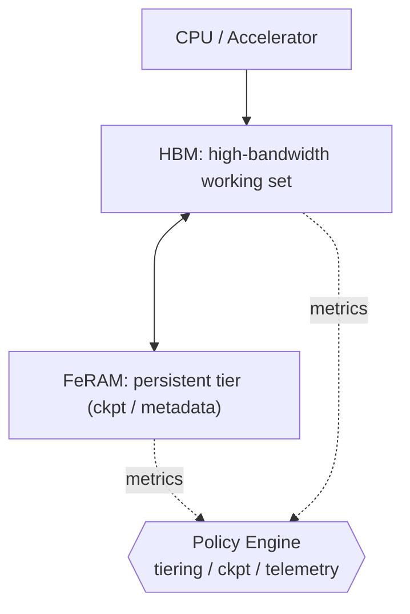
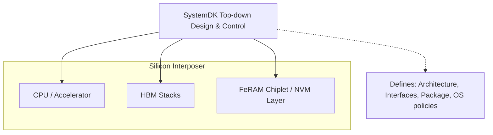

# 1.6 統合メモリ：HBM＋FeRAMによるモバイルエッジAI

現在、モバイルエッジAI向けメモリとして **HBM** の採用が検討されている。  
我々は **FeRAM** を実装し、不揮発機能を付与することで、低待機電力と **インスタントレジューム（電源断後も状態を保持し、即時復帰／瞬時再開できる機能）** を実現し、モバイルエッジAIの可能性をさらに広げる。  
*HBM is now being considered for memory in mobile edge AI systems. By implementing FeRAM to add non-volatility, we enable low standby power and instant resume (the ability to retain state across power-off and resume instantly), thereby broadening the potential of mobile edge AI.*

将来的には **HBM＋FeFET** がアドバンスト解として期待される。  
また、大容量モデルやログ用途が必須の場合には、**3D NAND をストレージ層としてオプション的に追加**できる。  
*In the future, HBM＋FeFET is expected to become the advanced solution. In addition, when large model storage or log retention is required, 3D NAND can be added as an optional storage tier.*

---

### 1.6.1 目標と制約 / Goals & Constraints

本構成の目標は、(1) 推論ピーク時の帯域確保、(2) 常用レイテンシの安定化、(3) 待機電力の極小化、(4) インスタントレジュームの実現である。主要制約は、実装面積・BOM・熱設計・耐久性（FeRAM書換）である。  
*The goals of this configuration are: (1) secure bandwidth at inference peaks, (2) stabilize working latency, (3) minimize standby power, and (4) enable instant resume. The main constraints are die area, BOM cost, thermal design, and FeRAM endurance.*

---

### 1.6.2 アーキテクチャ / Architecture

HBMはワークセットの主記憶として高帯域を提供し、FeRAMはチェックポイント／メタデータ／低頻度更新データを保持する不揮発層として機能する。両者はコントローラで統合し、階層ポリシーで運用する。  
*HBM serves as the high-bandwidth working store, while FeRAM functions as a persistent tier for checkpoints, metadata, and low-update data. Both are integrated by a controller and managed via hierarchical policies.*

---

### 1.6.3 ポリシー設計 / Policy Design

ここではデータを **Hot / Warm / Cold** に分類し、アクセス頻度に応じて階層配置する。  
*Data is categorized into **Hot / Warm / Cold**, and placed across tiers according to access frequency.*

- **Tiering**：HotはHBM、Warm/ColdはFeRAMへ段階配置。  
- **Checkpoint**：中断復帰時間の目標から間隔 \(T_{\mathrm{ckpt}}\) を決定。差分書込みを優先。  
- **Refresh連携**：FeRAMで保護されたCold領域はHBMのリフレッシュを抑制。  
- **Wear管理**：書込み頻度制限・ウェアレベリング・エラー訂正（ECC）を併用。  
- **テレメトリ**：帯域/遅延/書込み回数/温度を常時収集し動的最適化。  
*Tiering: hot→HBM; warm/cold→FeRAM. Checkpoint: choose \(T_{\mathrm{ckpt}}\) from resume targets; prefer delta writes. Refresh coupling: reduce HBM refresh for FeRAM-backed cold regions. Wear: throttle writes, wear-leveling, ECC. Telemetry: continuously collect bandwidth, latency, writes, and temperature.*

---

### 1.6.4 サイジング指針 / Sizing Guidelines

- **HBM帯域**：\(B_{\mathrm{HBM}} \ge \text{p95帯域}\)（余裕係数1.1–1.3）。  
- **FeRAM容量**：\(C_{\mathrm{Fe}} \ge C_{\mathrm{ckpt}} + C_{\mathrm{meta}} + C_{\mathrm{cold}}\)（余裕20%推奨）。  
- **Checkpoint間隔**：レジューム目標 \(t_{\mathrm{resume}}\) と書込み帯域 \(W_{\mathrm{Fe}}\) から  
  \\[
  T_{\mathrm{ckpt}} \approx \frac{C_{\mathrm{ckpt}}}{W_{\mathrm{Fe}}/k}
  \\]
  （\(k\): 圧縮/差分係数）。  
- **耐久チェック**：年間書換回数 \(N_{\mathrm{year}}\) がデバイス耐久（10¹²–10¹³）内に収まるよう調整。  
*HBM bandwidth: ≥p95 demand with 10–30% margin. FeRAM capacity: ckpt+metadata+cold (+20%). Checkpoint interval: \(T_{\mathrm{ckpt}} \approx C_{\mathrm{ckpt}} / (W_{\mathrm{Fe}}/k)\). Endurance: ensure annual writes within 10¹²–10¹³ cycles.*

---

### 1.6.5 実装ノート / Implementation Notes

- **パッケージ**：CPU/アクセラレータ、HBM、FeRAMはいずれもシリコンインターポーザ上で統合。これにより、広帯域かつ低レイテンシな接続が可能となり、待機電力低減やインスタントレジューム機能の効果が最大化される。  
*Package: CPU/accelerator, HBM, and FeRAM are all integrated on a silicon interposer, enabling wide-bandwidth, low-latency connections and maximizing the effectiveness of low standby power and instant resume.*

- **インタフェース**：HBMは並列広帯域I/F、FeRAMはNVMバスでコントローラ直結。  
*Interface: HBM via wide parallel I/F; FeRAM attached directly to the controller through an NVM bus.*

- **CPU設計統合**：これらを前提としたCPU/SoC設計は、**SystemDK** によるトップダウン統合設計で行い、チップレット／パッケージ／OSレイヤまで一貫して最適化する。  
*CPU/SoC design is performed under the assumption of this integration using **SystemDK**, enabling top-down co-design across chiplets, package, and OS layers.*

- **信頼性**：ECC、リテンション監視、温度ガード、スクラブ。  
*Reliability: ECC, retention monitors, thermal guard, scrubbing.*

- **セキュリティ**：チェックポイント暗号化と改ざん検知。  
*Security: encrypt and integrity-check checkpoints.*

---

### 1.6.6 評価計画 / Evaluation Plan

代表ワークロードで (帯域, p95遅延, 待機電力, レジューム時間, 年間書換数) を測定し、導入前後を比較する。失敗基準（例：p95遅延悪化、耐久超過の兆候）も定義する。  
*Measure bandwidth, p95 latency, standby power, resume time, and annual writes under workloads; compare against baseline and define failure criteria.*

---

### 1.6.7 将来展開 / Path to HBM＋FeFET

同じポリシーフレームでFeFETモデルに置き換える。非破壊リード・高密度の利点を活かし、FeRAMで調整したパラメータを継承して検証を短縮。  
*Swap in FeFET models under the same policy framework. Leverage non-destructive reads and density; reuse FeRAM parameters to shorten validation.*

---

### 1.6.8 SystemDKによる統合設計 / SystemDK-based Integration

CPU/アクセラレータ、HBM、FeRAMを含むメモリ階層の設計は、個別要素の積み上げではなく、**SystemDK** によるトップダウン設計で統合される。  
この枠組みでは、以下を一貫して最適化できる：  

- 全体アーキテクチャ定義（CPU–HBM–FeRAM–NANDの階層設計）  
- インタフェース仕様（帯域、バス幅、クロックドメイン）  
- パッケージ統合（インターポーザ、チップレット配置）  
- OS/ミドルウェア連携（チェックポイント管理、電力制御、セキュリティ）  

*Design of the memory hierarchy—including CPU/accelerator, HBM, and FeRAM—is not an ad-hoc assembly but integrated via **SystemDK** in a top-down flow. This framework co-optimizes:  
- System architecture (CPU–HBM–FeRAM–NAND hierarchy)  
- Interface specs (bandwidth, bus width, clock domains)  
- Package integration (interposer, chiplet placement)  
- OS/middleware support (checkpointing, power, security).*

#### 統合イメージ（本文補足）

