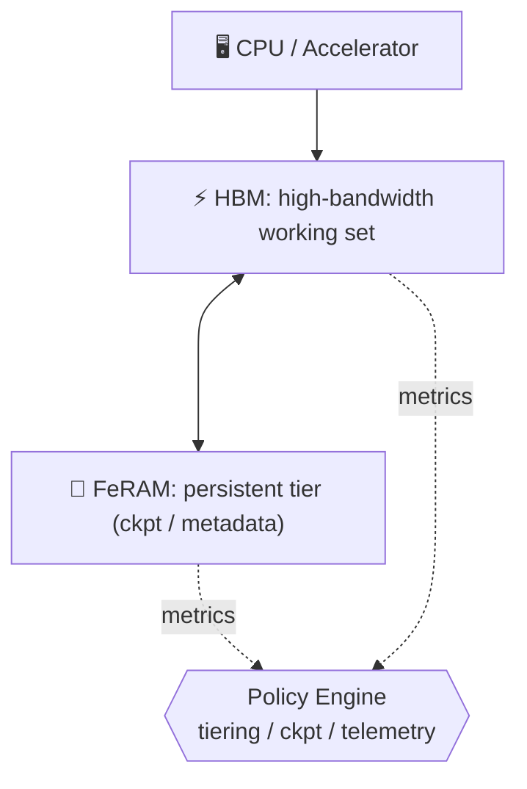

---

# 1.6 統合メモリ：HBM＋FeRAMによるモバイルエッジAI

---

現在、モバイルエッジAI向けメモリとして **HBM** の採用が検討されている。  
我々は **FeRAM** を実装し、不揮発機能を付与することで、低待機電力と **インスタントレジューム（電源断後も状態を保持し、即時復帰／瞬時再開できる機能）** を実現し、モバイルエッジAIの可能性をさらに広げる。  
*HBM is now being considered for memory in mobile edge AI systems. By implementing FeRAM to add non-volatility, we enable low standby power and instant resume (the ability to retain state across power-off and resume instantly), thereby broadening the potential of mobile edge AI.*

将来的には **HBM＋FeFET** がアドバンスト解として期待される。  
また、大容量モデルやログ用途が必須の場合には、**3D NAND をストレージ層としてオプション的に追加**できる。  
*In the future, HBM＋FeFET is expected to become the advanced solution. In addition, when large model storage or log retention is required, 3D NAND can be added as an optional storage tier.*

---

## 🎯 1.6.1 目標と制約 / Goals & Constraints

- **目標**: 帯域確保・レイテンシ安定化・低待機電力・インスタントレジューム  
- **制約**: 実装面積・BOMコスト・熱設計・FeRAM耐久性  

*Goals: secure bandwidth, stabilize latency, minimize standby power, enable instant resume.*  
*Constraints: die area, BOM, thermal design, endurance.*

---

## 🏗️ 1.6.2 アーキテクチャ / Architecture

- **HBM** = 高帯域ワーキングセット  
- **FeRAM** = チェックポイント／メタデータ／低頻度データ用の不揮発層  
- **統合** = コントローラ＋ポリシーエンジンによる階層管理  

---

## ⚙️ 1.6.3 ポリシー設計 / Policy Design

データを **Hot / Warm / Cold** に分類し、アクセス頻度に応じて階層配置する。  
*Data is categorized into Hot / Warm / Cold, and placed across tiers according to access frequency.*

- 🔥 **Tiering**: Hot=HBM、Warm/Cold=FeRAM  
- ⏱️ **Checkpoint**: 間隔 $T_{\mathrm{ckpt}}$ を設定、差分書込み優先  
- ♻️ **Refresh連携**: FeRAM保護領域のHBMリフレッシュ抑制  
- 🛡️ **Wear管理**: 書込み制御・ウェアレベリング・ECC  
- 📡 **テレメトリ**: 帯域/遅延/書込み/温度を常時収集  

---

## 📏 1.6.4 サイジング指針 / Sizing Guidelines

| 項目 / Item | 指針 / Guideline | 補足 / Note |
|-------------|------------------|-------------|
| **HBM帯域** | $B_{\mathrm{HBM}} \ge \text{p95帯域}$（余裕1.1–1.3） | p95 = 95パーセンタイル。ほとんどのアクセスをカバー |
| **FeRAM容量** | $C_{\mathrm{Fe}} \ge C_{\mathrm{ckpt}} + C_{\mathrm{meta}} + C_{\mathrm{cold}}$ （+20%余裕推奨） | ckpt=チェックポイント, meta=メタデータ |
| **Checkpoint間隔** | $T_{\mathrm{ckpt}} \approx \tfrac{C_{\mathrm{ckpt}}}{W_{\mathrm{Fe}}/k}$ | $k$=圧縮/差分係数 |
| **耐久チェック** | 年間書換 $N_{\mathrm{year}}$ が 10¹²–10¹³ 内に収まること | FeRAM耐久性確保 |

（補足: **HBM帯域** = バス幅×転送レート×スタック数。HBM2 ≈ 256–410 GB/s, HBM3 ≈ 819 GB/s, HBM3E ≈ 1.2 TB/s）  

---

## 🛠️ 1.6.5 実装ノート / Implementation Notes

- 📦 **パッケージ**: CPU/HBM/FeRAM をインターポーザ統合 → 広帯域・低レイテンシ  
- 🔌 **インタフェース**: HBM=広帯域I/F、FeRAM=NVMバス直結  
- 🧩 **CPU設計統合**: **SystemDK** によるトップダウン設計で一貫最適化  
- 🔒 **信頼性**: ECC, リテンション監視, 温度ガード, スクラブ  
- 🔑 **セキュリティ**: チェックポイント暗号化＋改ざん検知  

---

## 📊 1.6.6 評価計画 / Evaluation Plan

- 帯域, p95遅延, 待機電力, レジューム時間, 年間書換数を測定  
- 導入前後を比較し、失敗基準（例: p95悪化, 耐久超過）を定義  

---

## 🚀 1.6.7 将来展開 / Path to HBM＋FeFET

- 同じポリシーでFeFETに置換可能  
- **非破壊リード**と**高密度**の利点を活かし、検証期間短縮  

---

## 🧭 1.6.8 SystemDKによる統合設計 / SystemDK-based Integration

SystemDKによるトップダウン設計で以下を統合最適化：  
- 🖥️ 全体アーキ (CPU–HBM–FeRAM–NAND 階層)  
- 🔌 I/F仕様 (帯域・バス幅・クロックドメイン)  
- 📦 パッケージ (インターポーザ・チップレット配置)  
- 🛠️ OS/ミドル (ckpt管理・電力制御・セキュリティ)  

