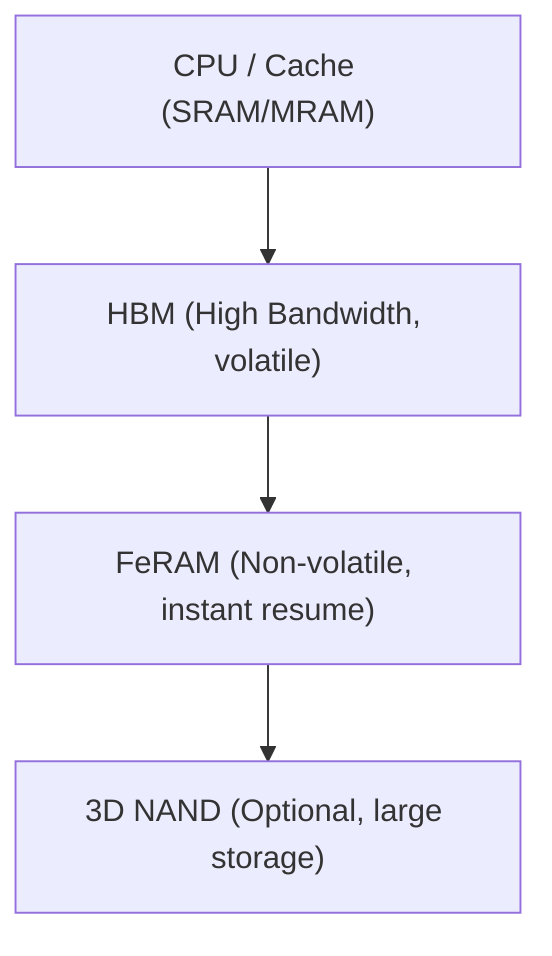

# 1.6 HBM＋FeRAM：ハイブリッドメモリによるモバイルAI応用
*HBM + FeRAM Hybrid Memory for Mobile/Edge AI*

---

**日本語**  
HBM（High Bandwidth Memory）はAI推論や学習で必須となる広帯域を提供するが、揮発性とリフレッシュ電力が課題である。  
これを補完するのが **FeRAM（強誘電体RAM）** であり、チェックポイントやinstant resume、低待機電力動作を可能にする。  
両者を組み合わせることで、**高性能と低消費電力の両立**が図れる。

**English**  
HBM provides the high bandwidth required for AI workloads but suffers from volatility and refresh power overhead.  
**FeRAM** complements HBM by enabling checkpointing, instant resume, and low standby power.  
Together, they form a **hybrid memory solution** that balances **performance and energy efficiency** for mobile/edge AI.

---

## 📊 メモリ階層イメージ / Memory Hierarchy Concept

---

🔍 ポイント / Key Points
	•	HBM：高帯域・大容量・揮発性
	•	FeRAM：不揮発・nsアクセス・高耐久（10¹²〜10¹³）
	•	組み合わせの効果：
	•	DRAMリフレッシュ負荷の削減
	•	待機電力低減と即時復帰
	•	モバイルAI/エッジAIデバイスにおける省電力化

⸻

将来展望：HBM＋FeRAMは「現実解」、さらに HBM＋FeFET が「アドバンスト解」として期待される。

