---

# 1.6 統合メモリ：HBM＋FeRAMによるモバイルエッジAI

---

現在、モバイルエッジAI向けメモリとして **HBM** の採用が検討されている。  
我々は **FeRAM** を実装し、不揮発機能を付与することで、低待機電力と **インスタントレジューム（電源断後も状態を保持し、即時復帰／瞬時再開できる機能）** を実現し、モバイルエッジAIの可能性をさらに広げる。  
*HBM is now being considered for memory in mobile edge AI systems. By implementing FeRAM to add non-volatility, we enable low standby power and instant resume (the ability to retain state across power-off and resume instantly), thereby broadening the potential of mobile edge AI.*

将来的には **HBM＋FeFET** がアドバンスト解として期待される。  
また、大容量モデルやログ用途が必須の場合には、**3D NAND をストレージ層としてオプション的に追加**できる。  
*In the future, HBM＋FeFET is expected to become the advanced solution. In addition, when large model storage or log retention is required, 3D NAND can be added as an optional storage tier.*

---

## 🎯 1.6.1 目標と制約 / Goals & Constraints

- **目標**: 帯域確保・レイテンシ安定化・低待機電力・インスタントレジューム  
*Goals: secure bandwidth, stabilize latency, minimize standby power, enable instant resume.*  

- **制約**: 実装面積・BOMコスト・熱設計・FeRAM耐久性  
*Constraints: die area, BOM, thermal design, endurance.*  

---

## 🏗️ 1.6.2 アーキテクチャ / Architecture

- **HBM** = 高帯域ワーキングセット  
*HBM = high-bandwidth working set*  

- **FeRAM** = チェックポイント／メタデータ／低頻度データ用の不揮発層  
*FeRAM = persistent tier for checkpoints, metadata, and low-update data*  

- **統合** = コントローラ＋ポリシーエンジンによる階層管理  
*Integration = managed by controller and policy engine*  

```mermaid
flowchart TD
  CPU["🖥️ CPU / Accelerator"]
  HBM["⚡ HBM: high-bandwidth working set"]
  NV["💾 FeRAM: persistent tier (ckpt / metadata)"]

  CPU --> HBM
  HBM <---> NV
  note1{{Policy Engine<br/>tiering / ckpt / telemetry}}
  NV -. metrics .-> note1
  HBM -. metrics .-> note1
```

---

## ⚙️ 1.6.3 ポリシー設計 / Policy Design

データを **Hot / Warm / Cold** に分類し、アクセス頻度に応じて階層配置する。  
*Data is categorized into Hot / Warm / Cold, and placed across tiers according to access frequency.*  

- 🔥 **Tiering**: Hot=HBM、Warm/Cold=FeRAM  
*Tiering: hot→HBM; warm/cold→FeRAM*  

- ⏱️ **Checkpoint**: 間隔 $T_{\mathrm{ckpt}}$ を設定、差分書込み優先  
*Checkpoint: choose $T_{\mathrm{ckpt}}$ from resume targets; prefer delta writes*  

- ♻️ **Refresh連携**: FeRAM保護領域のHBMリフレッシュ抑制  
*Refresh coupling: reduce HBM refresh for FeRAM-backed cold regions*  

- 🛡️ **Wear管理**: 書込み制御・ウェアレベリング・ECC  
*Wear: throttle writes, wear-leveling, ECC*  

- 📡 **テレメトリ**: 帯域/遅延/書込み/温度を常時収集  
*Telemetry: continuously collect bandwidth, latency, writes, and temperature*  

---

## 📏 1.6.4 サイジング指針 / Sizing Guidelines

| 項目 / Item | 指針 / Guideline | 補足 / Note |
|-------------|------------------|-------------|
| **HBM帯域** | $B_{\mathrm{HBM}} \ge \text{p95帯域}$（余裕1.1–1.3） | *p95 = 95th percentile, covering almost all accesses* |
| **FeRAM容量** | $C_{\mathrm{Fe}} \ge C_{\mathrm{ckpt}} + C_{\mathrm{meta}} + C_{\mathrm{cold}}$ （+20%余裕推奨） | *ckpt=checkpoint, meta=metadata* |
| **Checkpoint間隔** | $T_{\mathrm{ckpt}} \approx \tfrac{C_{\mathrm{ckpt}}}{W_{\mathrm{Fe}}/k}$ | *$k$ = compression/delta factor* |
| **耐久チェック** | 年間書換 $N_{\mathrm{year}}$ が 10¹²–10¹³ 内に収まること | *FeRAM endurance check* |

（補足: **HBM帯域** = バス幅×転送レート×スタック数。HBM2 ≈ 256–410 GB/s, HBM3 ≈ 819 GB/s, HBM3E ≈ 1.2 TB/s）  
*Note: HBM bandwidth = bus width × transfer rate × stack count. HBM2 ≈ 256–410 GB/s, HBM3 ≈ 819 GB/s, HBM3E ≈ 1.2 TB/s (per stack).*  

---

## 🛠️ 1.6.5 実装ノート / Implementation Notes

- 📦 **パッケージ**: CPU/HBM/FeRAM をインターポーザ統合 → 広帯域・低レイテンシ  
*Package: CPU/HBM/FeRAM are integrated on a silicon interposer → wide bandwidth, low latency*  

- 🔌 **インタフェース**: HBM=広帯域I/F、FeRAM=NVMバス直結  
*Interface: HBM = wide parallel I/F; FeRAM = direct NVM bus connection*  

- 🧩 **CPU設計統合**: **SystemDK** によるトップダウン設計で一貫最適化  
*CPU design integration via SystemDK top-down approach*  

- 🔒 **信頼性**: ECC, リテンション監視, 温度ガード, スクラブ  
*Reliability: ECC, retention monitors, thermal guard, scrubbing*  

- 🔑 **セキュリティ**: チェックポイント暗号化＋改ざん検知  
*Security: checkpoint encryption and tamper detection*  

---

## 📊 1.6.6 評価計画 / Evaluation Plan

代表ワークロードで (帯域, p95遅延, 待機電力, レジューム時間, 年間書換数) を測定し、導入前後を比較する。  
*Measure bandwidth, p95 latency, standby power, resume time, and annual writes under workloads; compare against baseline.*  

---

## 🚀 1.6.7 将来展開 / Path to HBM＋FeFET

同じポリシーでFeFETに置換可能。非破壊リード・高密度の利点を活かし、検証期間短縮。  
*FeFET can be swapped in under the same policy. Non-destructive read and high density reduce validation cost.*  

---

## 🧭 1.6.8 SystemDKによる統合設計 / SystemDK-based Integration

CPU/アクセラレータ、HBM、FeRAMを含むメモリ階層の設計は、**SystemDK** によるトップダウン設計で統合される。  
*Design of memory hierarchy (CPU, HBM, FeRAM) is integrated via SystemDK in a top-down manner.*  

- 🖥️ **全体アーキ**: CPU–HBM–FeRAM–NAND 階層  
*System architecture: CPU–HBM–FeRAM–NAND*  

- 🔌 **I/F仕様**: 帯域・バス幅・クロックドメイン  
*Interface specs: bandwidth, bus width, clock domains*  

- 📦 **パッケージ統合**: インターポーザ・チップレット配置  
*Package integration: interposer, chiplet placement*  

- 🛠️ **OS/ミドルウェア**: ckpt管理・電力制御・セキュリティ  
*OS/middleware: checkpoint management, power, security*  

```mermaid
flowchart TB
    subgraph Interposer["🧩 Silicon Interposer"]
        CPU["CPU / Accelerator"]
        HBM["HBM Stacks"]
        FeRAM["FeRAM Chiplet / NVM Layer"]
    end

    SystemDK["SystemDK Top-down Design & Control"]

    SystemDK --> CPU
    SystemDK --> HBM
    SystemDK --> FeRAM

    note1["Defines: Architecture, Interfaces, Package, OS policies"]
    SystemDK -.-> note1
```

---

## 関連文書 / Related Documents

📘 **VSRAMアーカイブ (2001)**  
2001年に量産された **エプソン製モバイル用疑似SRAM（VSRAM）** が、  
シャープ製 Flash と組み合わせられることで、世界初の **カメラ付き携帯電話** が実現した記録です。  
*This is a record of Epson’s pseudo-SRAM (VSRAM) for mobile devices, mass-produced in 2001,  
which enabled the world’s first camera-equipped mobile phone in combination with Sharp’s Flash.*  

👉 [こちらから参照 / Access here](https://samizo-aitl.github.io/Edusemi-Plus/archive/in2001/VSRAM_2001/)

💾 **Hybrid Memory (HBM+FeRAM)**  
HBMは高帯域・大容量を提供し、FeRAMは不揮発・低電力・瞬時復帰を補完。  
*HBM provides high bandwidth and capacity, while FeRAM complements with non-volatility,  
low standby power, and instant resume.*  

**SystemDK** によるトップダウン協調設計（チップレット／コントローラ／OS）で、  
スタンバイ電力と再起動時間を削減するハイブリッド構成を検討・教材化。  
*Using **SystemDK** top-down co-design (chiplets / controllers / OS),  
we explore and document hybrid memory architectures that reduce standby power and reboot time.*  

[📄 HBM+FeRAM Chiplet Integration (PDF)](./HBM_FeRAM_Chiplet_MobileEdgeAI.pdf)
