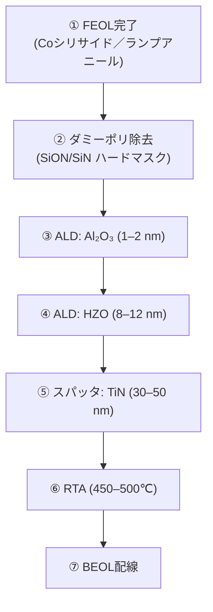
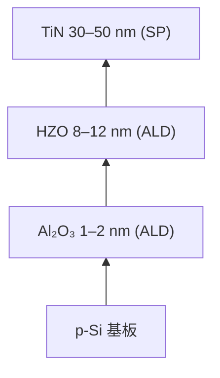

# 2. プロセス統合

- ベースライン：0.18 µm CMOS (1.8 V ロジック、3.3 V SRAM/I/O)  
- FeFETモジュールは Poly 定義後、Coシリサイド形成とランプアニール後に挿入  
- スタック構成：TiN / HZO (8–12 nm, ALD) / Al₂O₃ (1–2 nm, ALD) / p-Si  
- **追加プロセスコスト**：マスク1枚、ALD一台  
  - Al₂O₃ と HZO は同一 ALD 装置内で連続堆積可能  
  - TiN は既存のバリアメタルスパッタ装置を流用可能  
- 既存の 0.18 µm ラインに最小限の改修で組み込める点が最大の利点  

---

## 2.1 材料ごとの意義と製造方法

### Al₂O₃ (1–2 nm, ALD)
- **意義**  
  - Si基板界面をパッシベーションし、酸素空孔や界面欠陥を抑制  
  - HZO強誘電相（斜方晶）の安定化に寄与  
  - 保持特性・耐久性を改善  
- **製造方法**  
  - ALD（Trimethylaluminum + H₂O または O₃）  
  - 原子層制御により 1–2 nm の精密成膜が可能  

### HZO: Hf₀.₅Zr₀.₅O₂ (8–12 nm, ALD)
- **意義**  
  - CMOS互換の強誘電材料  
  - Hf/Zr 比率を調整することで、低電圧（±2.5 V程度）動作と安定したメモリ窓 ΔVth を実現  
- **製造方法**  
  - ALDで Hf 前駆体（HfCl₄, TEMAH）と Zr 前駆体（ZrCl₄, TEMAZr）を交互に供給  
  - サイクル数比で Hf:Zr ≈ 1:1 を調整  
  - Oソースは H₂O または O₃ を使用  

### TiN (30–50 nm, スパッタ)
- **意義**  
  - 仕事関数（約4.6–4.9 eV）を利用して Vth を制御  
  - 酸素拡散バリアとして HZO 内の酸素空孔生成を抑制  
  - 既存バリアメタルプロセスを流用可能 → 導入コスト低  
- **製造方法**  
  - 既存のバリアメタルスパッタ装置（コンタクトバリアやCuプロセス用）で成膜  
  - 成膜条件（N₂/Ar比）で仕事関数調整が可能  

---

## 2.2 プロセス断面およびフロー

**図1**: プロセス断面およびフロー図  

