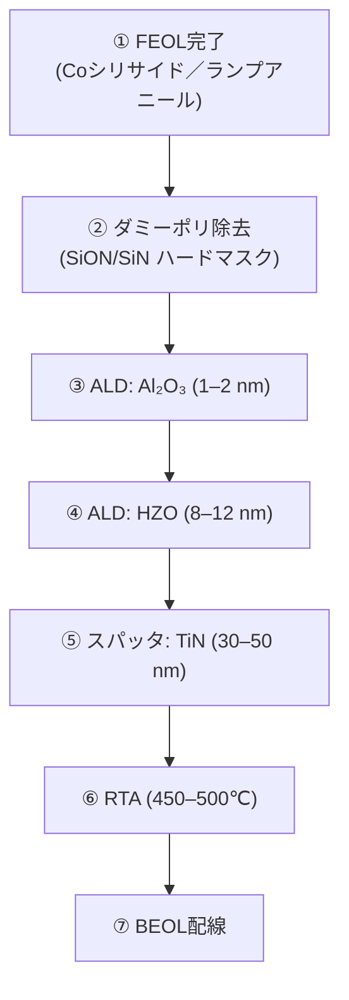
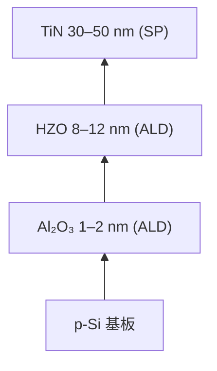

# 2. プロセス統合
- ベースライン：0.18 µm CMOS (1.8 V ロジック、3.3 V SRAM/I/O)  
- FeFETモジュールは Poly 定義後、Coシリサイド形成とランプアニール後に挿入  
- スタック構成：TiN / HZO (8–12 nm, ALD) / Al₂O₃ (1–2 nm, ALD) / p-Si  
- **図1**: プロセス断面およびフロー図

