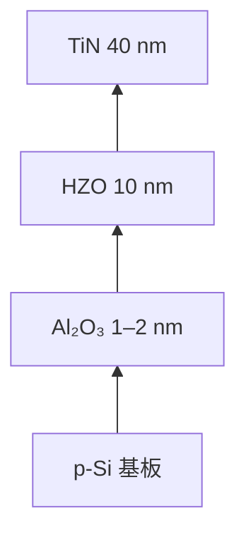
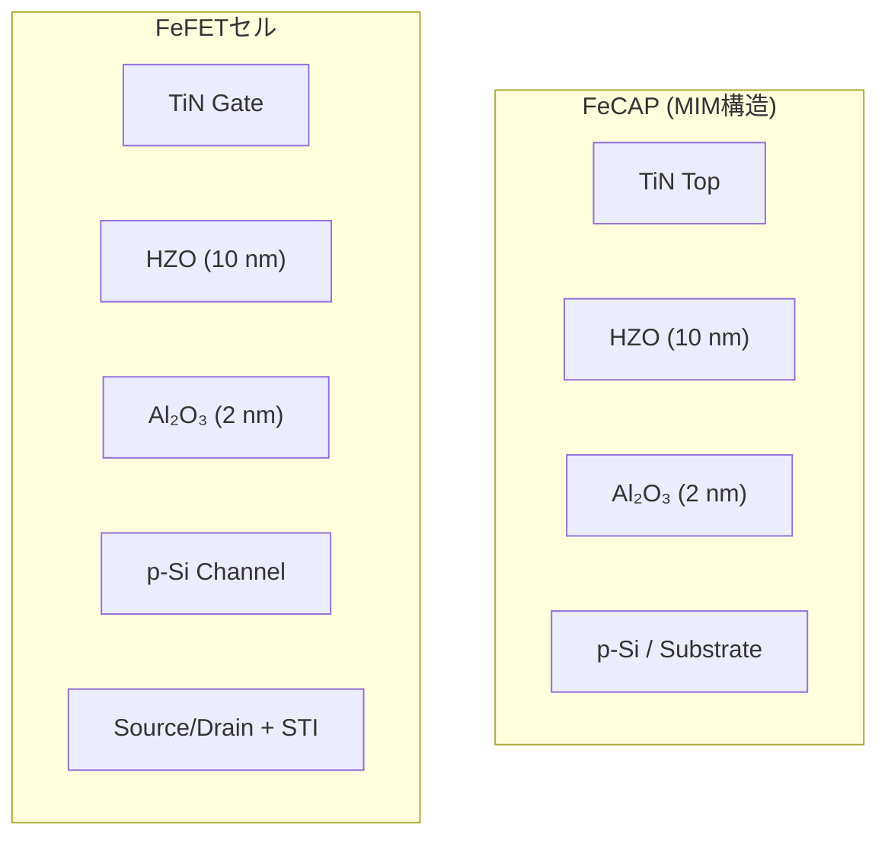

# 3. デバイス試作と測定方法

- プロセスフロー：ダミーポリ除去 → ALD (Al₂O₃/HZO) → TiNスパッタ → 結晶化アニール  
- 測定条件：書込/消去電圧 ±2.3–2.7 V、パルス幅 1–50 µs  
- 測定装置：Keysight B1500A + プローバステーション  

---

## 3.1 試作構造 (TEG)

- **強誘電HZOキャパシタ (FeCAP, MIM構造)**  
  - 材料スタック特性と信頼性の独立評価用。  
  - **面積依存性**：大面積セルでの欠陥支配リスクを確認。  
  - **周辺長依存性**：矩形セル＋スネークパターン電極により、STI近傍薄膜シンニング起因リークを評価。  

- **FeFETセル (100 × 100 µm²)**  
  - 1.8 V動作を想定したゲートラスト統合セル。  
  - SRAM補助NVM用途における動作検証を実施。  

---

**図2**: HZOスタック断面模式図（TEM相当）

## 3.2 評価項目と測定条件

- **TZDB (Time-Zero Dielectric Breakdown)**  
  - 評価構造: FeCAP (MIM)  
  - 温度条件: 室温〜125 ℃  
  - 測定方法: DCストレス印加、リーク電流モニタリング  
  - 目的: 絶縁膜初期欠陥による即時破壊モードを評価  

- **TDDB (Time-Dependent Dielectric Breakdown)**  
  - 評価構造: FeCAP (MIM)  
  - 温度条件: 85 ℃  
  - 測定方法: 定電圧ストレス (±2.5〜3.0 V)、破壊時間を統計処理  
  - 解析: Weibull分布により β (形状パラメータ) と η (特性寿命) を抽出  

- **Endurance (書換耐久性)**  
  - 評価構造: FeFETセル  
  - 温度条件: 室温  
  - 測定方法: 書込/消去電圧 ±2.5 V、パルス幅 10 µs、繰返し周波数 10 kHz  
  - 最大サイクル: 10⁵  
  - 目的: ΔVth 窓の縮小率を評価  

- **Retention (保持特性)**  
  - 評価構造: FeFETセル  
  - 温度条件: 25 ℃, 85 ℃, 125 ℃  
  - 測定方法: 書込/消去後に ΔVth を経時測定  
  - 解析: Arrhenius外挿により10年寿命を予測、活性化エネルギー Ea を算出  

---

## 3.3 TEG構造模式図

**図3**: 評価用TEG構造（FeCAP & FeFET）

