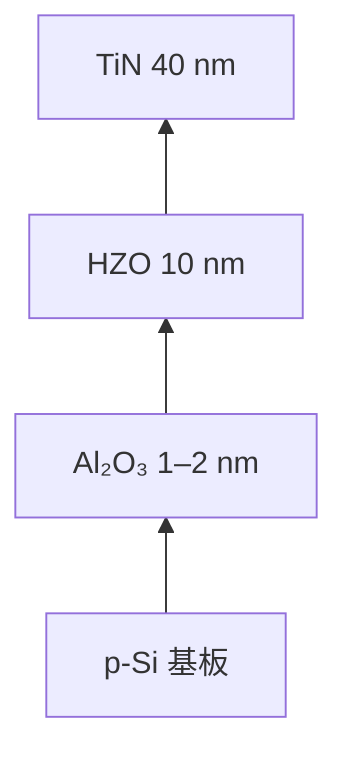
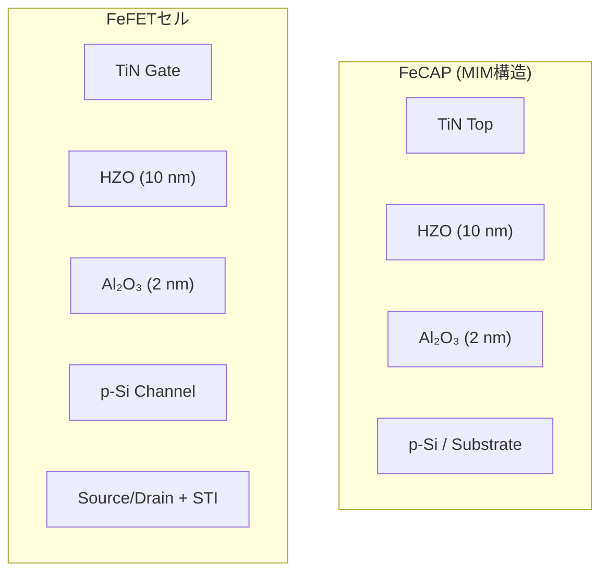

# 3. デバイス試作と測定方法

- プロセスフロー：ダミーポリ除去 → ALD (Al₂O₃/HZO) → TiNスパッタ → 結晶化アニール  
- 測定条件：書込/消去電圧 ±2.3–2.7 V、パルス幅 1–50 µs  
- 測定装置：Keysight B1500A + プローバステーション  

---

## 3.1 試作構造 (TEG)

- **強誘電HZOキャパシタ (FeCAP, MIM構造)**  
  - 材料スタック特性と信頼性の独立評価用。  
  - **フラットパターン**：大面積電極で欠陥統計を評価。  
  - **スネークパターン**：同一面積で周辺長を増やし、STI端部の薄膜シンニングによるリーク影響を比較。  

- **FeFETセル (100 × 100 µm²)**  
  - 1.8 V動作を想定したゲートラスト統合セル。  
  - SRAM補助NVM用途における ΔVth 書換／保持特性を直接評価。  

---

**図2**: HZOスタック断面模式図（TEM相当）

---

## 3.2 評価項目と測定条件

### (A) TZDB (Time-Zero Dielectric Breakdown)
- **評価構造**: FeCAP (MIM)  
  - **フラットパターン**：大面積セルにより欠陥密度の統計を取得  
  - **櫛パターン (comb pattern)**：多数の指電極により周辺長を増加させ、**STI端部シンニングやエッジ欠陥依存性**を抽出  
- **温度条件**: 85 ℃, 100 ℃, 125 ℃（車載Grade-1に対応）  
- **電圧レンジ**:  
  - 動作電圧 VDD = 1.8 V  
  - 絶対最大定格 Vabs = 1.95 V  
  - 上位ストレス (+30〜50%) = 2.3–2.7 V  
  - **理由**: VDD近傍では破壊時間が長すぎて測定困難なため、実動作領域を外挿可能にする目的で加速ストレスを印加  
- **印加方法**: DCランプ (0.05–0.10 V/s)、リークモニタリング  
- **破壊判定**: Soft BD（リーク×10増）、Hard BD（電流ジャンプ）  
- **評価目標**: 欠陥密度 **D ≤ 0.5 個/cm²**  
  - 95%信頼・ゼロ故障を主張するため、総面積 **6.0 cm²/温度** を測定  
- **サンプリング**:  
  - ウェハ内で中心・中間・端を含む **25点/ウェハ以上**配置  
  - 総数150個を5ウェハ程度に分散し、**面内傾向をマッピング**  
- **出力**:  
  - CDFプロット（横軸 Eox=V/tox, 縦軸 CDF[%]）  
  - VDD/AbsMax の縦線表示  
  - D50%, D1% を明示し、AbsMaxに対するマージンを議論  

---

### (B) TDDB (Time-Dependent Dielectric Breakdown)
- **評価構造**: FeCAP (MIM, フラット)  
- **温度条件**: 85 ℃, 100 ℃, 125 ℃  
- **ストレス条件**: 定電圧ストレス (±2.5–3.0 V)  
  - **理由**: 実動作電圧 (VDD=1.8 V, Vabs=1.95 V) より高い電圧を印加することで、酸化膜の寿命試験を数時間〜数千時間スケールに短縮。加速ストレスで得た寿命分布を電界加速則 (E-model, 1/E-model) に基づき実動作条件へ外挿。  
- **サンプル数**:  
  - 各電圧条件で **30デバイス以上**  
  - 85 ℃・125 ℃でそれぞれ3電圧 → **90デバイス/温度**  
  - 中心・端を分散サンプリングして**面内差を評価**  
- **解析**:  
  - Weibullフィットにより β (形状パラメータ) と η (特性寿命) を抽出  
  - Ea を推定し、125 ℃動作寿命に外挿  
- **目的**: 酸素空孔・界面起因の時間依存破壊モードを評価  

---

### (C) Endurance (書換耐久性)
- **評価構造**: FeFETセル (100×100 µm²)  
- **温度条件**: 室温, 85 ℃  
- **パルス条件**: 書込/消去電圧 ±2.5 V、パルス幅 10 µs、繰返し周波数 10 kHz  
  - **理由**: VDD=1.8 Vより高いパルス電圧を与えることで、FeFETの分極反転を確実に行い、書換劣化モードを加速評価する。  
- **測定項目**: ΔVth 窓の保持率、劣化率（20–30%縮小までを基準）  
- **最大サイクル**: 10⁵  
- **サンプル数**: 各温度10セル（中心・端を均等に配置）  

---

### (D) Retention (保持特性)
- **評価構造**: FeFETセル (100×100 µm²)  
- **温度条件**: 25 ℃, 85 ℃, 125 ℃  
- **測定方法**: 書込／消去後の ΔVth を経時測定し、窓保持率を算出  
  - **理由**: 高温保持試験でデータ保持の加速劣化を発生させ、Arrhenius外挿により常温・車載温度での10年寿命保証を予測する。  
- **解析**: Arrhenius外挿により10年寿命を予測、活性化エネルギー Ea を算出  
- **サンプル数**: 各温度10セル（中心・端を均等に配置）  

---

**補足**:  
全評価項目について、結果は **分布データ（CDF, Weibull, ヒストグラム等）** として整理し、平均値ではなく統計的ばらつき・面内傾向を評価する。

---

## 3.3 TEG構造模式図

**図3**: 評価用TEG構造（FeCAP & FeFET）

---

### 補足: 評価目標の設定理由
既存のロジック CMOS (SiON/SiO₂ ゲート酸化膜) においては、欠陥密度 D は **0.7–0.8 個/cm²** 程度が一般的に報告されている。  
本研究では、新規材料 HZO/Al₂O₃ stack を導入するにあたり、これを下回る **D ≤ 0.5 個/cm²** を第一段階の信頼性目標として設定した。  
すなわち、**ゲート膜起因の欠陥を支配因子と仮定し、既存ロジック実績よりも厳しい基準を課す**ことで、新規材料としての優位性を示す狙いがある。  
