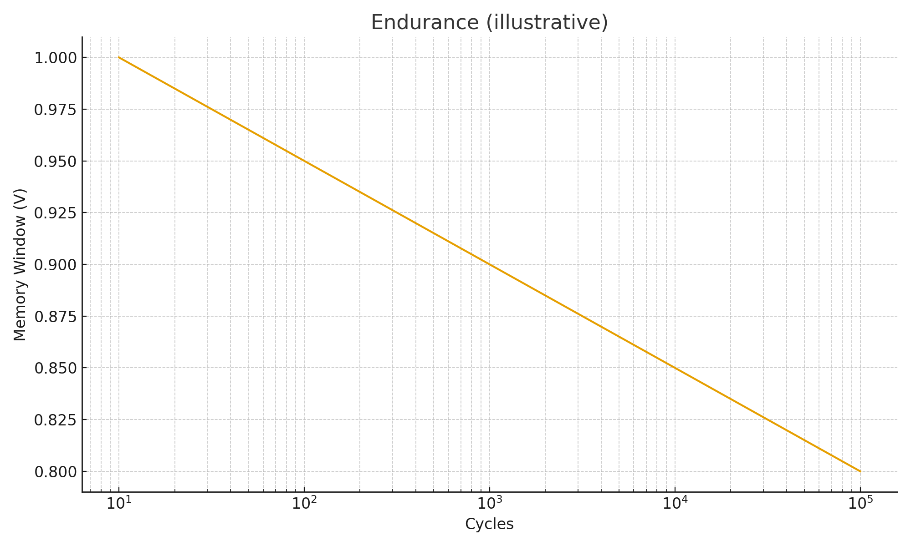
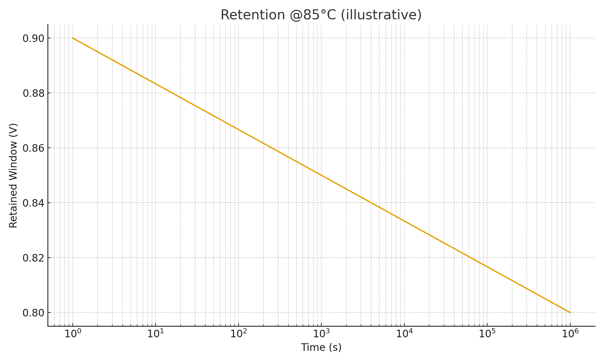
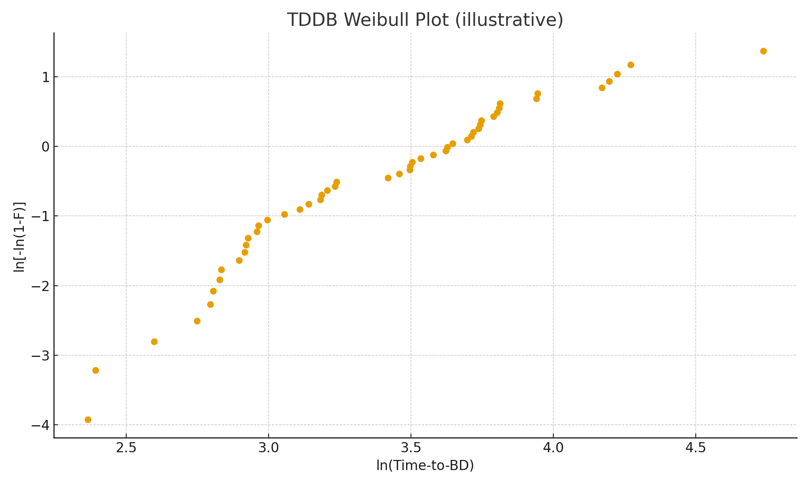

# 4. 実験結果
## 4.1 書換耐久性
- 10⁵サイクル以上で動作を確認、しきい値窓は20–30%縮小  

**図3**: 耐久性カーブ  

## 4.2 保持特性
- 85 ℃での測定を Arrhenius 外挿 → 10年以上の保持を見積もり  

**図4**: 保持特性  

## 4.3 TDDB特性
- 酸素空孔由来のリークを Al₂O₃ IL で抑制  
- 書込電圧は ±2.7 V 上限でストレスを制御  

**図5**: TDDBワイブルプロット  

