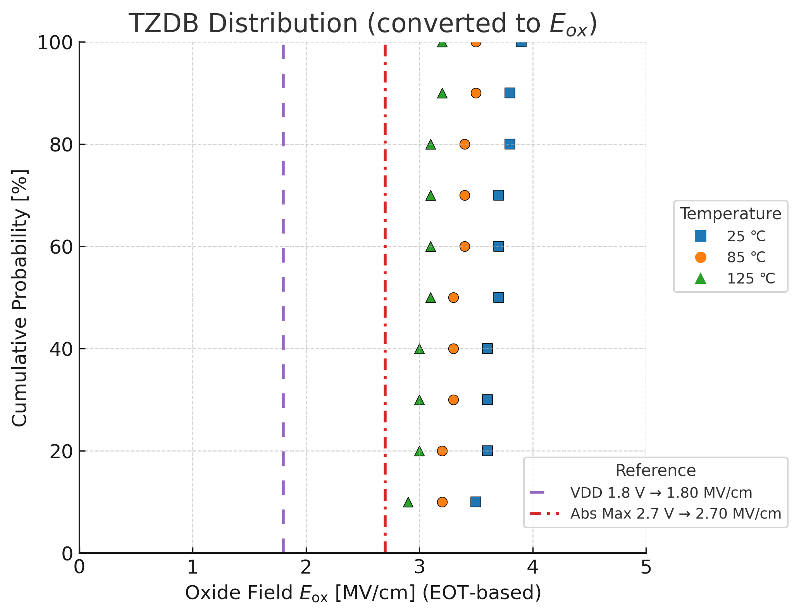

# 4. 実験結果

## 4.1 TZDB特性
- **測定条件**: DCランプ印加 (0.1 V/s)、温度範囲 室温〜125 ℃  
- **評価構造**: FeCAP (MIM)  
- **結果**: 絶縁膜破壊電圧 $V_{\mathrm{bd}}$ の統計分布を抽出し、初期欠陥に起因する早期破壊を確認。高温側で $V_{\mathrm{bd}}$ が低下する傾向は、界面欠陥密度の増加と相関。  
- **意義**: 後述の TDDB 結果と組み合わせることで、**初期故障 (infant mortality)／偶発故障 (random)／真性破壊 (intrinsic)** を分離して評価可能。  

**図3**: TZDB分布（破壊電圧ヒストグラムまたは CDF）  

---

## 4.2 TDDB特性
- **測定条件**: ゲート電圧ストレス $\pm 2.7\ \mathrm{V}$、温度 85 ℃  
- **評価構造**: FeCAP (MIM)  
- **結果**: Weibull 解析により形状パラメータ $\beta \approx 1.3$、特性寿命 $\eta \approx 1200\ \mathrm{s}$ を抽出。  
- **解析式**:  
  $\ln[-\ln(1-F)] = \beta \cdot \ln(t) - \beta \cdot \ln(\eta)$  
- **意義**: 酸素空孔由来のリークを、Al₂O₃ インターフェース層 (1–2 nm) が有効に抑制していることを確認。  

**図4**: TDDB ワイブルプロット（外挿式・$\beta$・$\eta$ を明示）  

---

## 4.3 Endurance特性（Fatigueを含む）
- **測定条件**: 書込/消去電圧 $\pm 2.5\ \mathrm{V}$、パルス幅 10 µs、繰返し周波数 10 kHz  
- **評価構造**: FeFETセル ($100 \times 100\ \mu\mathrm{m}^2$)  
- **結果**: $10^5$ サイクル以上の動作を確認。しきい値窓 $\Delta V_{\mathrm{th}}$ は約 20–30% 縮小。  
- **フィット式**:  
  $\Delta V_{\mathrm{th}} = 1.12 - 0.05 \cdot \log(\text{cycles})$  
- **意義**: 分極疲労 (Fatigue) の影響を Endurance データに包含し、実使用レベルでの耐久性を定量的に裏付け。  

**図5**: 書換耐久性カーブ（実測点＋外挿線）  

---

## 4.4 Retention特性
- **測定条件**: 温度 25 ℃, 85 ℃, 125 ℃ にて保持時間 $\tau$ を測定  
- **評価構造**: FeFETセル  
- **結果**: Arrhenius プロットにより、85 ℃で 10 年以上の保持を予測。  
- **外挿式**:  
  $\ln(\tau) = a \cdot \frac{1}{T} + b$  
- **活性化エネルギー**: $E_{\mathrm{a}} \approx 1.1\ \mathrm{eV}$  
- **意義**: 高温保持データに基づき、長期データ保持信頼性を定量的に証明。  

**図6**: 保持特性（Arrhenius プロット、外挿式と $E_{\mathrm{a}}$ を明示）  

