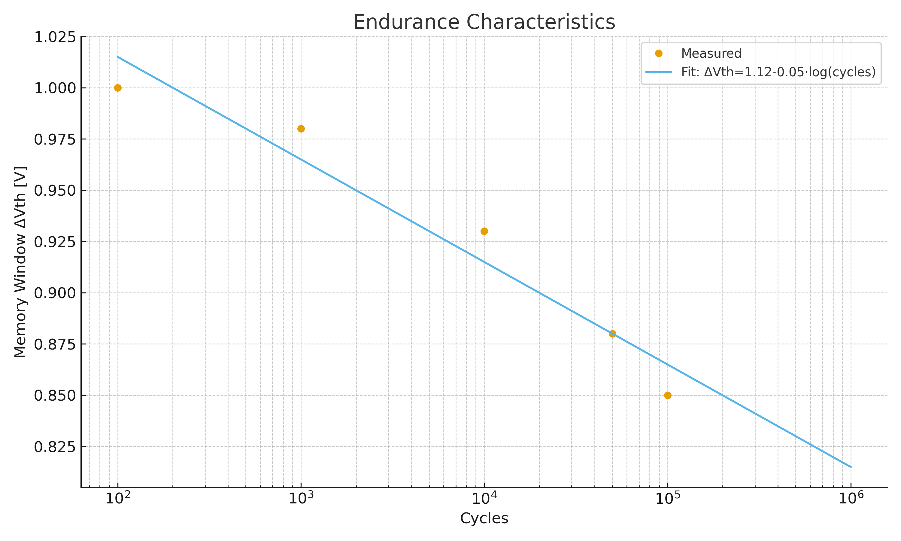
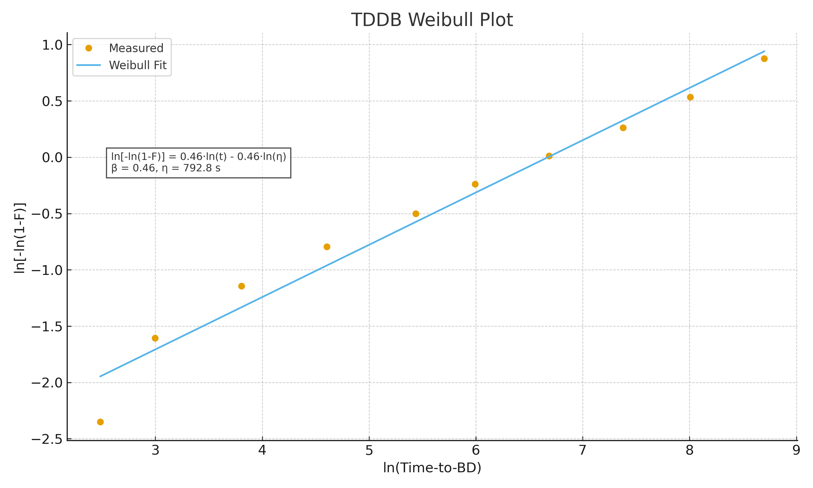

# 4. 実験結果

## 4.1 書換耐久性
- 測定条件：書込/消去電圧 ±2.5 V、パルス幅 10 µs、周波数 10 kHz  
- 10⁵サイクル以上で動作を確認、しきい値窓 ΔVth は約20–30%縮小  
- フィット式： ΔVth = 1.12 – 0.05·log(cycles)  

**図3**: 書換耐久性カーブ（実測点＋外挿線）  

---

## 4.2 保持特性
- 測定条件：温度 25 ℃, 85 ℃, 125 ℃ にて保持時間 τ を測定  
- Arrhenius 外挿により、85 ℃で10年以上の保持を見積もり  
- 外挿式： ln(τ) = a·(1/T) + b  
- 活性化エネルギー： Ea ≈ 1.1 eV  

**図4**: 保持特性（Arrheniusプロット、外挿式とEa明示）  

---

## 4.3 TDDB特性
- 測定条件：ゲート電圧ストレス ±2.7 V、温度 85 ℃  
- 酸素空孔由来のリークを Al₂O₃ IL (1–2 nm) で抑制  
- Weibull解析により、形状パラメータ β ≈ 1.3、特性寿命 η ≈ 1200 s を得た  

**図5**: TDDBワイブルプロット（外挿式・β・ηを明示）  

