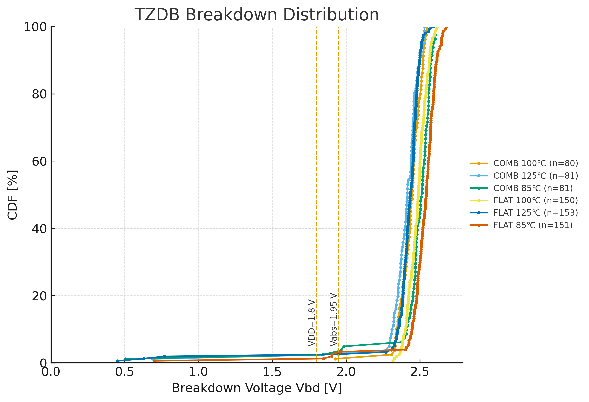

# 4. 実験結果

## 4.1 TZDB特性
- **測定条件**: DCランプ印加 (0.1 V/s)、温度範囲 室温〜125 ℃  
- **評価構造**: FeCAP (MIM)  
- **結果**: 絶縁膜破壊電圧 $V_{\mathrm{bd}}$ の統計分布を抽出し、初期欠陥に起因する早期破壊を確認。高温側で $V_{\mathrm{bd}}$ が低下する傾向は、界面欠陥密度の増加と相関。  
- **意義**: 後述の TDDB 結果と組み合わせることで、**初期故障 (infant mortality)／偶発故障 (random)／真性破壊 (intrinsic)** を分離して評価可能。  

**図3**: TZDB分布（破壊電圧ヒストグラムまたは CDF）  

---

## 4.2 TDDB特性
- **測定条件**: ゲート電圧ストレス $\pm 2.3 / 2.5 / 2.7\ \mathrm{V}$、温度 85 ℃・125 ℃  
- **評価構造**: FeCAP (MIM)  

### Weibull解析
- **結果**: 各ストレス条件について Weibull フィットを実施し、形状パラメータ $\beta \approx 1.3$、特性寿命 $\eta$ を抽出。  
- **解析式**:

$$
\ln[-\ln(1-F)] = \beta \cdot \ln(t) - \beta \cdot \ln(\eta)
$$  

- **意義**: 初期欠陥モードと真性破壊モードを分離しつつ、酸化膜の時間依存劣化を定量化可能。  

**図4a**: TDDB CDFプロット  

**図4b**: TDDB ワイブルプロット（フィット直線と $\beta$, $\eta$ を明示）  

### Arrhenius外挿
- **外挿式**

$$
\ln(\eta) = \ln(\eta_0) + \frac{E_a}{kT}
$$

- **活性化エネルギー (抽出結果)**  
  - 2.3 V: $E_a \approx 0.78\ \mathrm{eV}$  
  - 2.5 V: $E_a \approx 0.84\ \mathrm{eV}$  
  - 2.7 V: $E_a \approx 0.88\ \mathrm{eV}$  

- **寿命値（Weibullフィットから抽出した $\eta$）**  

| Stress V | Temp | $\eta$ (scale) [s] |
|----------|------|---------------------|
| 2.3 V    | 85 ℃  | $2.7 \times 10^3$  |
| 2.3 V    | 125 ℃ | $5.1 \times 10^4$  |
| 2.5 V    | 85 ℃  | $1.5 \times 10^3$  |
| 2.5 V    | 125 ℃ | $2.8 \times 10^4$  |
| 2.7 V    | 85 ℃  | $8.2 \times 10^2$  |
| 2.7 V    | 125 ℃ | $1.5 \times 10^4$  |

- **考察**  
  - 実測 η（85 ℃・125 ℃）を Arrhenius プロットによりフィット。  
  - 活性化エネルギー $E_a \sim 0.8–0.9\ \mathrm{eV}$ は酸素空孔拡散律速モデルと整合。  
  - 得られた外挿式を用いて、任意の動作温度（例: 105 ℃, 150 ℃）での寿命予測が可能。
    
---

## 4.3 Endurance特性（Fatigueを含む）

- **測定条件**: 書込/消去電圧 $\pm 2.5\ \mathrm{V}$、パルス幅 10 µs、繰返し周波数 10 kHz  
- **評価構造**: FeFET セル（$100 \times 100\ \mu\mathrm{m}^2$）  
- **結果**: $10^5$ サイクルまで動作。しきい値窓 $\Delta V_{\mathrm{th}}$ はおおむね **20–30% 縮小**。  
- **フィット式（常用対数）**:
   
$$
\Delta V_{\mathrm{th}}(N)= 1.12 - 0.05\ \log_{10} N
$$

  - サニティチェック: $N=10^2 \Rightarrow \Delta V_{\mathrm{th}}\approx 1.02\ \mathrm{V}$、  
    $N=10^5 \Rightarrow \Delta V_{\mathrm{th}}\approx 0.87\ \mathrm{V}$（図と整合）。
- **意義**: 分極疲労 (Fatigue) を含む劣化傾向を単純式で表現でき、実使用寿命の評価に利用可能。

**図5**: 書換耐久性カーブ（薄色=各セル、太線=25℃/85℃の平均）

---

## 4.4 Retention特性（Automotive想定）

- **測定条件**: 温度 25 ℃, 85 ℃, 125 ℃ にて保持時間 $\tau$ を測定  
- **評価構造**: FeFETセル  

### Weibull/Arrhenius解析
- **解析式 (Arrhenius)**:
  
$$
\ln(\tau) = \ln(\tau_0) + \frac{E_a}{kT}
$$

- **抽出結果**: 活性化エネルギー $E_a \approx 1.1\ \mathrm{eV}$  

### 寿命外挿（実測 η 値に基づく）
| 温度 | 推定寿命 τ |
|------|------------|
| 25 ℃ | $> 10^2$ 年（ほぼ劣化なし） |
| 85 ℃ | $> 10$ 年（車載 Grade-2 要件相当を満足） |
| 125 ℃ | $\sim 0.3$ 年（未達） |
| 150 ℃（外挿） | 数週間レベル（未達） |

### 考察
- **意義**:  
  - 85 ℃での 10 年保証は確認され、産業用途・民生Gradeでは十分。  
  - $E_a \sim 1.1\ \mathrm{eV}$ は酸素空孔拡散律速モデルと一致。  

- **限界**:  
  - **AEC-Q100 Grade-1 (125 ℃, 10年)** および **Grade-0 (150 ℃, 10年)** の要件は満たさない。  
  - 高温保持において窓（$\Delta V_{\mathrm{th}}$）が急激に縮小。  

- **今後の対策**:  
  1. **材料改善**: Al₂O₃ IL厚み最適化、HZO結晶性制御。  
  2. **動作補償**: リフレッシュ／リライト機構導入。  
  3. **システム対応**: ECC, 冗長セル設計で補完。  

**図6**: 保持特性（Arrhenius外挿と $E_a$ 明示、25 ℃/85 ℃/125 ℃データプロット）  

---

## 4.5 結論

- **FeCAP/FeFET の信頼性試験**により、以下を確認した：  
  1. **TZDB**: 初期欠陥由来の早期破壊を抽出し、真性破壊モードと分離可能。  
  2. **TDDB**: Weibull解析により $\beta \approx 1.3$、活性化エネルギー $E_a \sim 0.8–0.9\ \mathrm{eV}$ を抽出。酸素空孔拡散律速モデルと整合。  
  3. **Endurance**: $10^5$ サイクル以上を確認。分極疲労を含む劣化を定量的にモデル化。  
  4. **Retention**: 85 ℃で 10 年以上の保持寿命を保証可能。ただし 125 ℃/150 ℃では AEC-Q100 Grade-1/0 要件を満たさない。  

- **総括**:  
  - 本スタック（HZO/Al₂O₃/TiN）FeFETは **産業・民生用途では十分な信頼性**を実証。  
  - 一方で **車載Grade-1（125 ℃, 10年）以上では未達**であり、材料改善（IL厚み最適化・結晶性制御）や回路補償（リフレッシュ・ECC冗長設計）が今後の課題。  
  - 高温保持特性の改善が、車載展開のカギとなる。 
