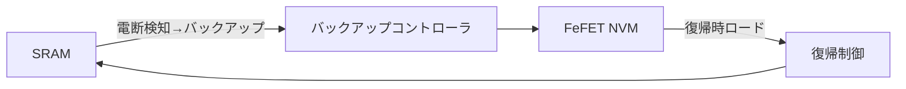

# 5. システムアーキテクチャ
- コア電源：1.8 V（ロジック、SRAM、FeFETを統一）  
- FeFET書込み：内部チャージポンプで ±2.5 V パルスを生成、1–50 µs幅  
- SRAM ⇄ FeFET 間に専用転送回路を設け、電断時に即バックアップ、復帰時にリストア  
- 外周3.3 Vは I/O および AMS 用にオプション追加可能  

**図6-1**: 電源ドメイン構成  

```mermaid
flowchart TB
    subgraph Core["Core 1.8 V"]
        L[Logic]
        S[SRAM]
        F[FeFET (補助NVM)]
        P[チャージポンプ<br/>±2.5 V生成]
    end

    subgraph Periphery["3.3 V I/O / AMS (Option)"]
        IO[I/O PAD]
        AMS[ADC/DAC, LDO]
    end

    %% 接続
    L --> S
    S <--> F
    P --> F

    Core --> Periphery
```



