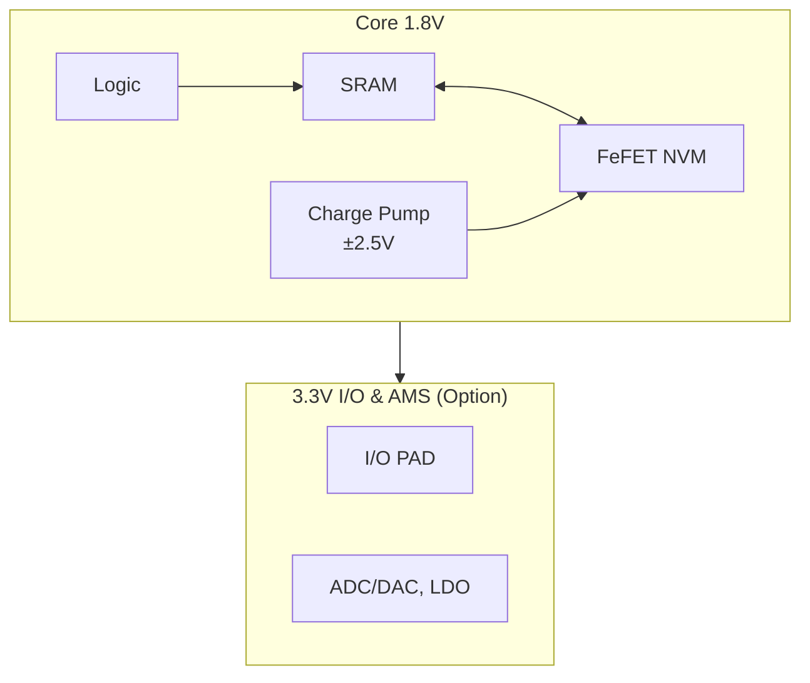
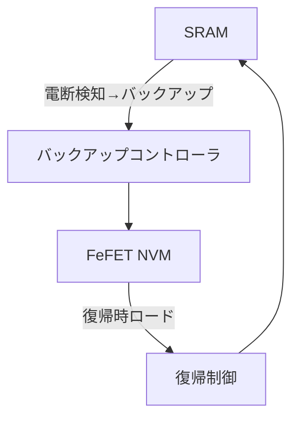

# 5. システムアーキテクチャ
- コア電源：1.8 V（ロジック、SRAM、FeFETを統一）  
- FeFET書込み：内部チャージポンプで ±2.5 V パルスを生成、1–50 µs幅  
- SRAM ⇄ FeFET 間に専用転送回路を設け、電断時に即バックアップ、復帰時にリストア  
- 外周3.3 Vは I/O および AMS 用にオプション追加可能  

**図6-1**: 電源ドメイン構成  

**図6-2**: バックアップ／リストア経路

