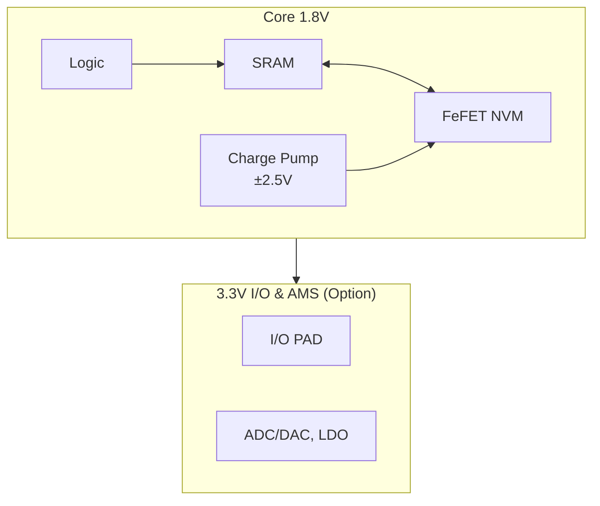
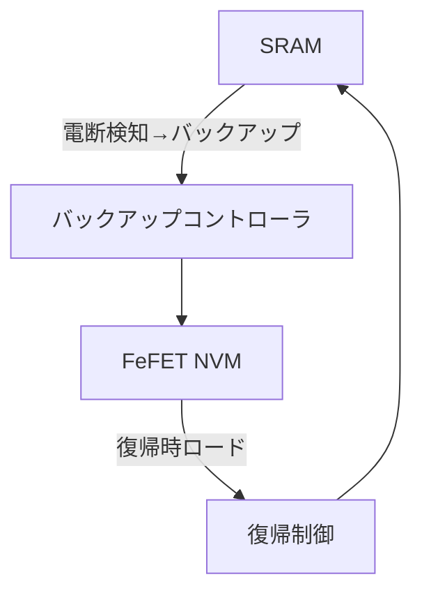

# 5. システムアーキテクチャ

- コア電源は **1.8 V** に統一（ロジック、SRAM、FeFETを同一電源領域で動作）。  
- FeFET 書込みは内部チャージポンプで ±2.5 V パルスを生成（パルス幅 1–50 µs）。  
- SRAM ⇄ FeFET 間に専用転送回路を配置し、電断検知時には即バックアップ、復帰時には自動リストアを実行。  
- 外周 **3.3 V ドメイン** はオプションとして配置可能（I/OおよびAMS: ADC/DAC, LDOなど）。  
- 本方式により、**標準 0.18 µm CMOS 技術で「瞬断耐性付きSRAM」アーキテクチャを低コスト実現可能**。

---

**図6-1**: 電源ドメイン構成

**図6-2**: バックアップ／リストア経路

