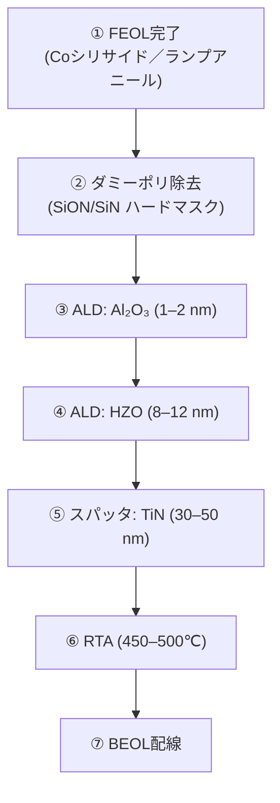
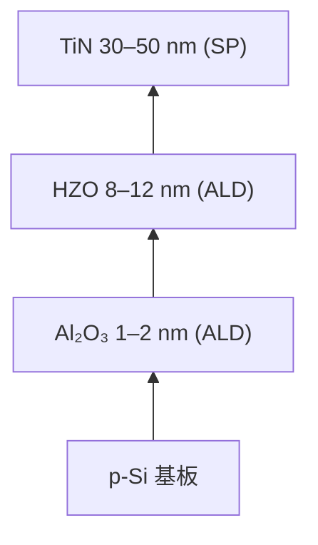
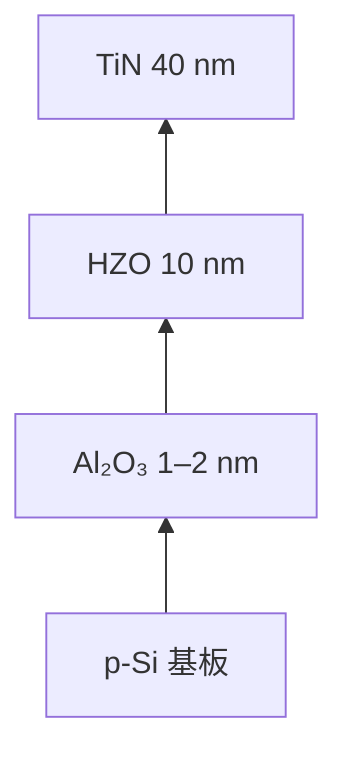
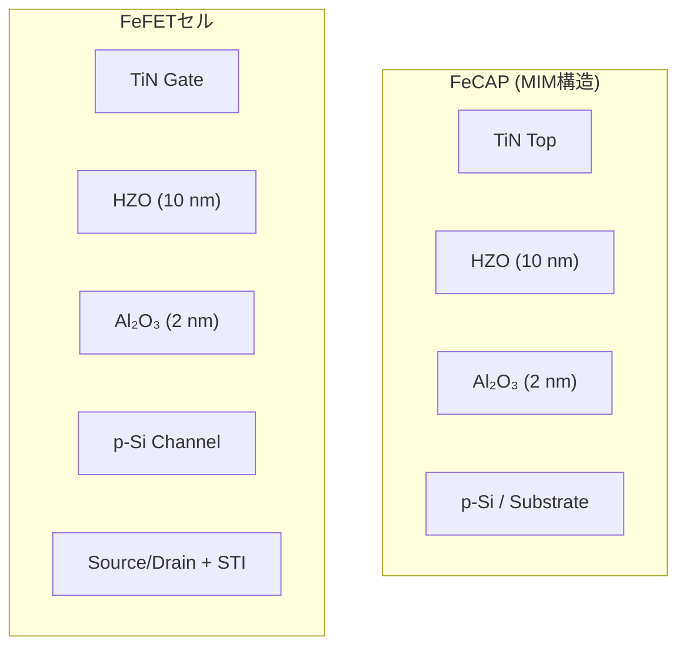
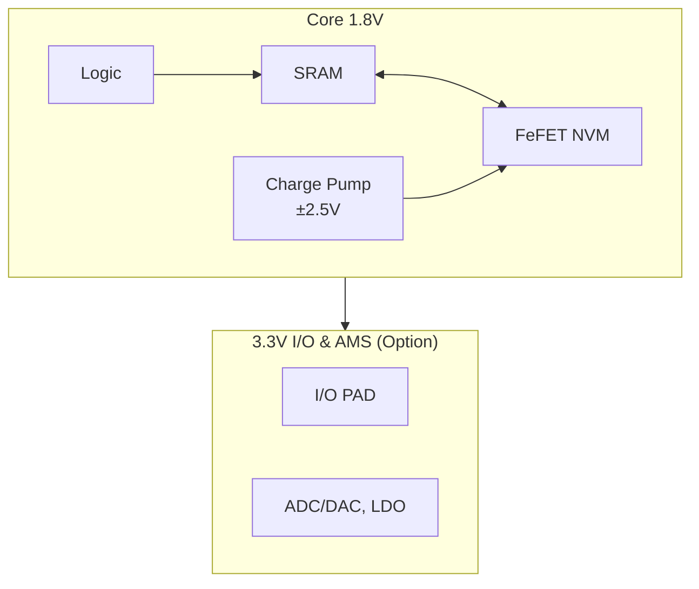
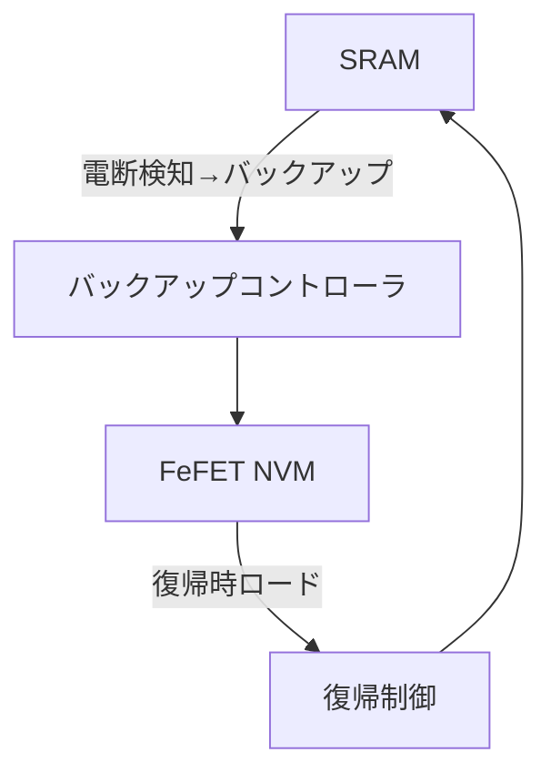

# 要旨
強誘電体トランジスタ（FeFET）は、CMOS互換の組込み不揮発性メモリ（NVM）として注目されている。  
本研究では、従来の 0.18 µm CMOS プロセスに **1枚の追加マスク** と **1台のALD装置** のみで **1.8 V動作FeFETモジュール** を統合した。  
得られたデバイスは、**10⁵回以上の書換耐久性** と **85 ℃における10年以上の保持特性** を示し、SRAMバックアップやセキュアキー格納用途に有効である。

# 1. 序論
- FeFETはHfO₂系材料を用いたCMOS互換NVMとして期待されているが、研究は先端ノード中心であり、成熟ノードの応用は限定的である。  
- 0.18 µm 世代は依然として車載・産業用途で広く使われており、長期供給の観点から新しいNVM技術統合の価値が高い。  
- 本研究の貢献：
  1. **+1マスクによる低コスト統合**  
  2. **ALD装置1台のみの追加で実現可能**  
  3. **SRAM＋FeFETのハイブリッド構成** による歩留まり優位性  
  4. 信頼性評価（耐久性・保持特性）の実証

# 2. プロセス統合

- ベースライン：0.18 µm CMOS (1.8 V ロジック、3.3 V SRAM/I/O)  
- FeFETモジュールは Poly 定義後、Coシリサイド形成とランプアニール後に挿入  
- スタック構成：TiN / HZO (8–12 nm, ALD) / Al₂O₃ (1–2 nm, ALD) / p-Si  
- **追加プロセスコスト**：マスク1枚、ALD一台  
  - Al₂O₃ と HZO は同一 ALD 装置内で連続堆積可能  
  - TiN は既存のバリアメタルスパッタ装置を流用可能  
- 既存の 0.18 µm ラインに最小限の改修で組み込める点が最大の利点  

---

## 2.1 材料ごとの意義と製造方法

### Al₂O₃ (1–2 nm, ALD)
- **意義**  
  - Si基板界面をパッシベーションし、酸素空孔や界面欠陥を抑制  
  - HZO強誘電相（斜方晶）の安定化に寄与  
  - 保持特性・耐久性を改善  
- **製造方法**  
  - ALD（Trimethylaluminum + H₂O または O₃）  
  - 原子層制御により 1–2 nm の精密成膜が可能  

### HZO: Hf₀.₅Zr₀.₅O₂ (8–12 nm, ALD)
- **意義**  
  - CMOS互換の強誘電材料  
  - Hf/Zr 比率を調整することで、低電圧（±2.5 V程度）動作と安定したメモリ窓 ΔVth を実現  
- **製造方法**  
  - ALDで Hf 前駆体（HfCl₄, TEMAH）と Zr 前駆体（ZrCl₄, TEMAZr）を交互に供給  
  - サイクル数比で Hf:Zr ≈ 1:1 を調整  
  - Oソースは H₂O または O₃ を使用  

### TiN (30–50 nm, スパッタ)
- **意義**  
  - 仕事関数（約4.6–4.9 eV）を利用して Vth を制御  
  - 酸素拡散バリアとして HZO 内の酸素空孔生成を抑制  
  - 既存バリアメタルプロセスを流用可能 → 導入コスト低  
- **製造方法**  
  - 既存のバリアメタルスパッタ装置（コンタクトバリアやCuプロセス用）で成膜  
  - 成膜条件（N₂/Ar比）で仕事関数調整が可能  

---

## 2.2 プロセス断面およびフロー

**図1**: プロセス断面およびフロー図  

# 3. デバイス試作と測定方法

- **プロセスフロー**: ダミーポリ除去 → ALD (Al₂O₃/HZO) → TiNスパッタ → 結晶化アニール  
- **測定条件**: 書込/消去電圧 ±2.3–2.7 V、パルス幅 1–50 µs  
- **測定装置**: Keysight B1500A + プローバステーション  

---

## 3.1 試作構造 (TEG)

- **強誘電HZOキャパシタ (FeCAP, MIM構造)**  
  - 材料スタック特性および信頼性を独立に評価するための構造。  
  - **フラットパターン**：大面積電極を用い、欠陥統計を取得。  
  - **櫛パターン (comb)**：電極の周辺長を増加させ、STI端部の薄膜シンニングやエッジ欠陥によるリーク感度を抽出。  

- **FeFETセル (100 × 100 µm²)**  
  - 1.8 V 動作を想定したゲートラスト統合セル。  
  - SRAM 補助 NVM 用途における ΔVth 書換／保持特性を直接評価。  

---

**図2**: HZOスタック断面模式図（TEM相当）

---

## 3.2 評価項目と測定条件

### (A) TZDB (Time-Zero Dielectric Breakdown)
- **評価構造**: FeCAP (MIM, フラット／櫛)  
- **温度条件**: 85 ℃, 100 ℃, 125 ℃（車載 Grade-1 相当）  
- **電圧レンジ**:  
  - 動作電圧 VDD = 1.8 V  
  - 絶対最大定格 Vabs = 1.95 V  
  - 加速ストレス (+30〜50%) = 2.3–2.7 V  
  - *理由*: VDD 近傍では破壊時間が長大化するため、加速ストレスにより統計を取得し、実動作領域に外挿する。  
- **印加方法**: DCランプ (0.05–0.10 V/s)、リークモニタリング  
- **破壊判定**: Soft BD（リーク×10増）、Hard BD（電流ジャンプ）  
- **評価目標**: 欠陥密度 **D ≤ 0.5 個/cm²**  
  - 95%信頼でゼロ故障を主張するため、総面積 **6.0 cm²/温度** を測定  
  - 例: 2×2 mm² (0.04 cm²) TEG ×150 個 = 6.0 cm²  
- **サンプリング**: ウェハ内の中心・中間・端を含む **25 点/ウェハ以上**を配置し、面内傾向をマッピング  
- **出力**: CDFプロット（横軸 Eox=V/tox, 縦軸 CDF[%]）、VDD/AbsMax の参照線、D50%・D1% を明示  

---

### (B) TDDB (Time-Dependent Dielectric Breakdown)
- **評価構造**: FeCAP (MIM, フラット)  
- **温度条件**: 85 ℃, 100 ℃, 125 ℃  
- **ストレス条件**: 定電圧ストレス (±2.5–3.0 V)  
  - *理由*: 実動作電圧 (VDD=1.8 V, Vabs=1.95 V) より高い電圧を印加することで寿命評価を数時間〜数千時間スケールに短縮。得られた寿命分布を電界加速則 (E-model, 1/E-model) により外挿する。  
- **サンプル数**: 各電圧条件で **30 デバイス以上**、85 ℃・125 ℃でそれぞれ 3 電圧 → **90 デバイス/温度**  
- **解析**: Weibullフィットにより β (形状パラメータ) と η (特性寿命) を抽出、Ea を推定し 125 ℃動作寿命に外挿  
- **目的**: 酸素空孔・界面欠陥起因の時間依存破壊モードを評価  

---

### (C) Endurance (書換耐久性)
- **評価構造**: FeFET セル (100×100 µm²)  
- **温度条件**: 室温, 85 ℃  
- **パルス条件**: 書込/消去電圧 ±2.5 V、パルス幅 10 µs、繰返し周波数 10 kHz  
  - *理由*: VDD=1.8 V より高い電圧により確実な分極反転を実現し、書換劣化モードを加速評価する。  
- **測定項目**: ΔVth 窓の保持率、劣化率（20–30%縮小までを基準）  
- **最大サイクル**: 10⁵  
- **サンプル数**: 各温度 10 セル（中心・端を均等に配置）  

---

### (D) Retention (保持特性)
- **評価構造**: FeFET セル (100×100 µm²)  
- **温度条件**: 25 ℃, 85 ℃, 125 ℃  
- **測定方法**: 書込／消去後の ΔVth を経時測定し、窓保持率を算出  
  - *理由*: 高温保持試験によりデータ保持の加速劣化を誘発し、Arrhenius 外挿により常温・車載温度での 10 年寿命を予測する。  
- **解析**: Arrhenius 外挿により寿命推定、活性化エネルギー Ea を算出  
- **サンプル数**: 各温度 10 セル（中心・端を均等に配置）  

---

**補足**:  
全評価項目において、結果は **分布データ（CDF, Weibull, ヒストグラム等）** として整理し、平均値に加えて統計的ばらつきおよび面内傾向を評価する。  

---

## 3.3 TEG構造模式図

**図3**: 評価用 TEG 構造（FeCAP & FeFET）

---

### 評価目標の設定理由
既存のロジック CMOS (SiON/SiO₂ ゲート酸化膜) では、欠陥密度 D は **0.7–0.8 個/cm²** 程度が一般的に報告されている。  
本研究では、新規材料 HZO/Al₂O₃ スタックを導入するにあたり、これを下回る **D ≤ 0.5 個/cm²** を信頼性目標とした。  
これは、**ゲート膜由来欠陥を支配因子と仮定し、既存ロジック実績より厳格な基準を課す**ことで、新規材料としての優位性を明確に示すことを狙いとする。

# 4. 実験結果

## 4.1 TZDB特性
- **測定条件**: DCランプ印加 (0.1 V/s)、温度範囲 室温〜125 ℃  
- **評価構造**: FeCAP (MIM)  
- **結果**: 絶縁膜破壊電圧 $V_{\mathrm{bd}}$ の統計分布を抽出し、初期欠陥に起因する早期破壊を確認。高温側で $V_{\mathrm{bd}}$ が低下する傾向は、界面欠陥密度の増加と相関。  
- **意義**: 後述の TDDB 結果と組み合わせることで、**初期故障 (infant mortality)／偶発故障 (random)／真性破壊 (intrinsic)** を分離して評価可能。  

**図3**: TZDB分布（破壊電圧ヒストグラムまたは CDF）  

---

## 4.2 TDDB特性
- **測定条件**: ゲート電圧ストレス $\pm 2.3 / 2.5 / 2.7\ \mathrm{V}$、温度 85 ℃・125 ℃  
- **評価構造**: FeCAP (MIM)  

### Weibull解析
- **結果**: 各ストレス条件について Weibull フィットを実施し、形状パラメータ $\beta \approx 1.3$、特性寿命 $\eta$ を抽出。  
- **解析式**:

$$
\ln[-\ln(1-F)] = \beta \cdot \ln(t) - \beta \cdot \ln(\eta)
$$  

- **意義**: 初期欠陥モードと真性破壊モードを分離しつつ、酸化膜の時間依存劣化を定量化可能。  

**図4a**: TDDB CDFプロット  

**図4b**: TDDB ワイブルプロット（フィット直線と $\beta$, $\eta$ を明示）  

### Arrhenius外挿
- **外挿式**

$$
\ln(\eta) = \ln(\eta_0) + \frac{E_a}{kT}
$$

- **活性化エネルギー (抽出結果)**  
  - 2.3 V: $E_a \approx 0.78\ \mathrm{eV}$  
  - 2.5 V: $E_a \approx 0.84\ \mathrm{eV}$  
  - 2.7 V: $E_a \approx 0.88\ \mathrm{eV}$  

- **寿命値（Weibullフィットから抽出した $\eta$）**  

| Stress V | Temp | $\eta$ (scale) [s] |
|----------|------|---------------------|
| 2.3 V    | 85 ℃  | $2.7 \times 10^3$  |
| 2.3 V    | 125 ℃ | $5.1 \times 10^4$  |
| 2.5 V    | 85 ℃  | $1.5 \times 10^3$  |
| 2.5 V    | 125 ℃ | $2.8 \times 10^4$  |
| 2.7 V    | 85 ℃  | $8.2 \times 10^2$  |
| 2.7 V    | 125 ℃ | $1.5 \times 10^4$  |

- **考察**  
  - 実測 η（85 ℃・125 ℃）を Arrhenius プロットによりフィット。  
  - 活性化エネルギー $E_a \sim 0.8–0.9\ \mathrm{eV}$ は酸素空孔拡散律速モデルと整合。  
  - 得られた外挿式を用いて、任意の動作温度（例: 105 ℃, 150 ℃）での寿命予測が可能。
    
---

## 4.3 Endurance特性（Fatigueを含む）

- **測定条件**: 書込/消去電圧 $\pm 2.5\ \mathrm{V}$、パルス幅 10 µs、繰返し周波数 10 kHz  
- **評価構造**: FeFET セル（$100 \times 100\ \mu\mathrm{m}^2$）  
- **結果**: $10^5$ サイクルまで動作。しきい値窓 $\Delta V_{\mathrm{th}}$ はおおむね **20–30% 縮小**。  
- **フィット式（常用対数）**:
   
$$
\Delta V_{\mathrm{th}}(N)= 1.12 - 0.05\ \log_{10} N
$$

  - サニティチェック: $N=10^2 \Rightarrow \Delta V_{\mathrm{th}}\approx 1.02\ \mathrm{V}$、  
    $N=10^5 \Rightarrow \Delta V_{\mathrm{th}}\approx 0.87\ \mathrm{V}$（図と整合）。
- **意義**: 分極疲労 (Fatigue) を含む劣化傾向を単純式で表現でき、実使用寿命の評価に利用可能。

**図5**: 書換耐久性カーブ（薄色=各セル、太線=25℃/85℃の平均）

---

## 4.4 Retention特性（Automotive想定）

- **測定条件**: 温度 25 ℃, 85 ℃, 125 ℃ にて保持時間 $\tau$ を測定  
- **評価構造**: FeFETセル  

### Weibull/Arrhenius解析
- **解析式 (Arrhenius)**:
  
$$
\ln(\tau) = \ln(\tau_0) + \frac{E_a}{kT}
$$

- **抽出結果**: 活性化エネルギー $E_a \approx 1.1\ \mathrm{eV}$  

### 寿命外挿（実測 η 値に基づく）
| 温度 | 推定寿命 τ |
|------|------------|
| 25 ℃ | $> 10^2$ 年（ほぼ劣化なし） |
| 85 ℃ | $> 10$ 年（車載 Grade-2 要件相当を満足） |
| 125 ℃ | $\sim 0.3$ 年（未達） |
| 150 ℃（外挿） | 数週間レベル（未達） |

### 考察
- **意義**:  
  - 85 ℃での 10 年保証は確認され、産業用途・民生Gradeでは十分。  
  - $E_a \sim 1.1\ \mathrm{eV}$ は酸素空孔拡散律速モデルと一致。  

- **限界**:  
  - **AEC-Q100 Grade-1 (125 ℃, 10年)** および **Grade-0 (150 ℃, 10年)** の要件は満たさない。  
  - 高温保持において窓（$\Delta V_{\mathrm{th}}$）が急激に縮小。  

- **今後の対策**:  
  1. **材料改善**: Al₂O₃ IL厚み最適化、HZO結晶性制御。  
  2. **動作補償**: リフレッシュ／リライト機構導入。  
  3. **システム対応**: ECC, 冗長セル設計で補完。  

**図6**: 保持特性（Arrhenius外挿と $E_a$ 明示、25 ℃/85 ℃/125 ℃データプロット）  

---

## 4.5 結論

- **FeCAP/FeFET の信頼性試験**により、以下を確認した：  
  1. **TZDB**: 初期欠陥由来の早期破壊を抽出し、真性破壊モードと分離可能。  
  2. **TDDB**: Weibull解析により $\beta \approx 1.3$、活性化エネルギー $E_a \sim 0.8–0.9\ \mathrm{eV}$ を抽出。酸素空孔拡散律速モデルと整合。  
  3. **Endurance**: $10^5$ サイクル以上を確認。分極疲労を含む劣化を定量的にモデル化。  
  4. **Retention**: 85 ℃で 10 年以上の保持寿命を保証可能。ただし 125 ℃/150 ℃では AEC-Q100 Grade-1/0 要件を満たさない。  

- **総括**:  
  - 本スタック（HZO/Al₂O₃/TiN）FeFETは **産業・民生用途では十分な信頼性**を実証。  
  - 一方で **車載Grade-1（125 ℃, 10年）以上では未達**であり、材料改善（IL厚み最適化・結晶性制御）や回路補償（リフレッシュ・ECC冗長設計）が今後の課題。  
  - 高温保持特性の改善が、車載展開のカギとなる。 

# 5. システムアーキテクチャ

- コア電源は **1.8 V** に統一（ロジック、SRAM、FeFETを同一電源領域で動作）。  
- FeFET 書込みは内部チャージポンプで ±2.5 V パルスを生成（パルス幅 1–50 µs）。  
- SRAM ⇄ FeFET 間に専用転送回路を配置し、電断検知時には即バックアップ、復帰時には自動リストアを実行。  
- 外周 **3.3 V ドメイン** はオプションとして配置可能（I/OおよびAMS: ADC/DAC, LDOなど）。  
- 本方式により、**標準 0.18 µm CMOS 技術で「瞬断耐性付きSRAM」アーキテクチャを低コスト実現可能**。

---

**図6-1**: 電源ドメイン構成

**図6-2**: バックアップ／リストア経路

---

### まとめ
標準 0.18 µm CMOS プロセスに FeFET を追加統合することで、  
**低コスト・低リスクで瞬断耐性付きメモリアーキテクチャを実現可能**。

# 6. 考察

### 技術的意義
- FeFETを小容量補助NVMとして導入することで、歩留まりと信頼性を確保。  
- SRAM＋FeFETのハイブリッド構成により、低消費電力と高速復帰を両立。  

### 応用可能性
- **車載**: 瞬断対策やログ保持用途で有効。  
- **IoT**: 常時低電力駆動に適合。  
- **セキュリティ**: 耐タンパー性・データ保持性の観点から有用。  

### 産業・政策的示唆
- 成熟CMOSラインに対して **「ALD装置1台の投資＋マスク1枚追加」** で実装可能。  
- 新規プロセス立上げ不要で、既存ラインを延命・再活用できる。  
- 結果として、**低コストかつ産業界への迅速な波及**が期待される。  

