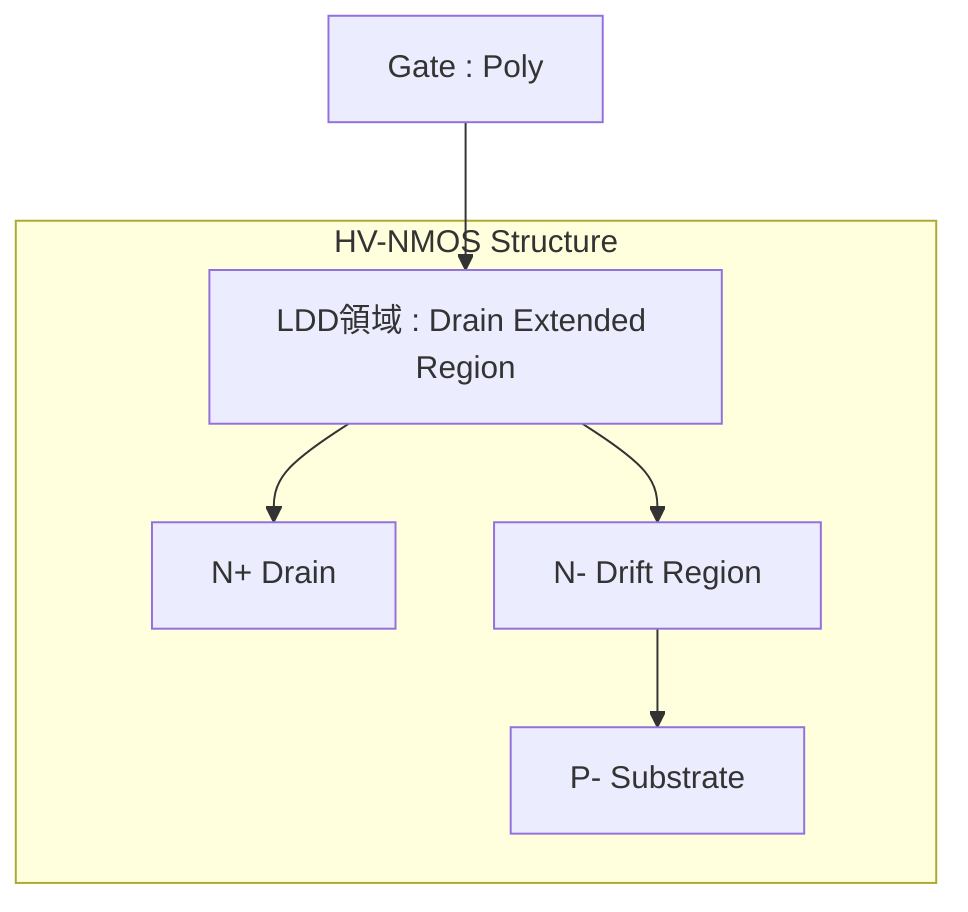
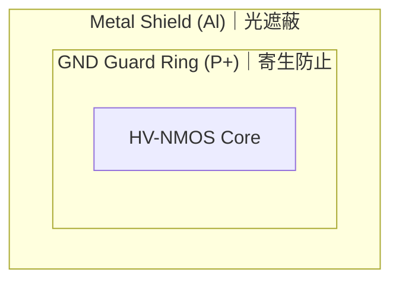

---

# 🧩 HV-CMOS（High Voltage CMOS）

---

## 📘 概要｜Overview

**HV-CMOS（高耐圧CMOS）** は、**標準CMOSプロセスに準拠しながら高電圧動作を可能にしたMOSデバイス技術**です。  
**HV-CMOS (High Voltage CMOS)** enables high-voltage operation while maintaining compatibility with standard CMOS processes.

主に以下の用途で使用されます：  
Main application areas include:

- ゲートドライバ（パワーFETの制御）  
  *Gate drivers for power FETs*
- アナログ制御回路（電源ライン監視など）  
  *Analog control circuits such as power monitoring*
- 高耐圧I/Oセル（5V〜30V駆動のインタフェース）  
  *High-voltage I/O cells for interfaces (5V–30V)*

👉 **LDMOSが構造的に高耐圧化されるのに対し、HV-CMOSは標準CMOSの延長として制御性・集積性を重視**  
👉 *Unlike LDMOS, which is structurally enhanced for high voltage, HV-CMOS extends CMOS compatibility with better control and integration.*

---

## 🏗️ 構造と特徴｜Structure and Features

【HV-NMOS構造例｜Example HV-NMOS Structure】

→ 多重ウェル構造（Deep N-Well）でSub絶縁
→ 厚膜酸化によるゲート耐圧向上

| 特徴｜Features | 説明｜Description |
|----------------|------------------|
| **ドレイン拡張領域** Drain Extended Region | 電界集中を緩和し、BVdss向上 *Reduces field crowding to increase breakdown voltage* |
| **厚ゲート酸化膜** Thick Gate Oxide | 5V以上の高電圧に対応可能 *Supports operation at 5V and above* |
| **多重ウェル絶縁構造** Deep Well Isolation | Substrateノイズや干渉を抑制 *Suppresses substrate noise and coupling* |
| **CMOS互換性** CMOS Compatible | ロジックと同時設計が可能 *Enables integration with logic design* |

---

## 📏 動作電圧とデバイス寸法  
### Operating Voltage vs Device Parameters

| 動作電圧｜Operating Voltage | Tox（nm）| L（μm） | 備考｜Remarks |
|-----------------------------|----------|---------|-------------------------|
| 1.8 V | 約 3.0〜4.0 | 約 0.18〜0.24 | 標準ロジック｜Standard Logic |
| 3.3 V | 約 7.0〜8.0 | 約 0.35〜0.5  | IOセル｜I/O CMOS |
| 5.0 V | 約 11〜13   | 約 0.6〜1.0  | 一般HV｜General HV |
| 20 V  | 約 30〜35   | 約 2.0〜3.0  | 厚酸化膜＋ドレイン拡張あり |
| 40 V  | 約 55〜65   | 約 4.0〜6.0  | NMOSのみ構成されることが多い |

> ⚠️ 上記数値はPDKやプロセス仕様により異なる場合があります。  
> *Values vary depending on PDK and process.*

---

## 🧪 応用例｜Applications

| 用途 | 説明 |
|------|------|
| ゲートドライバ   *Gate Driver* | 高電圧スイッチングFETの制御   *Control of high-voltage switching FETs* |
| 電源モニタ   *Power Monitor* | 高耐圧入力で電圧を監視・検出   *Voltage monitoring and detection with high-voltage input* |
| フルブリッジ制御   *H-Bridge Control* | 上下のHVトランジスタを対で駆動可能   *Enables driving of upper and lower HV transistors in pairs* |

---

## 🔁 プロセスフロー順序｜Process Flow Order

- ✅ **熱履歴の大きいHV工程を先行**  
  *HV steps with high thermal budget (e.g., thick oxidation, drift implantation) are done first.*
- ✅ **後段で標準CMOSロジック形成**  
  *Standard logic with thin gate oxide is fabricated after HV steps to prevent degradation.*

👉 **順序を誤ると、ロジックMOSの特性劣化（Vthシフト、リーク増加）が生じる**  
👉 *Incorrect order may cause logic degradation due to thermal stress.*

---

## ⚠️ 信頼性と環境耐性｜Reliability & Environmental Vulnerability

| 項目   *Concern* | 説明   *Description* | 対策   *Countermeasures* |
|---------------------|-------------------------|-----------------------------|
| COP影響   *COP Defect* | シリコン結晶起因の局所欠陥が、HV領域でリークや絶縁破壊を誘発   *Local defects originating from silicon crystal may induce leakage or dielectric breakdown in HV regions* | ウエハテストで **HVスクリーニング** 実施   *Perform HV screening in wafer test* |
| 熱ストレス   *Thermal Stress* | 厚膜酸化・ドレイン拡張が熱により劣化しやすい   *Thick oxide and drain extension are prone to degradation under thermal stress* | **HTOL試験**、放熱レイアウト、SOA管理   *HTOL test, thermal dissipation layout, SOA management* |
| 光感受性   *Photo Sensitivity* | 光による光起電流で誤動作・リークが発生   *Photogenerated current may cause malfunction or leakage* | **ALメタルガードリング**、遮光樹脂使用   *Al metal guard ring, use of light-shielding resin* |

---

## 🛡️ 耐圧設計の実装技術｜Breakdown Voltage Enhancement Techniques

### 🔸 ドレインオーバー構造とアニール  
**Drain Extension and Long-Time Anneal**

- 耐圧確保のために、**ドレイン側を広げてLDD領域を確保**し、  
  **約24時間の高温アニール（例：1000℃）**を行うことで、拡散プロファイルを滑らかにする。

> Smooth doping gradient in drift region reduces peak field and enhances BVdss.

---

### 🔸 GNDガードリングと遮光  
**GND Guard Ring and Optical Shielding**

- NMOSの周囲には、**GND接続されたP+ガードリング**を配置  
- 光照射や基板電流を遮断する目的で、**上層にAlメタルを重ねた遮光構造**を施すこともある。

【レイアウト例｜Guard Ring Layout】

> GND-tied guard ring and metal shielding suppress light-induced and parasitic effects.

---

## 📚 教材的意義｜Educational Relevance

- 高耐圧設計の実装構造と信頼性対策を理解できる  
  *Understand both layout-level and process-level HV design techniques*
- 標準CMOSとの**製造順序・構造の違い**を体系的に整理可能  
  *Compare and integrate HV CMOS with baseline logic*
- センサ／PMIC／混載SoCの**アナログ高電圧設計**に必須の知識  
  *Essential knowledge for analog and mixed-signal SoC design*

---

## 🔗 関連リンク｜Related Topics

- [📘 応用編 第2章｜高耐圧デバイス 全体README](./README.md)：章全体の構成と関連技術の導入  
  *Chapter 2 Top: Overview of high-voltage devices and structure of this section*

- [`ldmos.md`](./ldmos.md)：LDMOSによる高電流対応技術  
  *High-current structure using LDMOS*

- [`junction_isolation.md`](./junction_isolation.md)：寄生素子を防ぐ絶縁設計  
  *Isolation techniques to suppress parasitics*

- [chapter5_soc_design_flow](../chapter5_soc_design_flow/)：アナログブロックとSoC設計統合  
  *Integration of analog blocks into SoC design*

---

© 2025 Shinichi Samizo / MIT License
